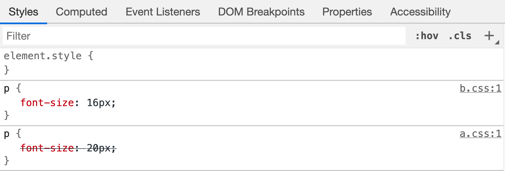
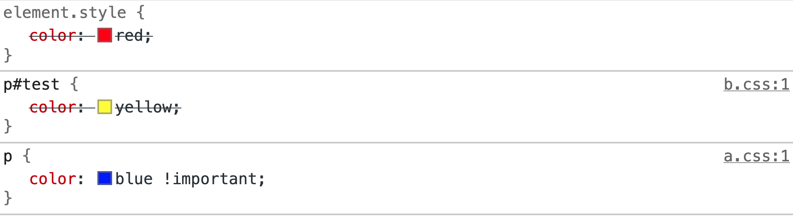

# CSS 层叠

### 背景

有时候在做项目过程中会发现某些元素上的 CSS 样式没有生效，在查看后发现是自己的样式被覆盖了，这里就需要用到 CSS 层叠的知识。而在之前，需要先学习**资源顺序**、**特殊性(specificity)**、**继承(inheritance)**对 CSS 层叠的影响，这样才能清楚它们之间的关联。

### 资源顺序

CSS 规则应用于元素上时，它的顺序很重要：**当一个元素上应用着多个 CSS 规则且具有相同的特殊性时，那么排在后面的规则将会应用，即后面的规则会覆盖前面的规则**。这不仅对处于同一个样式表中的 CSS 规则起作用，对于不同样式表也同样其作用。

- 比如在同一样式表中对 `p` 元素有两个特殊性相同的 CSS 规则，如下代码：

  ```html
  <style>
    p {
      color: yellow;
    }
    p {
      color: red;
    }
  </style>
  <p>p 元素的的字体颜色将是红色</p>
  ```

  由于字体样式为红色的规则排在后面，所以它将会生效，故最终 `p` 元素字体颜色显示是红色

- 对于由 `<link>` 元素引入的不同 CSS 样式表也同样遵循着这个原则，下面代码中有两个样式表，它们都有着 `p` 元素的字体大小的规则，如下代码：

  ```css
  /* a 样式表 */
  p {
    font-size: 20px;
  }
  
  /* b 样式表 */
  p {
    font-size: 16px;
  }
  ```

  而在 HTML 中是这样引用的两个 CSS 样式表：

  ```html
  <head>
    <link rel="stylesheet" href="./a.css">
    <link rel="stylesheet" href="./b.css">
  </head>
  <body>
    <p>p 元素的字体大小将是 16px</p>
  </body>
  ```

  由于 b 样式表排在后面，所以它对 `p` 元素字体大小的规则将会起作用，最终 `p` 元素的字体大小是 16px，在控制台也可发现 a 样式表中对 `p` 元素字体大小的规则被划上横线，表示被覆盖掉，如下图所示：

  

### 特殊性

**浏览器会根据特殊性来决定当有多个规则有不同选择器应用于同一元素时使用哪个规则**。特殊性是由选择器本身决定的，比如在一些情况下，有些规则在最后出现，但是却应用了前面的规则，这是因为前面的规则其特殊性更高，因此浏览器就把它选为元素的样式，如下示例：

```html
<style>
  #red {
    color: red;
  }
  .green {
    color: green;
  }
</style>
<p id="red" class="green">由于特殊性，p 元素的颜色将是红色</p>
```

由于ID 选择器的特殊性比类选择器更大，所以 `p` 元素最终在浏览器中显示为红色。现在我们来看下浏览器是如何计算特殊性，本质上，不同类型的选择器有不同的分数值，把这些分数相加就得到特定选择器的权重，然后就可以进行匹配。**一个选择器的特殊性表述为四个部分，即： 0,0,0,0，可以认为是四位数的四个位数：个十百千**，规则如下：

- **千位**：**声明在内联样式中则该位得一分**，由于内联样式没有选择器，所以其总得分为 1000
- **百位**：存在**ID 选择器**则该位得一分
- **十位**：存在**类选择器、伪类选择器、属性选择器**则该位得一分
- **个位**：存在**元素选择器、伪元素选择器**则该位得一分
- **通配选择器(\*)具有 0 特殊性，这与根本没有特殊性有区别**
- **组合符(+、>、~、' ')、否定伪类(:not)对特殊性没有影响，但是 :not()括号内声明的选择器会影响特殊性**
- 特殊性进行计算时**不允许进位**，比如 20 个类选择仅仅意味着 20 个十位，而不能视为两个百位，也就是说，无论多少个类选择器的权重叠加，都不会超过一个 ID 选择器

下面是一些特殊性计算的示例：

```
* /* 0,0,0,0 */
div p span /* 0,0,0,3 */
.wrapper.content /* 0,0,2,0 */
#app /* 0,2,0,0 */
内联样式 /* 1,0,0,0 */
div + p::first-line /* 0,0,0,3 */
ul > li[class="active"] > .test /* 0,0,2,2 */
ul > li:not(.active) /* 0,0,1,2 */
```

### !important

当在一个样式表中声明 `!important` 规则时，此声明将会覆盖掉任何其他声明。比如，在 index.html 中有如下内容：

```html
<!doctype html>
<html>
  <head>
    <link rel="stylesheet" href="./a.css">
  	<link rel="stylesheet" href="./b.css">
  </head>
  <body>
    <p id="test" style="color: red;">p 元素的最终颜色为蓝色</p>
  </body>
</html>
```

其中两个样式表的内容如下：

```css
/* a 样式表 */
p {
  color: blue !important;
}

/* b 样式表 */
p#test {
  color: yellow;
}
```

这时候会发现 `p` 元素最终显示为蓝色，即表示它应用了 a 样式表的颜色规则。而无论是从资源顺序、特殊性来看 a 样式表中的颜色规则权重都不是最高的，但由于其声明了 `!important` 规则，所以覆盖掉了其它权重更高的颜色规则，如下图所示：



而覆盖掉 `!important` 规则的办法就是声明一个具有相同特殊性且顺序排后，或者更高特殊性。但注意，除特殊情况下尽量不要使用 `!important` 规则

### 继承

继承指的是一个元素向其后代元素传递属性值的机制。比如，将 `div` 元素设置为红色，其后代元素也将是红色，如下代码：

```html

<div style="color: red; padding: 10px;">
  <p>
  	<span>这里的颜色是红色</span>
  </p>
</div>
```

`span` 元素继承了 `div` 元素中字体颜色属性，但是没有继承 `padding` 属性，故有些属性不能继承，比如 `width`、`margin`、`padding`、`border` 等属性。还有，继承的属性值没有特殊性，即连 0 特殊性也米有，比如如下代码：

```html
<style>
  * {
    color: blue;
  }
</style>
<div style="color: red;">
  <p>
  	<span>根据通配选择器，这里的颜色是蓝色</span>
  </p>
</div>
```

由于通配选择器具有 0 特殊性，其颜色规则权重将会比继承值更大，所以 `span` 元素会显示为蓝色而不是红色

### 理解 CSS 层叠

所谓层叠，就是指浏览器在向一个元素应用样式时，浏览器需要考虑继承、资源顺序、特殊性后选择出最终样式，这个过程就是层叠。在这个过程中，继承得到的属性值权重是最弱的，只要针对某个元素设置了某个属性，其都会覆盖掉该元素继承的值。而其余的重要性程度如下：

**!import 规则 > 特殊性 > 资源顺序**

再结合浏览器默认样式、用户样式，相互冲突的 CSS 声明可按照以下顺序解决，后一种声明将会覆盖掉前一种声明

- 用户代理样式表中的声明(比如，浏览器的默认样式)
- 用户样式表中的常规声明(用户的自定义样式)
- 开发者样式表中的常规声明
- 开发者样式表中的 `!important` 声明
- 用户样式表中的 `!important` 声明