# Flex 布局

### 一、认识 Flex 布局

在 Flex 之前，CSS 布局一般采用正常流、浮动、定位等方式进行页面布局，但是这些传统的布局方式在某些方面有一定局限性，比如使容器中的子项占有相同的宽高、在容器中垂直居中一个子项等等。Flex 布局有以下几个特点：

- **与方向无关**
- **容器空间自动分配、子项自动对齐**
- **一维布局模型**，一次只能处理一行或一列

基于这些特点，使用 Flex 布局会使布局任务变得更加容易。元素要使用 Flex 布局，可以通过 `display` 属性设置

```css
.container {
  display: flex; /* 元素的行为类似于块元素，并根据 flexbox 模型布局其内容 */
}

.container {
  display: inline-flex; /* 元素的行为类似于内联元素，并根据 flexbox 模型布局其内容 */
}
```

注意，设为 Flex 布局后，子项的 `float`、`clear`、`vertical-align` 属性将失效

### 二、Flex 布局模型

采用 Flex 布局的元素，称为 **flex 容器（flex container）**，flex 容器中的所有直接子元素被称为 **flex 项（flex item）**。flex 容器沿着两个轴来布局：


**主轴**（main axis）是沿着 flex item 放置方向延伸的轴，在页面中默认情况下从左到右的方向；主轴的开始位置称为 main start，结束位置称为 main end，主轴的尺寸由 main size 表示。main size 表示单个 flex item 在主轴方向上占据的空间

**交叉轴**（cross axis）是垂直于 flex item 放置方向的轴，在页面中默认情况下是从上到下的方向；交叉轴的开始位置称为 cross start，结束位置称为 cross end。 cross size 表示单个 flex item 在交叉轴方向上占据的空间

与 Flex 布局相关的 CSS 属性可分为两部分，一部分作用于 flex container，一部分作用于 flex item

### 三、flex container 属性 

作用于 flex container 的 CSS 属性一共有六个，分别是 `flex-direction`、`flex-wrap`、`flex-flow`、`justify-content`、`align-items`、`align-content`

- **`flex-direction`** 定义了 flex container 主轴的方向，从而指定了 flex item 是如何在 flex container 中布局的，语法如下：

  ```
  flex-direction: row | row-reverse | column | column-reverse
  ```

  - **`row`**：默认值，主轴显示为行，方向为当前文本方向。默认文本方向是 `ltr`，表示主轴是从左到右的水平方向；如果文本方向是 `rtl`，表示主轴是从右到左的水平方向

    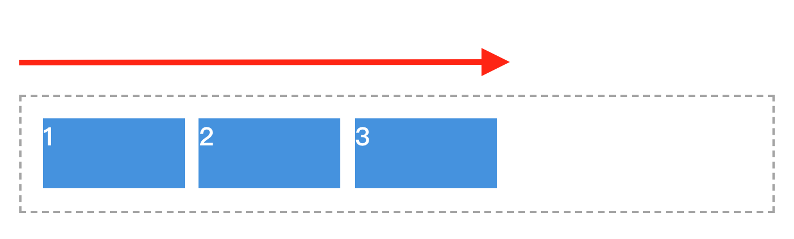

  - **`row-reverse`**：主轴显示为行，但方向和 `row` 属性值是相反的

    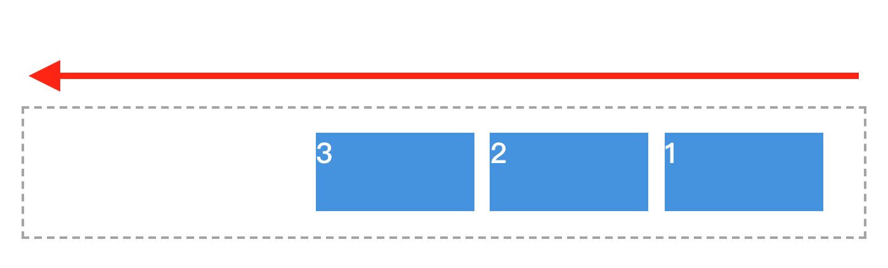

  - **`column`**：主轴显示为列，方向是从上到下

    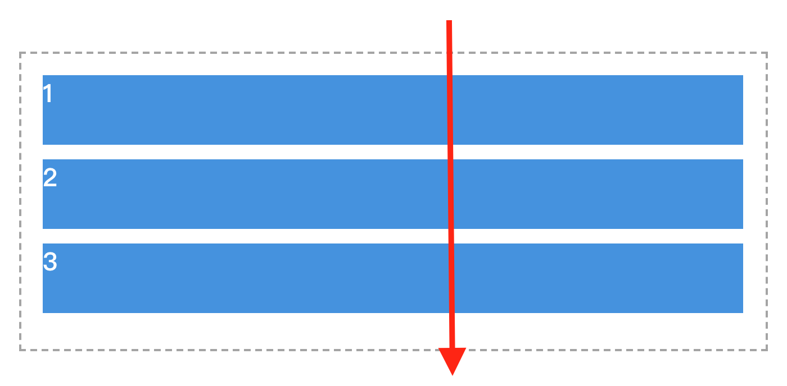

  - **`column-reverse`**：主轴显示为列，但方向和 `column` 属性值是相反，即从下到上

    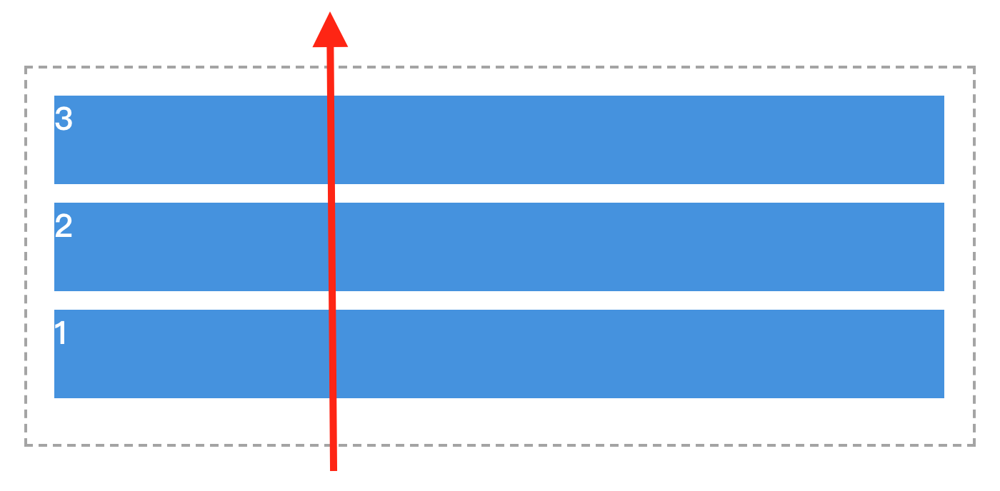

- **`flex-wrap`** 定义 flex item 是单行显示还是换行显示，语法如下：

  ```
  flex-wrap: nowrap | wrap | wrap-reverse
  ```

  - **`nowrap`**：默认值，flex item 单行显示，不换行，可能会导致 flex item 溢出。这需要对 CSS 宽度有一定认识，具体表现如下：

    - 如果 flex item 最小内容宽度（`min-content`）之和大于 flex container 宽度，则 flex item 会溢出

      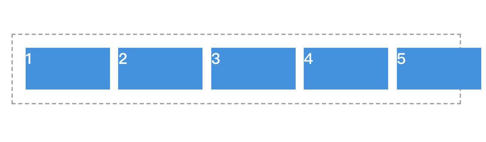

    - 如果 flex item 最小内容宽度（`min-content`）之和小于 flex container 宽度，有以下表现：

      - flex item 默认的 `fit-content` 宽度之和大于 flex container 宽度，则 flex item 宽度收缩填满容器，内容不溢出

        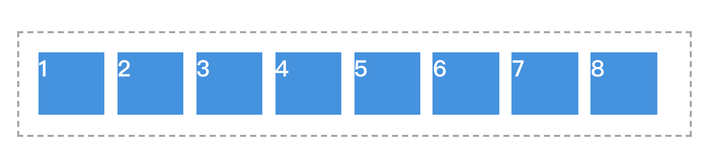

      - flex item 默认的 `fit-content` 宽度之和小于 flex container 宽度，则 flexitem 以`fit-content`宽度正常显示，内容不溢出

        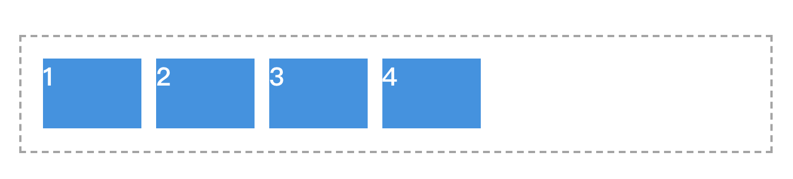

  - **`wrap`**：flex item 在容器宽度不足时换行，第一行在上面

    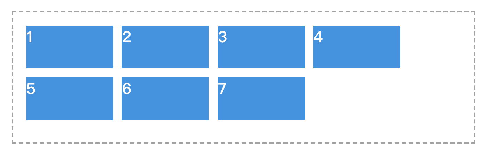

  - **`wrap-reverse`**：flex item 在容器宽度不足时换行，第一行在下面

    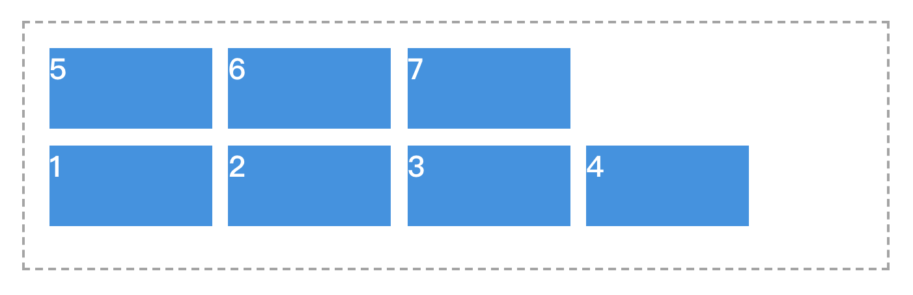

- **`flex-flow`** 是 `flex-direction` 属性和 `flex-wrap` 属性的简写，语法如下：

  ```
  flex-flow: <'flex-direction'> || <'flex-wrap'>
  ```

- **`justify-content`** 定义了 flex item 在主轴上的对齐和分布方式，语法如下

  ```
  justify-content: normal | flex-start | flex-end | center | space-between | space-around | space-evenly
  ```

  - `normal` 是初始值，在 flex 布局中和 `flex-start` 属性值的效果一样

  - **`flex-start`**：flex item 在主轴方向上左对齐。每行的第一个 flex item 从主轴起点开始，后续的 flex item 紧跟前一个对齐

    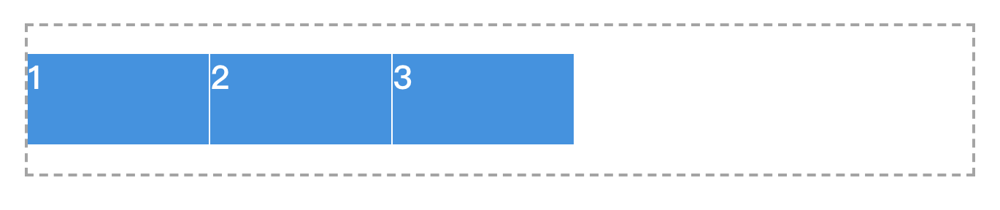

  - **`flex-end`**：flex item 在主轴方向上右对齐。每行的最后一个 flex item 从主轴终点开始，其它的 flex item 与后一个对齐

    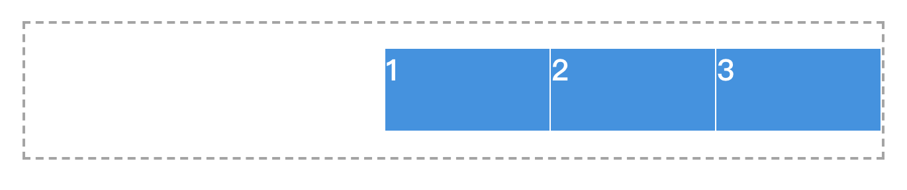

  - **`center`**：flex item 表现为居中对齐

    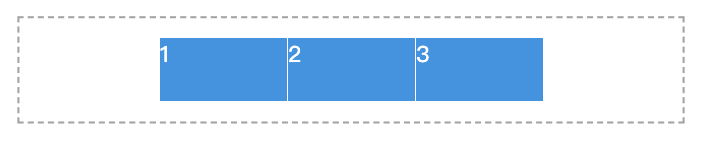

  - **`space-between`**：flex item 均匀分布在主轴方向上，表现为两端对齐。flex item 之间的间距相等，每行的第一个 flex item 与主轴起点对齐，最后一个 flex item 与主轴终点对齐

    

  - **`space-around`**：flex item 均匀分布在主轴方向上。flex item 之间的间距相等，但是每行第一个 flex item 与主轴起点之间有间距，每行最后一个 flex item 与主轴终点之间也有间距，它们的间距宽度都是 flex item 之间间距的一半

    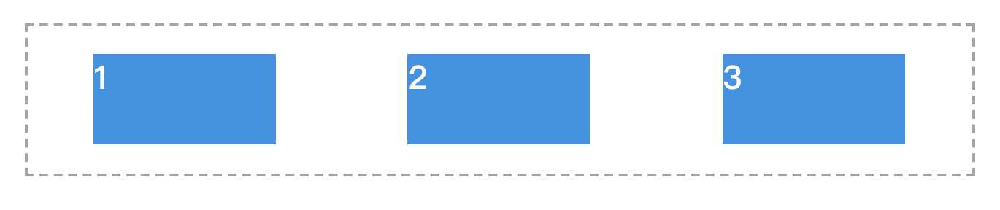

  - **`space-evenly`**：flex item 均匀分布在主轴方向上。flex item 之间的间距、每行第一个 flex item 到主轴起点之间的间距、每行最后一个 flex item 到主轴终点之间的间距都相等

    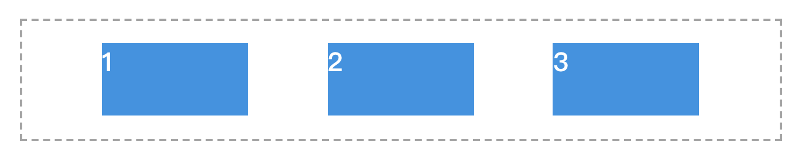

- **`align-items`** 定义了 flex item 在交叉轴上的对齐方式，语法如下：

  ```
  align-items: normal | stretch | flex-start | flex-end | center | baseline
  ```

  - `normal` 是初始值，在 flex 布局中和 `stretch` 属性值的效果一样

  - **`stretch`**： 如果 flex item 未设置高度（交叉轴方向上 flex item 的大小），则将 flex item 拉伸到 flex container 在交叉轴上的尺寸；如果 flex item 设置了高度，则按照设置的高度值渲染，而非拉伸

    - flex item 未设置高度

      

    - flex item 设置了高度

      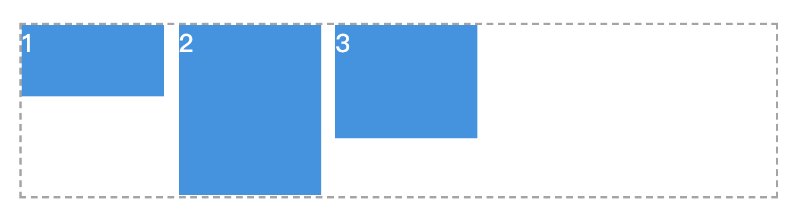

  - **`flex-start`**：flex item 沿着交叉轴起点对齐

    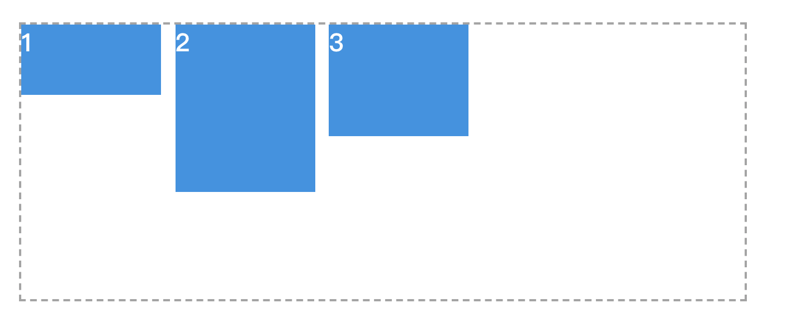

  - **`flex-end`**：flex item 沿着交叉轴终点对齐

    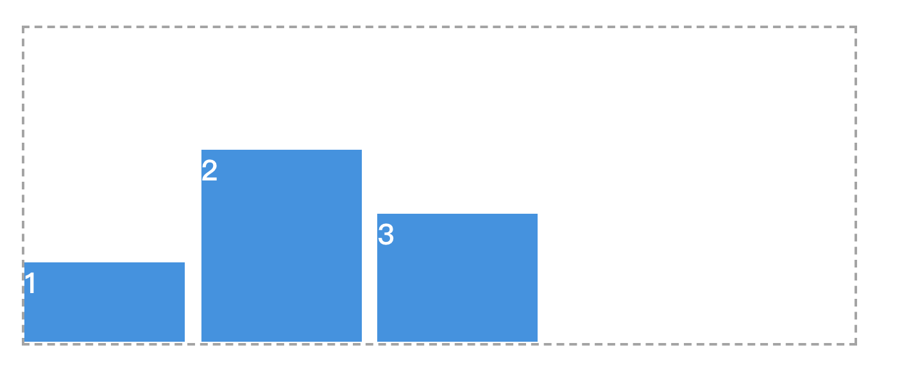

  - **`center`**：flex item 在交叉轴上居中对齐

    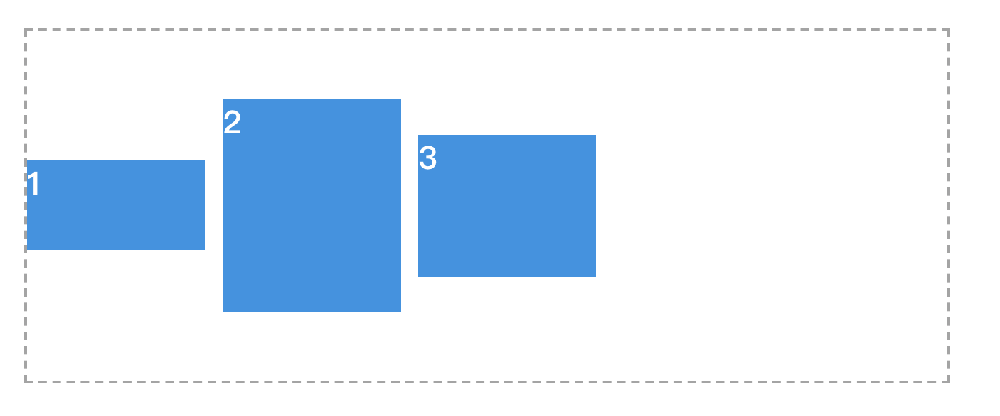

  - **`baseline`**：flex item 都相对于 flex container 的基线对齐

    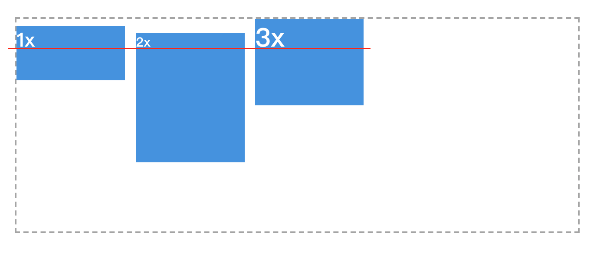

- **`align-content`** 定义 flex item 有多行的情况下在交叉轴上的对齐方式。如果 flex item 只有一行，则 `align-content` 是没有任何效果的。语法如下：

  ```
  align-content: normal | stretch | flex-start | flex-end | center | space-between | space-around | space-evenly
  ```

  - `normal` 是初始值，表现为未设置 `align-content` 属性的方式填充，在 flex 布局中和 `stretch` 属性值的效果一样

  - **`stretch`**：每行交叉轴上的空间都会被拉伸以填满交叉轴上的剩余空间，剩余空间平均地分配给每一行。如果 flex item 未设置高度，则剩余空间会分配给 flex item；如果 flex item 设置了高度，则按照 flex item 设置的高度值渲染而不会拉伸。比如，如果共有两行 flex item，则每一行拉伸高度都是50%，在每行中，未设置高度的 flex item 会被拉伸到每行的高度；设置了高度的 flex item 只会按照其高度值渲染

    - flex item 全部未设置高度，flex item 被拉伸到每行容器的高度值（只有两行，则每行的高度都是总容器的 50%）

      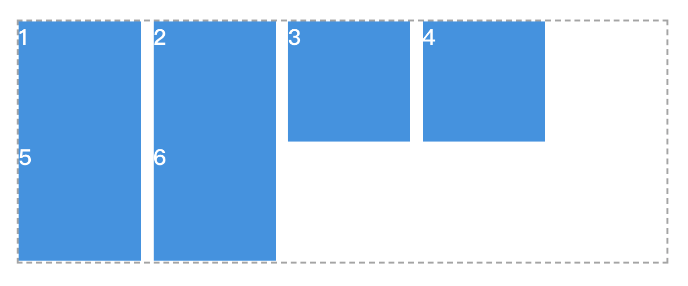

    - flex item 全部设置了高度，则按照 flex item 设置的高度值渲染

      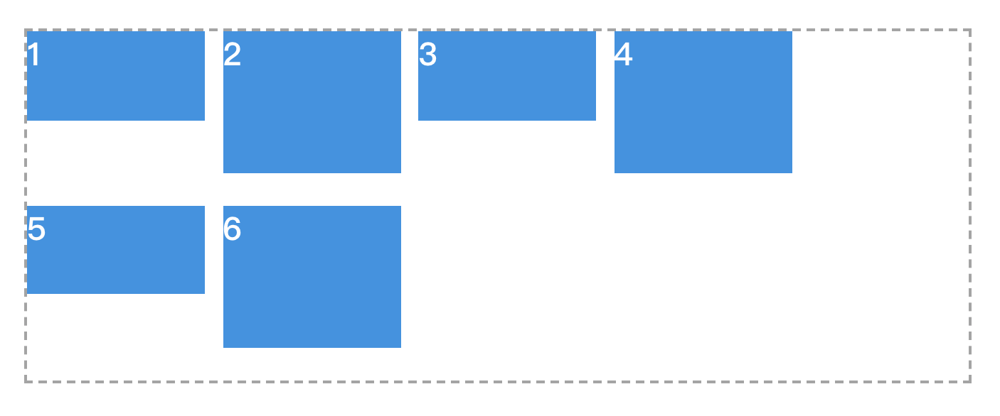
    
    - flex item 每行中一部分设置高度，一部分未设置高度。下图中，编号 1、3、5 未设置高度，它们会被拉伸到每行容器的高度；编号 2、4、6 设置了高度，则它们按照自身的高度值渲染

      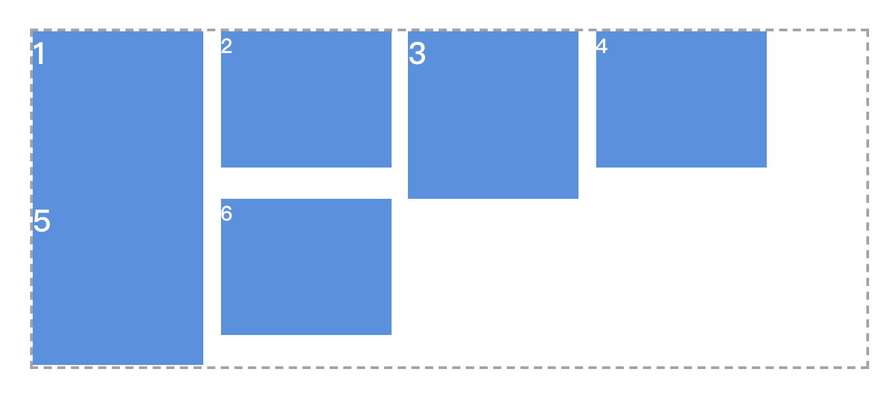

  - **`flex-start`**：第一行的 flex item 沿着交叉轴起点对齐，后面行的 flex item 紧接着上一行对齐

    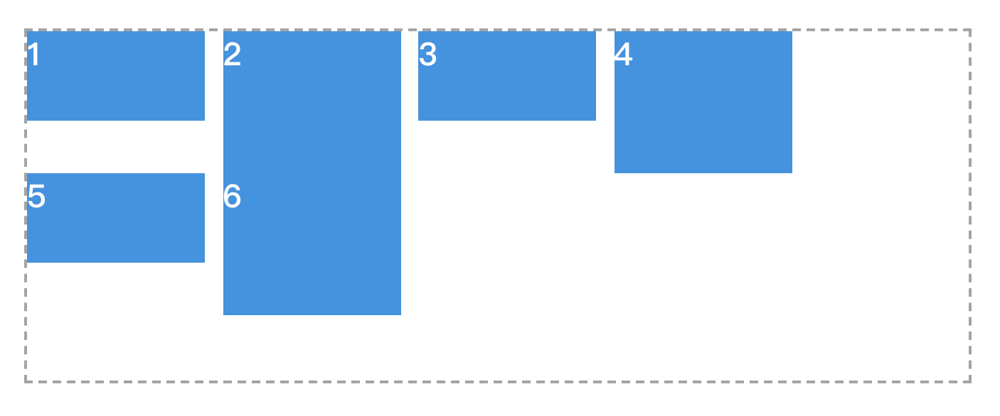

  - **`flex-end`**：最后一行的 flex item 沿着交叉轴终点对齐，其它行的 flex item 与前一行对齐

    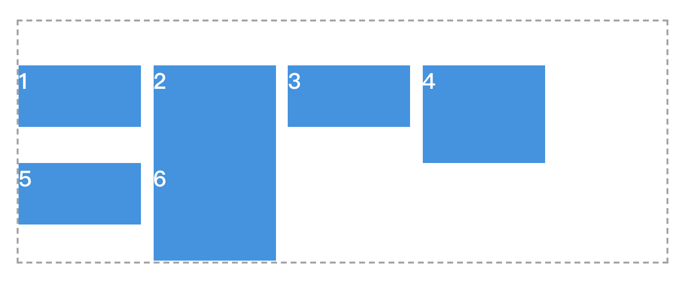

  - **`center`**：所有行的 flex item 在交叉轴上居中对齐，每行 flex item 互相紧挨着

    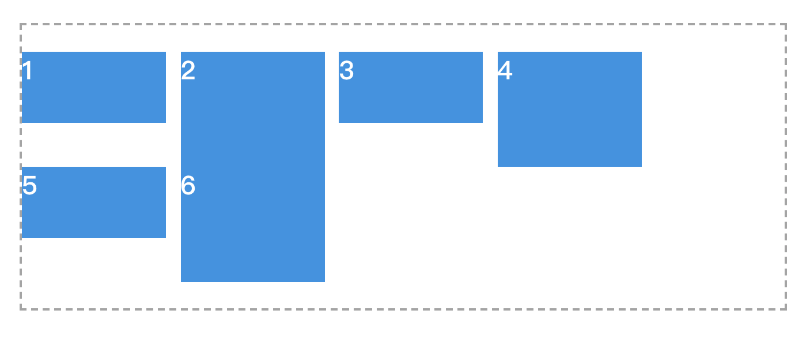

  - **`space-between`**：所有行的 flex item 都在交叉轴上均匀分布，每行之间的间距相等，第一行的 flex item 沿着交叉轴起点对齐，最后一行的 flex item 沿着交叉轴终点对齐

    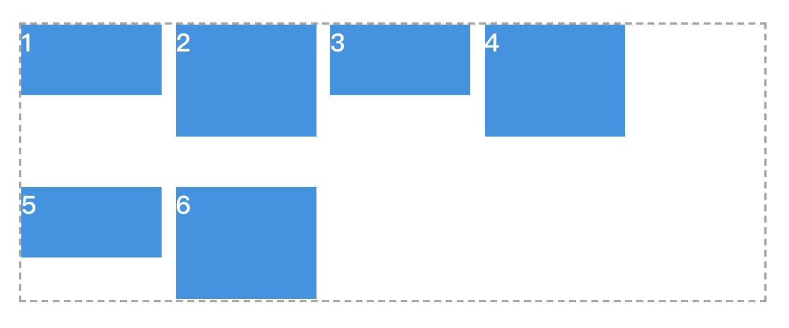

  - **`space-around`**：所有行的 flex item 都在交叉轴上均匀分布，每行之间的间距相等，第一行到交叉轴起点距离和最后一行到交叉轴终点的距离都等于每行之间间距的一半

    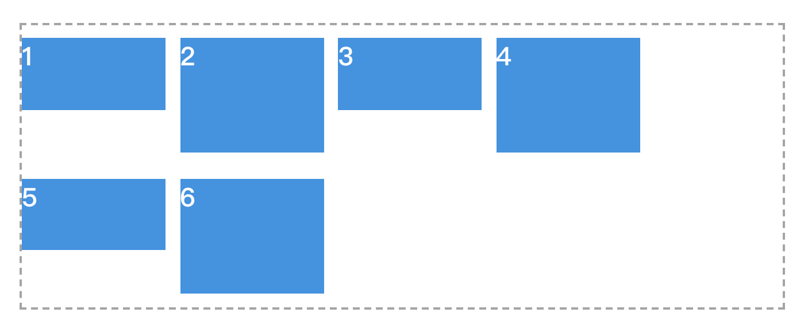
  
  - **`space-evenly`**：所有行的 flex item 都在交叉轴上均匀分布，第一行到交叉轴起点的距离、最后一行到交叉轴终点的距离、每行之间的间距都相等
  
    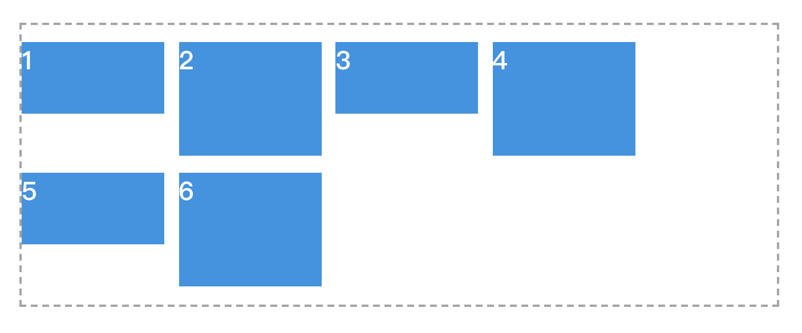

### 四、flex item 属性

作用于 flex item 的 CSS 属性共有六个，分别是：`order`、`flex-grow`、`flex-shrink`、`flex-basis`、`flex`、`align-self`

- **`order`** 定义了 flex item 在容器中布局时的排列顺序，flex item 按照 `order` 属性的值的增序进行排列（值越小，排列越靠前），拥有相同  `order` 属性值的 flex item 按照它们在源代码中出现的顺序进行排列。`order` 属性的初始值为 0，其值的格式是整数，语法如下：

  ```
  order: <integer>
  ```

  比如，下图中编号为 3 的 flex item 设置 `order: -1` 后的布局

  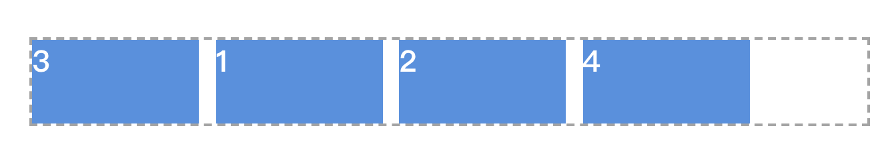

  注意：`order` 属性值只对元素的视觉顺序产生作用，并不会影响元素的逻辑顺序或 tab 顺序

- **`flex-grow`** 定义了 flex item 在主轴方向上扩展的比例，扩展的来源是剩余空间（flex container 的大小减去 flex item 的大小后的尺寸）。`flex-grow` 的初始值为 0，表示不占用剩余空间来扩展自己的大小，该属性值的格式为 number，负值无效，可以为小数，语法如下：

  ```
  flex-grow: <number>
  ```

  如果有 flex item 的 `flex-grow` 属性值大于 0，flex container 的剩余空间就会发生分配，具体规则如下：

  - 剩余空间的总量是 1

  - 只有一个 flex item 设置 `flex-grow` 属性：
    - 如果 `flex-grow` 属性值 < 1，则扩展的大小是该属性值 * 剩余空间，比如示例一
    - 如果 `flex-grow` 属性值 >= 1，则独享整个剩余空间，比如示例二
  - 多个 flex item 设置 `flex-grow` 属性：
    - 如果各个 `flex-grow` 属性值的总和 < 1，则每个 flex item 的扩展大小是当前元素的 `flex-grow` 属性值 * 剩余空间，比如示例三
    - 如果各个 `flex-grow` 属性值的总和 >= 1，则所有的剩余空间都会被分配，每个 flex item 的分配比例就是它们 `flex-grow` 的属性值比例。比如，所有 flex item 都设置 `flex-grow: 1` ，则表示所有的 flex item 等分剩余空间；如果flex item 设置的 `flex-grow` 属性值的比例为 2:1:1，则第一个 flex item 会占据 2 / 4 的剩余空间，后两个 flex item 会占据 1 / 4 的剩余空间，比如示例四

  比如当前有一 flex container，容器大小为 500px，它有 4 个 flex item，每个flex item 的 main size 为 100px，那么剩余空间为 100px，有以下设置 `flex-grow` 的情况：

  - 示例一，只有编号为 3 的 flex item设置了 `flex-grow: 0.5` ，那么它的扩展大小是 0.5 * 100，扩展后的主轴尺寸为 150px

    

  - 示例二，只有编号为 3 的 flex item 设置了 `flex-grow: 1`，那么它将独享整个剩余空间，那么它扩展后的主轴尺寸为 200px

    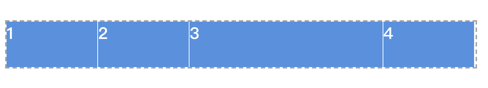

  - 示例三，每个 flex item 的 `flex-grow` 属性值分别设置为：0.1、0.2、0.3、0.1，那么它们的扩展大小分别是：0.1 * 100、0.2 * 100、0.3 * 100，0.1 * 100，扩展后的主轴尺寸为：110px、120px、130px、110px

    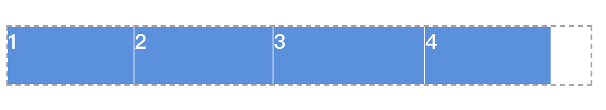

  - 示例四，每个 flex item 的 `flex-grow` 属性值分别设置为：2、1、3、4，那么它们的扩展大小分别是：2 / 10  * 100、1 / 10 * 100、3 / 10 * 100，4 / 10 * 100，扩展后的主轴尺寸为：120px、110px、130px、140px

    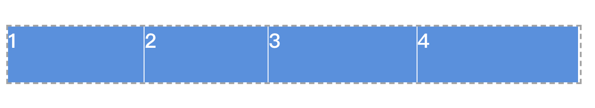

- **`flex-shrink`** 

- **`flex-basis`** 

- **`flex`** 

- **`align-self`** 

