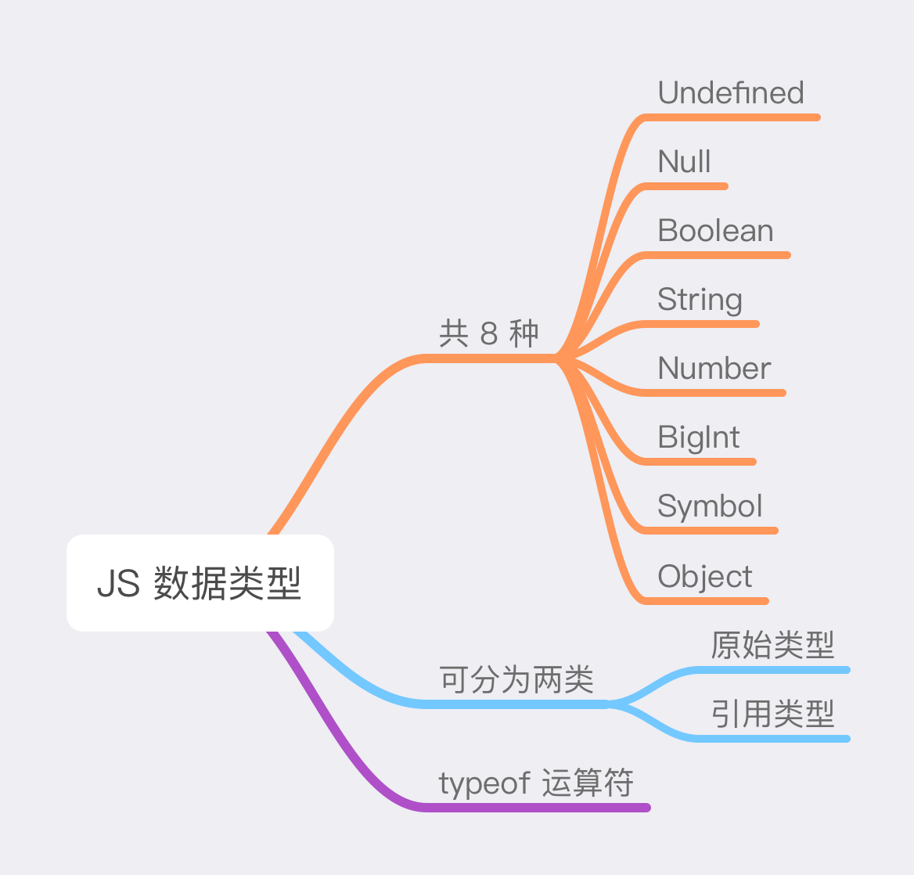

# JS 数据类型



### 数据类型

在 JavaScript 中，每个值都有其对应的数据类型。目前 JavaScript 中共有 **8** 种数据类型：

1. **`Undefined`** 类型：未定义的值——只有一个特殊值 `undefined`。
2. **`Null`** 类型：未知的值——只有一个特殊值 `null`。
3. **`Boolean`** 类型：布尔值——只有两个值：`true`、`false`。
4. **`String`** 类型：字符串——由 0 个或多个 16 位的 Unicode 字符序列组成。
5. **`Number`** 类型：数字类型——使用 64 位的 IEEE 754 格式表示整数和浮点数。
6. **`BigInt`** 类型：数字类型——表示任意长度的整数。
7. **`Symbol`** 类型：表示唯一的标识符。
8. **`Object`** 类型：表示一组无序键值对的集合，用于储存复杂的数据结构。

可以将它们分为两类：

- **原始类型**：`Undefined`、`Null`、`Boolean`、`String`、`Number`、`BigInt`、`Symbol`。
- **引用类型**：`Object`。

### typeof 运算符

当需要检验数据类型时，可以使用 `typeof` 运算符——返回一个字符串，表示未经计算的操作数的数据类型，用法是 `typeof` 后接操作数：

```javascript
typeof operand
typeof (operand)
```

下表是 `typeof` 可能的返回值。

|  数据类型   |    结果     |
| :---------: | :---------: |
| `Undefined` | 'undefined' |
|   `Null`    |  'object'   |
|  `Boolean`  |  'boolean'  |
|  `String`   |  'string'   |
|  `Number`   |  'number'   |
|  `BigInt`   |  'bigint'   |
|  `Symbol`   |  'symbol'   |
|  `Object`   |  'object'   |
|    函数     | 'function'  |
|    数组     |  'object'   |
|  其它对象   |  'object'   |

示例：

```javascript
// Undefined
let a;
typeof a; // 'undefined'

// Null
let b = null;
typeof b; // 'object'

// Boolean
let c1 = true;
typeof c1; // 'boolean'

let c2 = false;
typeof c2; // 'boolean'

// String
let e1 = 'JavaScript';
typeof e1; // 'string'

let e2 = '';
typeof e2; // 'string'

let e3 = '123';
typeof e3; // 'string'

// Number
let f1 = 987;
typeof f1; // 'number'

let f2 = 3.14159;
typeof f2; // 'number'

typeof NaN; // 'number'

// BigInt
let g = 24n;
typeof g; // 'bigint'

// Symbol
let h = Symbol('foo');
typeof h; // 'symbol'

// Object
let person = {
  name: 'lufei',
  age: 18
};
typeof person; // 'object'

let array = [1, 3, '5'];
typeof array; // 'object'

let date = new Date();
typeof date; // 'object'

let regex = /\d/;
typeof regex; // 'object'

let str = new String('JavaScript');
typeof str; // object

let num = new Number(100);
typeof num; // 'object'

typeof Math; // 'object'

// 函数
function fn1() {}
typeof fn1; // 'function'

const fn2 = function xxx() {};
typeof fn2; // 'function'
```

额外说明：

1. `typeof null === 'object'` 是官方承认的 `typeof` 错误，该问题来自于 JS 语言早期阶段，并为了兼容性而保留了下来。

   > 在 JavaScript 最初的实现中，JavaScript 中的值是由一个表示类型的标签和实际数据值表示的。对象的类型标签是 0。由于 `null` 代表的是空指针（大多数平台下值为 0x00），因此，null 的类型标签是 0，`typeof null` 也因此返回 `'object'`。

2. JS 中没有数据类型是 `function`，函数隶属于 `Object`。这也是来自于 JS 语言早期的问题。
