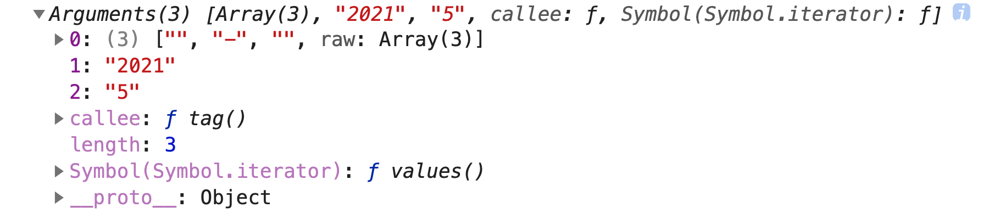

# 数据类型

### 数据类型分类

在 JavaScript 中，每一个值都有其对应的数据类型。目前 JavaScript 中共有 8 种数据类型，它们可以分为两个大类：**原始类型**、**复杂类型**：

- 原始类型：

  1. `Undefined` 只有一个特殊值 `undefined`，表示未定义或不存在。
  2. `Null` 只有一个特殊值 `null` ，表示空值。
  3. `Boolean` 布尔类型，表示布尔值，它有两个值分别是：`true`、`false`。
  4. `String` 字符串类型，表示文本数据，比如 `'JavaScript'`。
  5. `Number` 数字类型，使用 64 位双精度浮点型来表示整数或浮点数，比如 `25`、`3.14`。
  6. `BigInt` 数字类型，可以表示任意精度格式的整数。
  7. `Symbol` 表示唯一的标识符。
- 复杂类型：

  8. `Object` 表示一组无序键值对的集合。

### typeof 操作符

要确定 JavaScript 中变量的值的是什么类型，可以使用 `typeof` 操作符，它返回一个字符串来表示操作数（未经计算）的数据类型，使用方法如下：

```
typeof operand
typeof (operand)
```

`typeof` 可能的返回值如下表：

|    类型     |    结果     |
| :---------: | :---------: |
| `Undefined` | 'undefined' |
|   `Null`    |  'object'   |
|  `Boolean`  |  'boolean'  |
|  `String`   |  'string'   |
|  `Number`   |  'number'   |
|  `BigInt`   |  'bigint'   |
|  `Symbol`   |  'symbol'   |
|  `Object`   |  'object'   |
|    函数     | 'function'  |
|    数组     |  'object'   |
|  其它对象   |  'object'   |

`typeof` 使用示例如下：

```javascript
// Undefined
let a;
typeof a; // 'undefined'

// Null
let b = null;
typeof b; // 'object'

// Boolean
let c1 = true;
typeof c1; // 'boolean'
let c2 = false;
typeof c2; // 'boolean'

// String
let e1 = 'JavaScript';
typeof e1; // 'string'
let e2 = '';
typeof e2; // 'string'
let e3 = '123';
typeof e3; // 'string'

// Number
let f1 = 987;
typeof f1; // 'number'
let f2 = 3.14159;
typeof f2; // 'number'

// BigInt
let g = 24n;
typeof g; // 'bigint'

// Symbol
let h = Symbol('foo');
typeof h; // 'symbol'

// 对象
let personObject = {
  name: 'lufei',
  age: 18
};
typeof personObject; // 'object'
let array = [1, 3, '5'];
typeof array; // 'object'
let date = new Date();
typeof date; // 'object'
let regex = /\d/;
typeof regex; // 'object'
typeof Math; // 'object'

// 函数
function fn1() {}
typeof fn1; // 'function'
const fn2 = function xxx() {};
typeof fn2; // 'function'
```

### `Undefined` 类型

在 `Undefined` 类型中只有一个值——特殊值 `undefined`，**它表示未定义，就是此处应该有一个值，但是没有定义**。在以下场景中可以得到 `undefined` 值：

- 变量声明了，但未被赋值。

  ```javascript
  let a;
  a; // undefined
  ```

- 对象没有被赋值的属性。

  ```javascript
  let obj = new Object();
  obj.name; // undefined
  ```

- 函数没有返回值时，默认返回 `undefined`。

  ```javascript
  function fn() {}
  fn(); // undfined
  ```

- 调用函数时，应该提供的参数没有提供，那么该参数就是 `undefined`。

  ```javascript
  function fn(a) {
    console.log(a)
  }
  fn(); // undefined
  ```

- 对未定义的变量使用 `typeof` 操作符也会得到 `undefined`。

  ```javascript
  // 变量 foo 未定义
  typeof foo; // undefined
  ```

当然，也可以显示地给变量赋值 `undefined`：

```javascript
let a = undefined;
a === undefined; // true
```

但是这是不必要且不合理的，因为默认情况下，任何未经初始化的变量都会取得特殊值 `undefined`。一般来说，永远不要显示地给变量赋值 `undefined`。

### `Null` 类型

`Null` 类型也只有一个值——特殊值 `null`，**它表示一个空对象指针，即已经定义了，只是为空值**。比如，在声明一个将来要保存对象值的变量时，可以用 `null` 来进行初始化：

```javascript
let query = null;
```

在使用相等操作符时，JavaScript 认为 `undefined` 和 `null` 在表面上是相等的：

```javascript
undefined == null; // true
```

但二者还是有一些不同之处：

- `undefined` 表示根本未定义；而 `null` 表示定义了只是为空值。所以判断一个值是否存在可以使用 `undefined`：

  ```javascript
  name === undefined;
  ```

- 在转换成数值时，`Number(undefined)` 是 `NaN`；而 `Number(null)` 是 0。

- 给变量赋值 `undefined` 是不合理的；而给变量赋值 `null` 是合理的。

- 在严格相等操作符下二者并不相等。

### `Boolean` 类型

布尔值是一种取值只能是真或假的数据类型，它赋予了编程语言在逻辑上表达真或假的能力。有了这种能力，`if` 语句、`for` 循环等才能实现。

在 JavaScript 中，`Boolean` 类型的真假值分别用 `true` 和 `false` 来表示，二者都区分大小写。下面是给变量赋值布尔值的示例：

```javascript
let visible = false;
let loading = true;
```

虽然 `Boolean` 类型只有两个布尔值，但其它数据类型的值都有相应的布尔值的等价形式。要将其它类型的值转换成一个布尔值，需要使用 `Boolean()` 函数，使用方法如下：

```javascript
let stringAsBoolean = Boolean('foo');
stringAsBoolean; // true

let numberAsBoolean = Boolean(0);
numberAsBoolean; // false
```

在上面代码中，字符串 `foo` 和数值 `0` 都会被 `Boolean()` 函数转换为相应的布尔值：分别是 `true` 和 `false`。那么哪些值会被转换为 `true`，哪些值又会被转换为 `false` 呢？这取决于以下规则：

**`undefined`、`null`、`''`（空字符串）、`0`、`NaN`、`false` 这 6 个值会被转换成 `false`，其余的值都会被转换成 `true`**。请看如下示例：

```javascript
Boolean(undefined); // false
Boolean(null); // false
Boolean(''); // false
Boolean(0); // false
Boolean(NaN); // false
Boolean(false); // false

Boolean('aaa'); // true
Boolean(' '); // true，这是包含了空格的字符串，并不是空字符串，注意区分
Boolean(123); // true
let obj = {};
Boolean(obj); // true
let array = [];
Boolean(array); // true
function fn() {}
Boolean(fn); // true
```

同时，在 JavaScript 中，凡是预期为布尔值的位置，都会将该位置上的值自动转换为相应的布尔值，转换规则还是上面那条。比如，在 `if` 流程控制语句中：

```javascript
let a = 'foo';
if (a) {
  console.log('a 被自动转换为了 true')；
}
```

运行上面代码，控制台上会输出 `a 被自动转换为了 true` 。这是因为 `if` 后面的判断条件，预期是一个布尔值，所以字符串 `a` 会被自动转换成布尔值 `true`，从而执行了代码块内的代码。

### `String` 类型

##### 字符串定义及使用

**`String` 类型用于存储文本数据，可以表示零个或多个 16 位（两个字节） Unicode 字符序列**。了解更多关于 Unicode 的信息可以查看[Unocde](./unicode.md)。字符串通常使用单引号（''）、双引号（"")、反引号（``）来标示：

```javascript
let a = 'aaa';
let b = "bbb";
let c = `ccc`;
```

同时，单引号的内部可以使用双引号或反引号；双引号内部可以使用单引号或反引号；而反引号内部也可以使用单引号或双引号，比如下面这些代码的语法都是合法的：

```javascript
let a1 = '"a11"';
let a2 = '`a22`';

let b1 = "'b11'";
let b2 = "`b22`";

let c1 = `'c11'`;
let c2 = `"c22"`;
```

需要值得注意的是：**以某种引号开头的字符串，就必须以该引号作为字符串的结尾**，否则会导致语法错误，比如：

```javascript
let name = 'lufei"; // Uncaught SyntaxError: Invalid or unexpected token
```

由于通常在 HTML 中属性值使用双引号，所以在 JavaScript 中一般约定字符串使用单引号。

##### 多行字符串

有时候，代码中可能包含着很长的字符串，为了排版好看通常会将长字符串分成多行写，比如：

```javascript
let address = '广东省广州市
某某区某某路189号
某某小区...
';
```

在分成多行写后，打开控制台会发现报错信息 `Uncaught SyntaxError: Invalid or unexpected token`，原因是因为字符串在单引号或双引号中只能写在一行内，分成多行写会报错。

不过，可以使用下面的方法达到字符串多行写的目的：

- 每行末尾使用反斜杠（`\`），并且反斜杠后只能接换行符（注意：输出的字符串仍然是单行）：

  ```javascript
  let address = '广东省广州市 \
  某某区某某路189号 \
  某某小区...';
  console.log(address); // 广东省广州市 某某区某某路189号 某某小区...
  ```

  不过该方法有个缺点是反斜杠后必须接换行符才会起作用，如果不小心在反斜杠加了空格，代码仍然会报错：

  ```javascript
  let address = '广东省广州市 \ 
  某某区某某路189号 \
  某某小区...';
  // 报错，Uncaught SyntaxError: Invalid or unexpected token
  ```

- 可以使用 `+` 操作符，将多个单行字符串拼接起来（注意：输出的字符串仍然是单行）：

  ```javascript
  let address = '广东省广州市 ' +
      '某某区某某路189号 ' +
      '某某小区...';
  console.log(address); // 广东省广州市 某某区某某路189号 某某小区...
  ```

- 可以使用模板字面量，它通过反引号来标示（输出的字符包含换行符）：

  ```javascript
  let address = `广东省广州市
  某某区某某路189号
  某某小区...
  `;
  console.log(address); // 广东省广州市\n某某区某某路189号\n某某小区...\n
  ```

##### 字符串长度和访问字符

对于由两个字节字符组成的字符串长度可以通过 `length` 属性正确获取，比如：

```javascript
'123'.length; // 3，该字符串都是由两个字节的字符组成
'😂123'.length; // 5，😂 是一个由四个字节表示的表情字符，length 属性不能正确识别其长度
Array.from('😂123').length; // 4，可以通过这个方法获取正确字符串长度
```

要获取字符串中某个位置的字符，可以使用方括号 `[index]`，字符串位置编号从 0 开始，比如：

```javascript
let lang = 'JavaScript';
lang[0]; // J
lang[5]; // c
```

注意，如果方括号中的数字比字符串长度大，或者方括号中根本不是数字，则都返回 `undefined`：

```javascript
let lang = 'JavaScript';
lang[20]; // undefined
lang[-9]; // undefined
lang[true]; // undefined
lang['a']; // undefined
```

##### 字符串是不可更改的

不同于类 C 语言，JavaScript **字符串是不可更改的**。这意味着字符串一旦被创建，就不能被修改，比如下面代码就可以证明字符串被创建后是无法修改的：

```javascript
let a = 'aaa';
console.log(a[0]); // a
a[0] = 'A';
console.log(a[0]); // a
console.log(a); // aaa
```

如果一定要修改某个变量中的字符串值，就必须先销毁原始的字符串，然后将包含新值的字符串分配给该变量：

```javascript
let date = '2021';
date = '2021-' + '05';
```

以上代码中，最开始变量 `date` 的值是字符串 `'2021'`，随后变量 `date` 被重新定义为两个字符串值 `'2021-'` 和 `'05'` 的组合。在这个过程中，会先分配一个可以容纳 7 个字符的空间，填充上 `'2021-'` 和 `'05'` ，紧接着将原始的字符串 `'2021-'` 和 `'05'` 销毁。

同时，还可以基于对原始字符串的操作来创建新的字符串。比如使用 `String.prototype.concat()`，该方法会一个或多个字符串与原字符串连接合并，并返回一个新的字符串，如下代码：

```javascript
let city = '广州市';
let street = '某某街道';
let address = city.concat(street);
console.log(address); // 广州市某某街道
```

##### 转义字符

反斜杠（`\`）在字符串内有特殊含义，可进行转义，故称为转义符。字符串内需要用反斜杠进行转义的转义字符有下面这些：

- `\n` ：换行
- `\r` ：回车
- `\b` ：退格
- `\f` ：换页
- `\t` ：水平制表符
- `\v` ：垂直制表符
- `\\` ：反斜杠
- `\'` ：单引号
- `\"` ：双引号
- `` \` ``：反引号
- `\xnn`：以十六进制编码 `nn` 表示的字符（`n` 是十六进制数字0~F），例如 `\x41` 等于 `'A'`
- `\unnnn`：以十六进制编码 `nn` 表示的 Unicode 字符（`n` 是十六进制数字0~F），例如 `\u00A9` 等于 `'©'`

以上这些转义字符都可以出现在字符串中的任意位置，并且会被当作**单个字符**解释：

```javascript
let a = '这个是版权符号\u00A9';
```

上面代码中，尽管变量 `a` 包含着 6 个字符长的转义符 `\u00A9`，但它实际上仍只有 8 个字符长，这是因为转义 `\u00A9` 只表示一个字符。

注意：如果在非特殊字符前使用反斜杠，则反斜杠会被省略：

```javascript
let a = '\aaa';
console.log(a); // aaa
```

##### 其它类型转换为字符串

在 JavaScript 中，要想把其它类型的数据转换成字符串，有以下方法：

- 使用 `+` 操作符给一个值加上空字符串 `''`  会得到该值的字符串等价物，比如：

  ```javascript
  let a;
  a + ''; // 'undefined'
  
  let b = null;
  b + ''; // 'null'
  
  let c = false;
  d + ''; 'false'
  
  let d = 2.89;
  c + ''; // '2.89'
  
  let e = 24n;
  e + ''; // '24'，n 被去掉，不会作为字符串的一部分
  
  let g = Symbol('foo');
  g + ''; // symbol 原始值不能转换为字符串，会报错：Uncaught TypeError: Cannot convert a Symbol value to a string
  
  let personObj = {
    name: 'lufei',
    age: 19
  };
  personObj + ''; // '[object Object]'
  
  let list = [1, 3, 5];
  list + ''; // '1, 3, 5'，数组会反回一个包含着用逗号分隔的每个数组元素的字符串
  
  function fn() {}
  fn + ''; // 'function fn() {}'
  ```

- 除了 `undefined` 和 `null` 没有 `toString()` 方法外，其它数据类型都可以使用该方法返回相应的字符串，比如：

  ```javascript
  let a = true;
  a.toString(); // 'true'
  
  let b = 'xxx';
  a.toString(); // 'xxx'，字符串类型也有 toString() 方法
  
  // 在 Number、BigInt 数据类型中，toString() 方法可以通过接收参数得到该数值不同进制的字符串
  // 参数不在 2 到 36 之间则会抛出 RangeError 报错
  let c = 123;
  c.toString(); // '123'，默认是十进制
  c.toString(2); // '1111011'
  c.toString(8); // '173'
  c.toString(16); // '7b'
  let d = 79n;
  d.toString(8); // '117'，n 会被去掉
  d.toString(16); // '4f'，n 会被去掉
  
  let f = Symbol('foo');
  f.toString(); // 'Symbol(foo)'
  
  let car = { price: 100 };
  car.toString(); // '[object Object]'
  
  let list = [1, 3, 5];
  list.toString(); // '1, 3, 5'
  
  function fn() {}
  fn.toString(); // 'function fn() {}'
  ```

- 使用 `String()` 函数，不管什么类型的值，它都会返回一个表示当前值的字符串。它的转换规则如下：

  1. 如果值有 `toString()` 方法，则不加参数地调用该方法并返回结果。
  2. 如果值是 `undefined`，则返回 `'undefined'`。
  3. 如果值是 `null`，则返回 `'null'`。

##### 模版字面量

模板字面量是允许嵌入表达式的字符串字面量，它使用反引号来标示字符串，具有以下特性：

- 支持跨行定义字符串，输出后会保留反引号内的空格和换行符，如下代码：

  ```javascript
  let tel = `187
  89
  45
  2...`;
  console.log(tel); // '187\n89\n45\n2...'
  
  let test = `abc
              def`;
  console.log(test); // 'abc\n            def'
  test.length; // 19
  ```

- 可使用 `${}` 进行插值，比如：

  ```javascript
  // 以前的字符串插值使用 + 操作符拼接实现
  let year = 2021;
  let month = 5;
  let result = year + '-' + month;
  console.log(result); // '2021-5'
  
  // 现在使用模板字面量
  let resultByTemplate = `${year}-${month}`;
  console.log(resultByTemplate); // '2021-5'
  ```

  所有插入的值都会使用 `toString()` 方法强制转换为字符串，比如：

  ```javascript
  let person = { name: 'lufei' };
  let test = `${person}`;
  console.log(test); // '[object Object]'
  ```

- **标签函数**

  标签函数的形如是 `` tag`${a}` `` 这种形式的函数，可以通过标签函数自定义插值行为。先来看看标签函数的参数是怎样的，如下代码：

  ```javascript
  function tag() {
    console.log(arguments);
  }
  let year = '2021';
  let month = '5';
  tag`${year}-${month}`;
  ```

  调用 `tag` 函数会在控制台打印出一些参数，如下图：

  

  其中，第一个参数是以 `${}` 分隔后的数组，而剩下的参数分别是插值表达式的结果。利用这些参数，可以通过插值表达式结果的不同拼接出不同字符串并返回，如下示例：

  ```javascript
  function caculateScore(stringList, score) {
    let description = stringList[1];
    return score > 60 ? `${description}及格` : `${description}不及格`;
  }
  let score1 = 78;
  let result1 = caculateScore`${score1}这次考试的情况：`;
  console.log(result1); // '这次考试的情况：及格'
  let score2 = 42;
  let result2 = caculateScore`${score2}这次考试的情况：`;
  console.log(result2); // '这次考试的情况：不及格'
  ```

  标签函数这种语法在 [styled-components](https://github.com/styled-components/styled-components) 中也得到了使用，比如：

  ```javascript
  const Title = styled.h1`
    font-size: 1.5em;
    text-align: center;
    color: palevioletred;
  `;
  ```

- **原始字符串**

  在标签函数的第一个参数中，存在一个特殊的属性 `raw` ，我们可以通过它来访问模板字面量中的原始字符串，而不是被转换后的字符，比如：
  
  ```javascript
  function tag(stringList) {
    console.log(stringList.raw[0]);
  }
  
  tag`第一行\n第二行`; // '第一行\n第二行'
  ```
  
  另外，也可以通过 `String.raw` 来获取一个模板字符串的原始字符串，比如：
  
  ```javascript
  // \u00A9 是版权符号
  console.log(String.raw`\u00A9`); // \u00A9
  ```

### `Number` 类型

在其它编程语言中，可能会有好几种不同的数字类型存在，比如：整型、单精度浮点型、双精度浮点型、大数等。但在 JavaScript 中，数字类型只有两种：`Number` 类型和 `BigInt` 类型。先来让我们学习在开发中常用的 `Number` 类型吧。

##### 定义及使用

`Number` 类型是一种定义为 **64 位双精度浮点型**（IEEE 754）的数字数据类型。`Number` 类型可以使用数值字面量来表示整数和浮点数，其字面量格式分别如下：

- **整数字面量**可以使用二进制（以 2 位基数）、八进制（以 8 为基数）、十进制（以 10 为基数）、十六进制（以 16 为基数）来表示，并且可以使用符号 `+` 和 `-` 来表示数值正负，同时遵循以下规则：

  - 二进制整数字面量以 `0b`（或 `0B`）开头，后面只能包含二进制数字：0、1，如下示例：

    ```javascript
    let a = 0b0111;
    let b = 0B11;
    let c = -0b101;
    ```

    如果 `0b` 或 `0B` 后面的数字不是 0 或 1，会导致语法错误，比如：

    ```javascript
    let d = 0b012; // Uncaught SyntaxError: Invalid or unexpected token
    ```

  - 八进制整数字面量以 `0o`（或 `0O`、`0`）开头，后面只能包含八进制数字：0~7，如下示例：

    ```javascript
    let a = 0o01234;
    let b = 0O367;
    let c = 0567;
    let d = -0o123;
    ```

    如果是 `0o` 或 `0O` 后面的数字超出了 0~7 的范围，会导致语法错误，比如：

    ```javascript
    let e = 0o788; // Uncaught SyntaxError: Invalid or unexpected token
    let f = 0O812; // Uncaught SyntaxError: Invalid or unexpected token
    ```

    如果是 `0` 后面的数字超出了 0~7 的范围，会被忽略前缀零，并且后面的数字会被当成十进制数，比如：

    ```javascript
    let g = 0798; // 忽略 0，并且将 798 当作十进制数
    g === 798; // true
    ```

    值得注意的是，严格模式下，八进制整数只能以 `0o` 或 `0O` 开头，如果以 `0` 开头会被视为语法错误。

  - 十进制整数字面量由数字 0~ 9 组成，并且没有特殊意义的前缀 `0`，如下示例：

    ```javascript
    let a = 10;
    let b = 123;
    let c = -9087;
    let d = 0;
    ```

  - 十六进制整数以 `0x` （或 `0X`）开头，后面只能是十六进制数字：0~9 以及 a-f（或大写 A-F），如下示例：

    ```javascript
    let a = 0x123ab;
    let b = 0Xcd;
    let c = -0x9f;
    ```

    同样地，如果 `0x` 或 `0X` 后面的数字超出了对应范围，会导致语法错误，比如：

    ```javascript
    let d = 0x9fh; // Uncaught SyntaxError: Invalid or unexpected token
    ```

  另外，在 JavaScript 中以二进制、八进制、十六进制创建的数值都会被自动转为十进制数，如下示例：

  ```javascript
  let a = 0b1101;
  console.log(a); // 十进制数 13
  a + 1; // 14
  
  let b = 0o732;
  console.log(b); // 十进制数 474
  b - 10; // 464
  
  let c = 0x9af;
  console.log(c); // 十进制数 2479
  c * 4; // 9916
  ```

- **浮点数字面量**的表示由以下组成：

  - 一个十进制整数，并且可以带符号 `+` 和 `-` 表示正负。
  - 小数点（`.`）。
  - 一组十进制数组成小数部分。

  如下示例：

  ```javascript
  let a = 2.8;
  let b = 0.5;
  let c = -10.9;
  let d = 10.2354;
  ```


##### 数值的科学记数法表示

如果开发中需要写数值一百万，可以这样写：

```javascript
let million = 100000;
```

但这样写很容易多打或少打一个零，从而影响后面的运算。对于非常大或者非常小的数值，可以使用科学记数法来表示。

>科学记数法是一种记数的方法，它把一个数表示成 a 与 10 的 n 次幂相乘的形式。当我们要标记或运算某个较大或较小且位数较多时，用科学记数法免去浪费很多空间和时间

**在 JavaScript 中，科学记数法的格式是一个数字后跟 `e`（或 `E`），再加上一个需要乘 10 的多少次幂来表示**。比如刚刚的一百万就可以这样写：

```javascript
let million = 1e6; // 一百万，表示数字 1 后面跟 6 个 0
```

对于其它更大的数值：

```javascript
// 五千万
let fiftyMillion = 5e7;
// 十亿
let billion = 1e9;
```

对于其它更小的数值：

```javascript
// 0.000007，科学记数法表示为 7 × 10−6
let a = 7e-6;

// 0.00000123，科学记数法表示为 1.23 × 10−6
let b = 1.23e-6;
```

另外，在 JavaScript 中有以下两种情况会将数值以科学记数法表示：

- 整数部分数字大于 21 位，如下示例：

  ```javascript
  let a = 1234567890123456789012;
  console.log(a); // 1.2345678901234568e+21
  ```

- 小数点后的零连续多于 5 个，如下示例：

  ```javascript
  let b = 0.0000006;
  console.log(b); // 6e-7
  
  let c = 0.10000008;
  console.log(c); // 0.10000008，没有以科学记数法表示，因为小数点后不是以 0 开始
  ```


##### 数值的精度和范围

##### NaN

##### 数值转换

#### 经典问题 0.1 + 0.2
