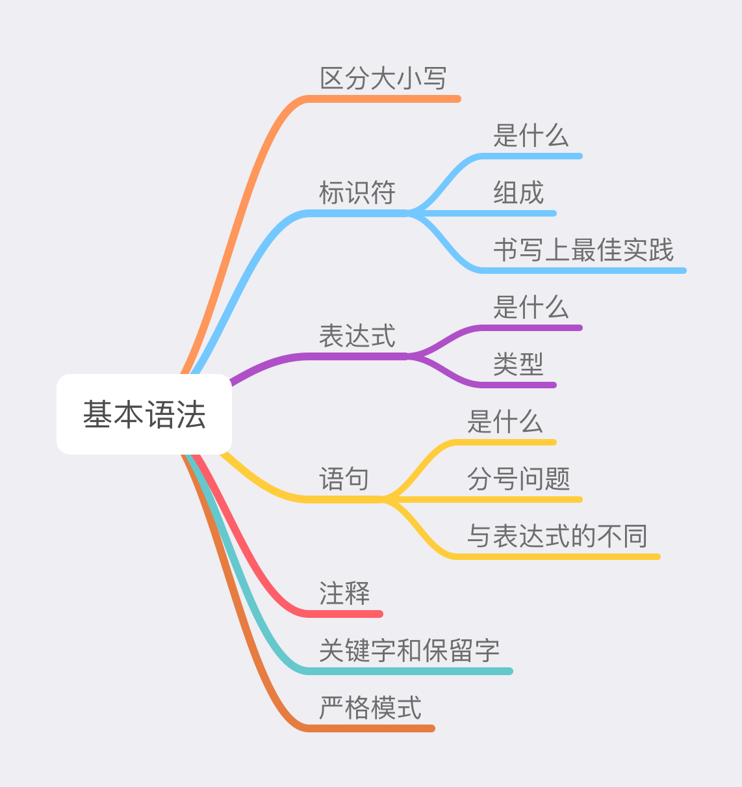

# 基本语法

### 概览



### 区分大小写

JavaScript 中的一切都**区分大小写**，不管是变量还是函数都区分大小写。例如：

- 变量 `obj` 和 变量 `Obj` 是两个不同的变量。
- 函数 `getData` 和函数 `getdata` 是两个不同的函数。

### 标识符

- **标识符是代码中用来标识变量、函数、函数参数或属性的字符序列**。

- JavaScript 标识符的命名规则：

  - **标识符只能由字母、下划线（_）、美元符号（$）、数字（0-9）组成，且不能以数字开头**。

  - 由于 JavaScript 使用的是 **Unicode** 字符集，所以可以使用 Unicode 中的字母字符。例如，中文也是合法的标识符。

  - 避免将关键字、保留字、`true`、`false`、`null` 用作变量名。

    ```javascript
    // 合法的标识符
    obj
    Obj
    arg0
    _test
    $element
    临时变量 // 中文也是合法的标识符
    π
    
    // 不合法的标识符
    23ab // 第一个字符不能是数字
    a+b // 标识符不包含加号
    a*b2 // 标识符不包含星号
    ```

- 书写标识符的最佳实践是使用**驼峰大小写**的形式，即第一个单词首字母小写，后面每个单词首字母大写。
  ```javascript
  let person = {
    firstName: 'xxx',
    lastName: 'yyy'
  };
  let mayCar = '卡丁车';
  function sayHello() {
    console.log('hello');
  }
  ```
### 表达式
**表达式是任何可以计算为值的合法代码的集合**。每个合法的表达式都能计算成某个值，凡是在 JavaScript 中预期为值的地方，都可以使用表达式。表达式有以下类型：

- 算数表达式：计算结果为数值，一般使用算数操作符。

  ```javascript
  10 // 10 是一个算数表达式，由 JS 解释器计算为数值 10
  5 + 3 // 计算值为 8 的算数表达式
  ```

- 字符串表达式：计算结果为字符串，一般使用字符串操作符。

  ```javascript
  'hello'
  'hello' + 'world' // 计算结果为字符串 'hello world'
  ```

- 逻辑表达式：计算结果为布尔值 true 或者 false，一般使用布尔操作符。

  ```javascript
  5 > 3 // 计算结果为布尔值 true
  false // 计算结果为布尔值 false
  a === 2 && b > 10 // 该逻辑表达式的值取决于 a 和 b
  ```

- 基本表达式：指的是在 JavaScript 中的关键字和一般表达式。

  ```javascript
  this // 比如 this 关键字，其值为使用的当前对象
  
  // 使用分组操作符()控制表达式中计算的优先级
  let a = 1;
  let b = 2;
  let c = 3;
  a + b * c // 7，默认优先级，相当于 a + (b * c)
  (a + b) * c // 9，通过 () 操作符使加法优先
  ```
  
- 左值表达式：是指可以出现在赋值表达式左侧的表达式。在 JavaScript 中左值是使用**引用**类型的，比如变量、数组、对象、函数等。

  ```javascript
  a = 10 // 不报错，变量 a 对当前执行环境中变量名为 a 的引用
  3 = 5 // 报错，Uncaught SyntaxError: Invalid left-hand side in assignment
  ++(a + 1) // 报错，尝试递增非左值表达式将报错。a + 1 不能出现在赋值表达式的左侧。
  
  // 比如数组中的元素
  var array = [];
  array[0] = 'hello'
  array[1] = 'world'
  
  // 比如对象的属性
  var person = {};
  person.name = 'xxx'
  person.age = 100
  
  function fn() {}
  fn = 'test' // 对当前执行环境中函数名为 fn 函数的引用，不会报错
  fn() = 'test' // 函数调用则会报错，Uncaught ReferenceError: Invalid left-hand side in assignment
  ```

表达式从概念上还可以划分为：

- **单纯计算求值的**。例如，算数表达式 `3 + 5` 就是单纯求值的，其求值结果为 8。

- **有副作用的**。例如，赋值表达式就是有副作用的， `a = 10` 通过 `=` 操作符将数值 10 赋值给变量 a，从而改变了变量 a 的值，同时该表达式自身的计算值是 10。除了赋值表达式外，还有副作用的表达式有：

  ```javascript
  add(1, 3) // 函数调用
  delete obj.name // delete 操作符
  ++a // 自增操作符
  --b // 自减操作符
  ```
### 语句

JavaScript 中的语句是指**执行特定操作的指令**，例如，创建变量或函数、遍历数组等。语句以分号结尾，一个分号就表示一个语句结束。如果省略分号则由解析器确定在哪里结束。多个语句可以写在一行内，分号前面也可以没有内容，此时会被 JavaScript 引擎视为空语句。

```javascript
let a = 1;
const obj = {}; const carColor = 'black'; // 多个语句写在一行
;; // 空语句
```

**语句和表达式的区别在于**：

- 语句是为了进行某种操作，一般情况下不需要得到一个值；表达式是一个值，或者可以计算为一个值。

- 表达式也不需要分号结尾，一旦在表达式后面添加分号，则 JavaScript 引擎就将该表达视作语句，但是这样会产生一些没有任何意义的语句。

  ```javascript
  // 表达式添加分号，成为无意义的语句
  2 * 5;
  'JavaScript';
  ```

语句和表达式可以通过`if` 流程语句来判断，因为它的控制条件预期是为得到一个逻辑值：

```javascript
if (a = 1) {}
if (var b = 1) {} // var b = 1 是语句，会报错Uncaught SyntaxError: Unexpected token 'var'
```

### 注释

在 JavaScript 中，有两种添加注释的方式：

- **单行注释**
- **多行注释**

```javascript
// 单行注释

/* 
多行
注释
*/
```

### 关键字和保留字

- 关键字在 JavaScript 中有特殊的用途，比如表示控制语句的开始和结束，或者执行特定操作。例如：`import`、`export`、`if`、`else`、`switch`、`catch`、`this`、`new`、`delete`、`var`、`const`、`class` 等。
- 保留字目前在 JavaScript 中还没有特殊用途，但它们是保留给将来做关键字用的。例如：始终保留：`enum`；严格模式下保留：`let`、`package`、`public`、`interface` 等。
- 避免使用保留字和关键字用作标识符。

### 严格模式

严格模式是采用具有限制性 JavaScript 变体的一种方式，从而使代码隐式地脱离“稀松模式”。严格模式对正常的 JavaScript 语义做了一些更改。

1. 严格模式通过抛出错误来消除了一些原有静默错误。
2. 严格模式修复了一些导致 JavaScript 引擎难以执行优化的缺陷：有时候，相同的代码，严格模式可以比非严格模式下运行得更快。
3. 严格模式禁用了在 ECMAScript 的未来版本中可能会定义的一些语法。

严格模式可以应用到整个脚本或个别函数中，启用方式如下：

```javascript
// 在 index.js 的开头
// 确保出现在脚本的最顶部
'use strict';

// 在函数内部
function sum(a, b) {
  'use strict';
  // 函数体
}
```
