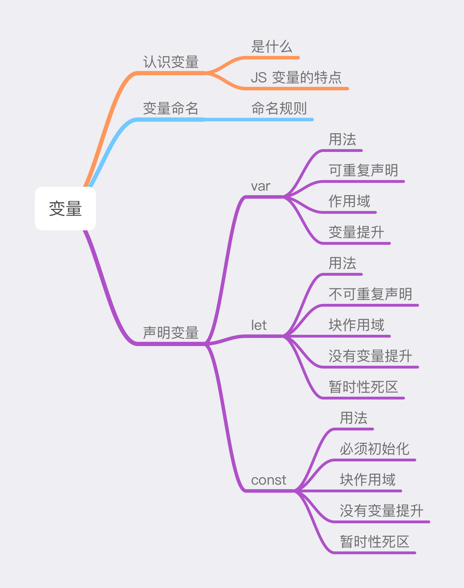

# 变量




### 认识变量

变量是**用来保存任意值的命名占位符，变量不是值本身，它仅仅是一个用于存储任意值的容器**。例如，可以把变量想象成一个个装东西的盒子，盒子外边有一个唯一标注盒子名称的贴纸，盒子里面可以放入任何值。例如：

```javascript
let a = 'Bob';
let b = true;
let c = 35;
```

对于以上代码：

- 可以把变量 `a` 想象成一个贴着“a“名称贴纸的盒子，盒子里面放着字符串值 `Bob`。
- 可以把变量 `b` 可以想象成一个贴着“b“名称贴纸的盒子，盒子里面放着布尔值 `ture`。
- 可以把变量 `c` 可以想象成一个贴着“c“名称贴纸的盒子，盒子里面放着数值 `35`。


JavaScript 中的变量具有**松散类型**的特点——在脚本的生命周期内，变量的值和值的数据类型都可以改变。因此可以多次更改变量的值及其类型。

```javascript
var a = 10;
a = 25; // 变量 a 的值从数值 10 改变为数值 25
a = true; // 变量 a 的数据类型从 Number 改变为 Boolean
```

### 变量命名

变量作为标识符，其命名须遵守一定的规则：

- 变量名只能包含字母、下划线（_）、美元符号（$）、数字，且不能以数字开头。
- 因为 JavaScript 使用了 **Unicode** 字符集，所以变量名可以使用 Unicode 中的字母字符。例如，中文也是合法的变量名。
- 避免将关键字、保留字、`true`、`false`、`null` 用作变量名。

以下是一些变量命名的示例：

```javascript
// 合法的变量命名
let name;
let _this;
let $attr;
let 临时变量; // 中文变量名合法，但不推荐
let Früh; // 德文变量名合法，但不推荐
let имя；// 合法，但不推荐

// 不合法的变量命名
let 9age; // 不能以数字开头
let age*; // 不包含 *
let new; // 不能使用关键字
let enum; //不能使用保留字
let null; // 不能使用 null
```

如果变量名包含多个单词，常采用**驼峰式**命名法：

```javascript
let carType;
let userName;
let deviceStatus;
```

### 声明变量

在 JavaScript 中使用变量，首先需要创建它——即声明一个变量，**声明变量的方式有三种：在 `var`、`let`、`const` 后加变量名的方式**。

#### var

##### 用法

使用 `var` 后跟变量名的方式可以声明一个变量，并可选地将其初始化为一个值。

```javascript
var name;
```

这里声明了一个名为 `name` 的变量，可以用它保存任意类型的值。当未初始化时，变量会保存特殊值 `undefined`。

```javascript
var message;
console.log(message); // undefined
```

当初始化时，可以在定义变量时使用赋值操作符 `=` 给变量设置初始值。

```javascript
var name = 'lufei';
```

此时 `name` 是一个保存字符串值 `lufei` 的变量：

```javascript
var name; // var 告诉 JS 引擎，要声明一个变量 name
name = 'lufei'; // 通过赋值操作符将字符串值 lufei 保存到 name 中
```

还可以同时定义多个变量，方法是在一条语句中用逗号分隔开变量。

```javascript
var a,
    b = 10,
    c = false,
    d = [1, 2, 3];
```

##### 可重复声明

在同一个作用域下，使用 `var` 可重复声明同一个变量，变量的值会取后面声明变量的值。

```javascript
var a = 10;
// ...
var a = 'x';
// ...
var a = true;
console.log(a); // true
```

##### 作用域

**使用 `var` 声明的变量的作用域是它当前的执行上下文**：

- 在**函数外**声明的变量会成为**全局变量**，同时也会成为全局对象的一个属性。全局变量在当前执行环境下都能被访问。

  ```javascript
  var a = 2;
  console.log(window.a); // 2
  function test() {
    console.log(a);
  }
  test(); // 2
  ```

- 在**函数内**声明的变量会成为其包含函数的**局部变量**，变量只在该函数内部能够被访问。

  ```javascript
  function test() {
    var a = 1; // 局部变量
    console.log(a); 
  }
  test(); // 1
  console.log(a); // Uncaught ReferenceError: a is not defined
  ```

  但如果在函数内声明变量时省略 `var` 关键字，同时函数内也无该变量，那么该变量会被隐式地创建为全局变量。

  ```javascript
  // 函数内无该变量
  function test() {
    c = 3;
  }
  test();
  console.log(c); // 3
  console.log(window.c); // 3
  
  // 函数内有该变量
  function foo() {
    var d;
    function bar() {
      d = 2; // d 是外边 foo 函数里的局部变量 d
    }
    bar();
  }
  foo();
  console.log(window.d); // undefined
  ```

##### 变量提升

使用 `var` 声明的变量无论出现在什么地方，总是会被"移动"到当前作用域的最顶端，从而可以在声明该变量之前就能使用它，这个行为叫做**变量提升**。

```javascript
console.log(name); // 控制台没有报错并打印出 undefined
var name = 'lufei';
```

理解如下：

```javascript
// 假设这是当前作用域顶部
var name; // 把 var 声明的变量移动到当前作用域顶部
console.log(name); // 执行打印，但此时变量 name 还未进行赋值操作，所以保存的是特殊值 undefined
name = 'lufei'; // 对变量 name 进行赋值操作
```

这样就产生了“变量提升”的效果，但实际上变量在代码中的位置是不会被移动的，因此“提升”并非字面意思。

> JavaScript 作为一种即时编译型的编程语言，任何的 JavaScript 代码片段在执行前都要进行编译，并且大部分编译就发生在代码执行前的几微秒（甚至更短）的时间内。

这导致 **`var` 声明的变量会在任何代码被执行前首先被编译器处理**。对于 `var name = 'lufei';` 这个语句，JavaScript 会将其看作两个部分：

```javascript
var name; // 第一部分，编译阶段。变量被创建，并且允许在声明变量之前访问，此时变量的值为 undefined
name = 'lufei'; // 第二部分，执行阶段。
```

第一部分是在**编译阶段**进行的；第二部分则被留在原地等待**执行阶段**。这表示**只有声明本身会被提升，赋值操作或其它运行逻辑会留在原地**。因此，“提升”实际是 `var` 声明部分在编译阶段被提前处理，从而造成变量可以在声明之前使用的现象。

`var` 声明在每个作用域中都会进行“提升”操作。除全局作用域外，函数作用域也会对 `var` 声明的变量进行“提升”。

```javascript
function fn() {
  console.log(name); // undefined
  var name = 'lufei';
}
fn();
```

理解如下：

```javascript
function fn() {
  var name; // 将 var 声明提升到当前函数作用域的最顶部
  console.log(name); // 此时 name 还没有被赋值，所以是特殊值 undefined
  name = 'lufei';
}
fn();
```

#### let

##### 用法

使用 `let` 后跟变量名的方式可以声明一个拥有**块级作用域**的变量，并可选地将其初始化为一个值：

```javascript
let name;
```

当未初始化时，变量 `name` 的值为 `undefined`；当初始化时：

```js
let age = 18;
```

当使用 `let` 同时声明多个变量时，应使用逗号分隔开变量：

```javascript
let name = 'lufei',
    age = 18,
    school;
```

##### 不可重复声明

在相同作用域内，`let` 不允许重复声明同一个变量：

```javascript
// var let 声明同一个变量会报错
var name = 'lufei';
let name = 'test'; // Uncaught SyntaxError: Identifier 'name' has already been declared

let age = 18;
let age = 22; // Uncaught SyntaxError: Identifier 'age' has already been declared

let x = 1;
switch(x) {
  case 0:
    let foo;
    break;
  case 1:
    let foo; // Uncaught SyntaxError: Identifier 'foo' has already been declared
    break;
  default:
    let bar;
}

function fn() {
  let a = 1;
  let a = 8; // Uncaught SyntaxError: Identifier 'a' has already been declared
}

// 不能在函数内部重新声明变量
function sum(a, b) {
  let a = 10; // Uncaught SyntaxError: Identifier 'a' has already been declared
}
```

由于 JS 引擎会记录变量名及其所在的块作用域，所以嵌套使用相同的变量名并不会报错，这是因为它们位于不同的作用域中。

```javascript
switch(x) {
  case 0: {
    let foo;
    break;
  }
  case 1: {
    let foo;
    break;
  }
}
```

##### 作用域

**`let` 声明的变量的作用域是块作用域，只能在当前块及其子块使用**。

```javascript
if (true) {
  var a = 10;
  console.log(a); // 10
}
console.log(a); // 10

if (true) {
  let b = 15;
  console.log(b); // 15
}
// b 在 if 块外部使用会报错
console.log(b); // Uncaught ReferenceError: b is not defined

function testVar() {
  var name = 'lufei';
  {
    var name = 'namei'; // 同一个变量
    console.log(name); // namei
  }
  console.log(name); // namei
}
testVar();

function testLet() {
  let age = 18;
  {
    let age = 28; // 不同的变量
    console.log(age); // 28
  }
  console.log(age); // 18
}
testLet();
```

另外，`let` 在全局作用域内声明的变量不会成为全局对象的属性，而 `var` 声明的变量会成为全局对象的属性。

```javascript
let name = 'lufei';
console.log(window.name); // undefined

var age = 18;
console.log(window.age); // 18
```

##### 没有变量提升

**`let` 声明的变量没有“变量提升”**，它所声明的变量一定要在声明后使用，否则报错。

```javascript
console.log(name); // Uncaught ReferenceError: name is not defined
let name = 'lufei';

console.log(age); // undefined
var age = 18;
```

##### 暂时性死区

块级作用域中使用 `let` 声明的变量会绑定当前块，并从块的开始就形成封闭区域。在代码块内，`let` 声明的变量直到被执行时才**初始化**，因此变量初始化前不能被访问，如果访问变量则抛出错误 `ReferenceError`，这称为“暂时性死区”（TDZ，temporal dead zone）。

```javascript
if (true) {
  // TDZ 开始
  console.log(name); // ReferenceError
  name = 'namei'; // ReferenceError
  
  let name; // TDZ 结束
  console.log(name); undefined
}

if (true) {
  // price 变量的暂时性死区开始
  let price = (price + 20); // Uncaught ReferenceError: Cannot access 'price' before initialization
  // 报错是由于 (price + 20) 中的 price 还未进行初始化，所以这里仍处于 TDZ 中。
}
```

##### for 循环中的 let

如果 for 循环中的迭代变量是由 `var` 声明的，常会出现一些不符合期望的场景。

```javascript
const liTags = document.querySelectorAll('li'); // 假设有 5 个 li
for (var i = 0; i < liTags.length; i++) {
  liTags[i].addEventListener('click', () => {
    console.log(i);
  });
}
// 期望点击各个 li 时分别打印出 0 1 2 3 4
// 实际打印出 5 5 5 5 5
```

这是由于 `var` 声明的迭代变量 `i` 会渗透到循环体外，成为了全局作用域下的一个变量，因此循环时更改的所有变量 `i` 都是同一个变量。当点击 li 元素时，循环早已退出，此时变量 `i` 保存的值是 5，所以打印同一个值。

要想避免上面这种不符合预期的现象，可以使用 `let` 声明迭代变量。

```javascript
for (let i = 0; i < liTags.length; i++) {
  liTags[i].addEventListener('click', () => {
    console.log(i);
  });
}
// 当分别点击 li 时会依次打印出 0 1 2 3 4
```

在 for 循环中使用 `let` 声明迭代变量时会包含两个作用域：

1. 圆括号那部分是一个父作用域。
2. 循环体内部是一个单独的子作用域。

每次在进入循环体时，JS 引擎会为每个迭代循环声明一个新的迭代变量，同时 JS 引擎会将父作用域中变量 `i` 的值初始化给每轮的迭代变量。

```javascript
// 圆括号部分是父作用域
for (let i = 0; i < liTags.length; i++) {
  // 循环体内部是子作用域
  // 每次进入循环体 JS 引擎会在循环体这个块内声明一个同名的迭代变量 i（以 _i 表示）
  // 并将迭代变量的值初始化为父作用域中变量 i 的值
  let _i = i;
}
```

因此点击 li 时引用的都是不同的迭代变量实例，打印出的值也是循环执行过程中每个迭代变量的值。

#### const

##### 用法

使用 `const` 后跟变量名的方式可以声明一个常量，并且在声明时就必须**初始化**变量，否则报错。

```javascript
const age; // Uncaught SyntaxError: Missing initializer in const declaration
```

而且一旦声明，常量的值就不能改变，不然会导致运行时错误。

```javascript
const PI = 3.14;
PI = 3.14159; // Uncaught TypeError: Assignment to constant variable
```

`const` 声明的变量的值不能改变的本质是**变量指向的内存地址中保存的数据不得改动**。

- 对基本类型的数据（字符串、数值、布尔值等），值就保存在变量指向的内存地址中，等同于常量，因此值被改变时就会报错。
- 对于复杂类型的数据（对象），变量指向的内存地址，保存的只是一个指向实际数据的指针。`const` 保证的是这个指针不变——即总是指向固定的地址，但不保证这个指针指向的数据结构不变。

```javascript
const ROLE = {};
// 可以给 ROLE 添加属性
ROLE.name = 'lufei';
ROLE.age = 18;

// 但将一个新对象赋值给 ROLE 就会报错
ROLE = { name: 'namei', age: 15 }; // Uncaught TypeError: Assignment to constant variable
```

除此之外，`const` 和 `let` 声明的变量的行为基本相同，都具有不可重复声明、拥有块作用域、暂时性死区、没有变量提升等特性。

```javascript
// 不可重复声明
var price = 10;
const price = 20; // Uncaught SyntaxError: Identifier 'price' has already been declared

// 块作用域
const name = 'lufei';
if (true) {
  const name = 'suolong';
  console.log('inside name', name); // inside name suolong
}
console.log('outside name', name); // outside name lufei

// 暂时性死区
if (true) {
  console.log(age); // Uncaught ReferenceError: Cannot access 'age' before initialization
  const age = 18;
}
```

### 总结

- 由于 `var` 声明的变量会产生很多不合理的现象，所以开发时避免使用 `var` 声明变量。
- 尽量使用 `let` 或 `const`，其中 `const` 优先，`let` 次之。这是因为 `const` 声明可以保证变量的值不被改变，从而可以避免很多不合法的赋值操作。只有在提前知道未来会修改变量的值的情况下才使用 `let`。

