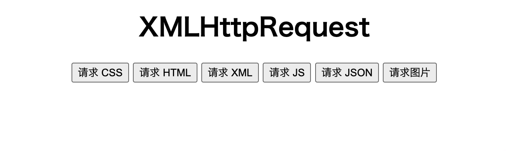

# XMLHttpRequest 请求静态资源

使用 [server-static.js](./codes/server-static.js) 作为静态服务器，在命令行输入以下代码启动服务：

```bash
node-dev server-static.js 8888
```

然后完成以下请求任务：


### 请求 style.css

通常使用 `<link>` 元素来链接一个外部的样式表：

```html
<link rel="stylesheet" href="style.css">
```

现在需要在点击“请求 CSS”按钮时使用 `XMLHttpRequest` 请求 style.css，并将样式应用到页面上：

```javascript
const buttonGetCSS = document.getElementById('get-css');
buttonGetCSS.addEventListener('click', () => {
  const request = new XMLHttpRequest();
  request.open('GET', '/style.css');
  request.addEventListener('load', () => {
    const { status, response } = request;
    const checkStatus = (status >= 200 && status < 300) || status === 304;
    if (checkStatus) {
      // 请求成功，处理响应
      const styleElement = document.createElement('style');
      styleElement.innerHTML = response;
      document.head.append(styleElement);
    } else {
      // 处理 HTTP error
    }
  });
  request.addEventListener('error', event => {
    // 处理非 HTTP error
    console.log(error);
  });
  request.send();
});
```

style.css 的内容：

```css
h1 {
  color: red;
}
```

结果：


### 请求 dynamic.html

在点击“请求 HTML”按钮时使用 `XMLHttpRequest` 请求 dynamic.html，并将其展示到页面上：

```javascript
const buttonGetHTML = document.getElementById('get-html');
buttonGetHTML.addEventListener('click', () => {
  const request = new XMLHttpRequest();
  request.open('GET', '/dynamic.html');
  request.addEventListener('load', () => {
    const { status, response } = request;
    const checkStatus = (status >= 200 && status < 300) || status === 304;
    if (checkStatus) {
      // 请求成功，处理响应
      const divElement = document.createElement('div');
      divElement.innerHTML = response;
      document.body.append(divElement);
    } else {
      // 处理 HTTP error
    }
  });
  request.addEventListener('error', event => {
    // 处理非 HTTP error
  });
  request.send();
});
```

dynamic.html 的内容：

```html
<div style="margin-top: 10px; padding: .5em; background-color: pink; border: 1px solid green; color: #fff; font-size: 24px;">
  落霞与孤鹜齐飞，秋水共长天一色
</div>
```

结果：


### 请求 test.xml

在点击“请求 XML“按钮时使用 `XMLHttpRequest` 请求 test.xml，并将返回的数据展示到页面上：

```javascript
const buttonGetXML = document.getElementById('get-xml');
buttonGetXML.addEventListener('click', () => {
  const request = new XMLHttpRequest();
  request.open('GET', '/test.xml');
  request.addEventListener('load', event => {
    const { status, responseXML } = request;
    const checkStatus = (status >= 200 && status < 300) || status === 304;
    if (checkStatus) {
      // 请求成功，处理响应
      const message = responseXML.getElementsByTagName('warning')[0].textContent;
      const divElement = document.createElement('div');
      divElement.textContent = message;
      document.body.append(divElement);
    } else {
      // 处理 HTTP error
    }
  });
  request.addEventListener('error', event => {
    // 处理非 HTTP error
  });
  request.send();
})
```

test.xml 的内容为：

```xml
<?xml version="1.0" encoding="UTF-8"?>
<message>
  <warning>
    Hello World
  </warning>
</message>
```

结果：


### 请求 main.js

通常使用 `<script>` 元素引入 JS 文件以供浏览器解析执行：

```html
<script src="main.js"></script>
```

现在需要在点击“请求 JS”按钮时使用 `XMLHttpRequest` 请求 main.js，并执行 JS：

```javascript
const buttonGetJS = document.getElementById('get-js');
buttonGetJS.addEventListener('click', () => {
  const request = new XMLHttpRequest();
  request.open('GET', '/main.js');
  request.addEventListener('load', () => {
    const { status, response } = request;
    const checkStatus = (status >= 200 && status < 300) || status === 304;
    if (checkStatus) {
      // 请求成功，处理响应
      const scriptElement = document.createElement('script');
      scriptElement.innerHTML = response;
      document.body.append(scriptElement);
    } else {
      // 处理 HTTP error
    }
  });
  request.addEventListener('error', event => {
    // 处理非 HTTP error
    console.log(error);
  });
  request.send();
});
```

main.js 的内容：

```javascript
alert('落霞与孤鹜齐飞，秋水共长天一色');
```

结果：


### 请求 JSON

在点击“请求 JSON”按钮时使用 `XMLHttpRequest` 请求 user.json，并将返回的数据展示到页面上：

```javascript
const buttonGetJSON = document.getElementById('get-json');
buttonGetJSON.addEventListener('click', () => {
  const request = new XMLHttpRequest();
  request.open('GET', '/user.json');
  request.addEventListener('load', event => {
    const { status, response } = request;
    const checkStatus = (status >= 200 && status < 300) || status === 304;
    if (checkStatus) {
      // 请求成功，处理响应
      let user = null;
      try {
        user = JSON.parse(response);
      } catch (error) {
        // JSON 解析出错了，设置默认的 user
        user = {
          name: 'xiaoming',
          age: 20
        };
      }
      const divElement = document.createElement('div');
      const { name, age } = user;
      divElement.textContent = `姓名：${name}，年龄：${age}`;
      document.body.append(divElement);
    } else {
      // 处理 HTTP error
    }
  });
  request.addEventListener('error', event => {
    // 处理非 HTTP error
  });
  request.send();
});
```

user.json 的内容：

```json
{
  "name": "lufei",
  "age": 18
}
```

结果：



### 请求图片

在点击“请求图片”按钮时使用 `XMLHttpRequest` 请求test.png，并将图片展示到页面上：

```javascript
const buttonGetImage = document.getElementById('get-image');
buttonGetImage.addEventListener('click', () => {
  const request = new XMLHttpRequest();
  request.open('GET', '/test.png');
  request.responseType = 'blob';
  request.addEventListener('load', event => {
    const { status, response } = request;
    const checkStatus = (status >= 200 && status < 300) || status === 304;
    if (checkStatus) {
      const img = document.createElement('img');
      img.src = URL.createObjectURL(response);
      const imgWrapper = document.getElementById('img-wrapper');
      imgWrapper.append(img);
    } else {
      // 处理 HTTP error
    }
  });
  request.addEventListener('error', event => {
    // 处理非 HTTP error
  });
  request.send();
});
```

结果：


### 总结

使用 `XMLHttpRequest` 发送请求可以获取各种静态资源，最主要的就是针对不同类型的数据进行解析处理，从而使用这些数据：

- 使用 `<style>` 标签将 CSS 样式应用到页面上。
- 使用 `<script>` 标签将 JS 提供给浏览器解析执行。
- 使用 DOM API 处理 HTML、XML、图片。
- 使用 `JSON.parse()` 处理 JSON。
