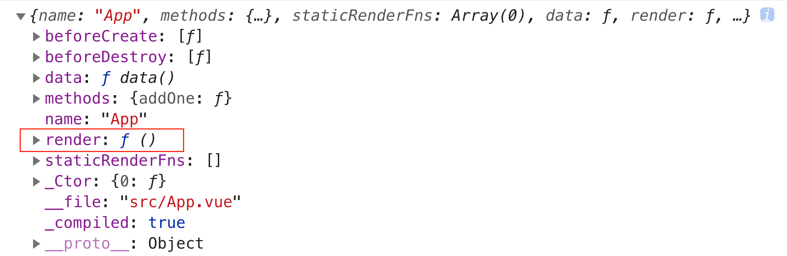

# 理解 Vue 不同构建版本

在 Vue 文档的安装章节中将 Vue 的构建版本大致划分为：**完整版**和**运行时版**，相应的术语解释如下：

> 完整版：同时包含编译器和运行时的版本。
>
> 编译器：用来将模板字符串编译成为 JavaScript 渲染函数的代码。
>
> 运行时：用来创建 Vue 示例、渲染并处理虚拟 DOM 等的代码。基本上就是除去编译器的其它一切。

接下来通过实例来看看二者有什么不同。

### 制作 +1 按钮

#### 使用完整版

在完整版中，可以使用模板语法得到视图：

```html
<html>
  <body>
    <div id="app">
      {{ n }}
      <button @click="addOne">+1</button>
    </div>
    <!-- 引入完整版的 Vue -->
    <script src="https://cdn.jsdelivr.net/npm/vue@2.6.12/dist/vue.js"></script>
    <script>
      new Vue({
        el: '#app',
        data: {
          n: 0
        },
        methods: {
         addOne() {
           this.n += 1
         }
        }
      })
    </script>
  </body>
</html>
```

此时，在页面中点击 `+1` 按钮，初始值 0 将会变为 1，实现了 `+1` 按钮的功能。

#### 使用运行时版

将引入完整版的 Vue更换为运行时版：

```html
<!-- 引入运行时版的 Vue -->
<script src="https://cdn.jsdelivr.net/npm/vue@2.6.12/dist/vue.runtime.js"></script>
```

 在刷新页面后，控制台中会出现如下报错信息：


运行时版的 Vue 由于没有模板编译器，所以不支持使用模板语法的方式来得到视图，解决办法是要么使用 `render` 函数，要么使用完整版的 Vue。下面试着使用 `render` 函数来解决报错：

```html
<html>
  <body>
    <div id="app"></div>
    <!-- 运行时版的 Vue -->
    <script src="https://cdn.jsdelivr.net/npm/vue@2.6.12/dist/vue.runtime.js"></script>
    <script>
      new Vue({
        el: '#app',
        data: {
          n: 0
        },
        methods: {
          addOne() {
            this.n += 1
          }
        },
        // render 函数
        render(h) {
          return h('div', [this.n, h('button', { on: { click: this.addOne }}, '+1')])
        }
      })
    </script>
  </body>
</html>
```

运行上述代码同样也实现了 `+1` 按钮的功能。

### 完整版 vs 运行时版

通过在开发 `+1` 按钮的过程中对两个 Vue 构建版本的使用，可以发现：模板语法相较于 `render` 函数更加直观易理解。那是否在开发时都使用完整版呢？答案是否定的，大多数情况下都是使用运行时版。比如，@vue/cli 创建的项目默认使用运行时版，原因在于：

> 因为运行时版本相比完整版体积要小大约 30%，所以应该尽可能使用这个版本。

完整版比运行时版体积大的部分就是编译器，编译器需要把模板字符串编译成为 JavaScript 渲染函数，所以编译器会比较复杂，进而导致体积较大。比如，在项目构建完成后，假设完整版的体积 100kb，那么运行时版的体积大约是 70kb，相当于完整版比运行时版体积大了 40% 左右，所以应尽可能地使用运行时版。

完整版和运行时版的区别在于**是否需要编译模板**，当需要编译模板时则必须使用完整版：

- 使用 `template` 选项。

  ```javascript
  new Vue({
    el: '#app',
    template: '<div>{{ n }}</div>'
  })
  ```

- 挂载到元素上并使用 DOM 内部的 HTML 作为模板。

  ```html
  <div id="app">
    <h1>hellow Vue.js</h1>
  </div>
  <script>
    new Vue({
      el: '#app'
    })
  </script>
  ```

### 最佳实践

总是使用使用运行时版，并配合着 `vue-loader` 和文件扩展名为 `.vue` 的单文件组件使用：

- 保证用户体验，要使用户下载的 JavaScript 体积更小，就需要使用 `render` 函数。

- 保证开发体验，开发者可以使用模板语法，所以在单文件组件中进行开发。

- 在构建时，通过使用 `vue-loader` 将 `*.vue` 文件内部的模板预编译成 JavaScript 渲染函数。

比如，@vue/cli 创建的项目中便是这样实践地，`App.vue` 开发时使用模板语法：

```vue
<template>
  <div id="app">
    {{ n }}
    <button @click="addOne">+1</button>
  </div>
</template>

<script>
export default {
  name: 'App',
  data () {
    return {
      n: 0
    }
  },
  methods: {
    addOne () {
      this.n += 1
    }
  }
}
</script>

<style lang="scss">
#app {
  color: red
}
</style>
```

然后在 `main.js` 中添加 `console.log(App)` ，在构建时会在控制台得到如下对象：

  

将该对象的 `render` 方法打印出来便会得到 `App.vue` 的 JavaScript 渲染函数：


