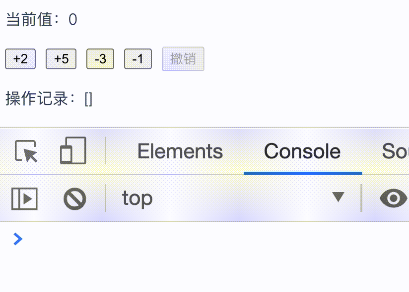
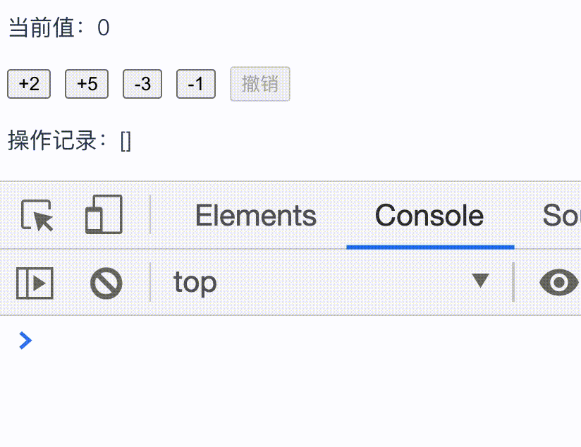

# 计算属性和侦听器

### computed

**`computed` 是计算属性，它会基于所依赖的响应式 property 动态显示最新的计算结果；计算属性的结果会被缓存，只有其依赖的响应式 property 有变化才会重新计算**。尽管计算属性的写法在形式上是方法，但它最终会被混入到 Vue 实例中当作 property 使用，同时所有 getter 和 setter 的 this 上下文自动地绑定为 Vue 实例，用法如下：

```javascript
const vm = new Vue({
  // ...
  data: {
    n: 1
  },
  computed: {
    // 用法一：仅读取，计算属性的 getter
    double () {
      // this 指向当前实例 vm
      return this.n * 2
    },
    // 用法二：读取和设置，计算属性的 getter 和 setter
    plus: {
      // getter
      get () {
        return this.n + 1
      },
      // setter
      set (value) {
        // this 指向当前实例 vm
        this.n = value - 1
      }
    }
  }
})
console.log(vm.double) // 2
vm.plus = 5 
console.log(vm.n) // n => 4
console.log(vm.plus) // 5
console.log(vm.double) // 8
```

`computed` 的使用场景：当需要的值会根据数据对象中 property 的变化而变化时，比如，以下两个示例：

##### 展示用户信息

在开发业务时，页面上某个地方需要按照昵称、手机、邮件的顺序展示用户信息，并且有以下规则：

- 昵称不存在就展示手机。
- 昵称和手机都不存在就展示邮件。

同时，这个用户信息展示模块会用到很多页面。我们可以使用双大括号插值的方法很快地完成业务需求：

```vue
<template>
  <!-- 很多地方都需要这样展示用户信息 -->
  <p>用户信息：{{ user.nickname || user.phone || user.email }}</p>
</template>

<script>
export default {
  data () {
    return {
      user: {
        nickname: '路飞',
        phone: '13389896666',
        email: 'lufei@qq.com'
      } 
    }
  }
}
</script>
```

结果如下：


但如果哪天业务变更，需要将用户信息的展示顺序变更为：手机、昵称、邮件，那么我们页面中包含有用户信息模块的代码都需要更改，这样极为不方便。同时，双大括号内那么长一串表达式也不是简单的声明式逻辑，修改业务时也需要看一会才清楚之前的逻辑，基于上述种种不便，我们可以使用 `computed` 来进行优化：

```html
<template>
  <!-- 使用计算属性展示用户信息 -->
  <p>用户信息：{{ displayUser }}</p>
</template>

<script>
export default {
  // ...
  computed: {
    displayUser () {
      const { user: { phone, nickname, email }} = this
      // 将用户信息展示顺序变更为：手机、昵称、邮件
      return phone || nickname || email
    }
  }
}
</script>
```

之前双大括号内逻辑不够简洁的长长的表达式被更换为一个计算属性 `displayUser`，这样模板内的逻辑看起来一目了然。

我们可以像使用普通 data property 一样在模板中使用计算属性，Vue 知道计算属性 `displayUser` 依赖于 `user` property，当 `user` property 发生改变时（比如，用户信息改变、用户信息的展示顺序改变等），所有在模板中使用了计算属性 `displayUser` 的地方都会自动更新。

如果页面还有一个修改手机号的按钮，当点击它时就重新设置用户手机号，那么计算属性可以改写为：

```vue
<script>
export default {
  // ...
  computed: {
    // 进行设置和读取
    displayUser: {
      get () {
        const { user: { phone, nickname, email }} = this
        return phone || nickname || email
      },
      set (value) {
        this.user.phone = value
      } 
    }
  },
  methods: {
    setPhone () {
      this.displayUser = '15133339999'
    }
  }
}
</script>
```

这样在点击修改手机号按钮时，计算属性 `displayUser` 的 `setter` 会被调用，进而更新 `user.phone` property 的值。

##### 根据性别切换用户列表

在页面中有一个展示用户昵称和性别的列表：

```vue
<template>
  <div>
    <div>
      <button>全部</button>
      <button>男</button>
      <button>女</button>
    </div>
    <ul>
      <li v-for="user in users" :key="user.id">
        {{ user.nickname }} - {{ user.gender }}
      </li>
    </ul>
  </div>
</template>

<script>
// 创建用户
let id = 0
const createUser = (nickname, gender) => {
  id += 1
  return { id, nickname: nickname, gender: gender }
}

export default {
  data: {
    users: [
      createUser('路飞', '男'),
      createUser('娜美', '女'),
      createUser('索隆', '男'),
      createUser('山治', '男'),
      createUser('罗宾', '女')
    ]
  }
}
</script>
```

结果如下：


要实现的需求是，根据点击按钮的不同切换用户列表，具体规则如下：

- 点击全部按钮时，展示所有的用户。
- 点击男按钮时，展示性别为男的用户。
- 点击女按钮时，展示性别为女的用户。

实现思路，用户列表的数据源改为计算属性 `displayUsers`，它会根据 `gender` property 值的变化展示对应用户：

```vue
<template>
  <div>
    <div>
      <!-- 给切换按钮添加事件 -->
      <button @click="setGender('all')">全部</button>
      <button @click="setGender('male')">男</button>
      <button @click="setGender('female')">女</button>
    </div>
    <ul>
      <!-- 页面用户列表的数据源改为计算属性 displayUsers -->
      <li v-for="user in displayUsers" :key="user.id">
        {{ user.nickname }} - {{ user.gender }}
      </li>
    </ul>
  </div>
</template>

<script>
// ...
export default {
  data: {
    // ...
    gender: 'all'
  },
  computed: {
    displayUsers () {
      const genderHash = {
        male: '男',
        female: '女'
      }
      const { users, gender } = this
      return gender === 'all' ? users : users.filter(user => user.gender === genderHash[gender])
    }
  },
  methods: {
    setGender (gender) {
      this.gender = gender
    }
  }
}
</script>
```

最终实现效果：


通过上述两个示例对计算属性的使用有了更多认识——**计算属性可以让模板更简洁、逻辑更清晰、代码更易于维护**。

##### computed vs methods

在根据性别切换用户列表的示例中，我们也可以使用 methods 来完成同样的需求，实现思路如下：

- 首先用户列表的数据源 `users` property 不能被修改，所以新增一个 `displayUsers` property。
- 在 `created` 钩子中将 `users` 赋值给 `displayUsers`。
- 添加一个根据性别展示不同用户的方法 `showUsers`。

完整代码如下：

```vue
<script>
// ...
export default {
  data: {
    // 新增 displayUsers
    displayUsers: []
  },
  created () {
    // 在 created 钩子赋值
    this.displayUsers = this.users
  },
  methods: {
    // 新增 showUsers 方法
    showUsers (gender) {
      const genderHash = {
        male: '男',
        female: '女'
      }
      const { users } = this
      this.displayUsers = gender === 'all' ? users : users.filter(user => user.gender === genderHash[gender])
    },
    setGender (gender) {
      this.showUsers(gender)
    }
  }
}
</script>
```

通过示例我们可以知道使用方法和计算属性都能实现需求，但不同的是**计算属性可以基于它们的响应式依赖进行缓存，并只有在相关依赖发生改变时才会重新计算；而调用方法则总是会重新执行函数**。

- 使用方法实现时，在 `showUsers` 方法中添加一个 log：

  ```vue
  <script>
  export default {
    methods: {
      showUsers (gender) {
        // ...
        console.log(`displayUsers 计算了 ${genderHash[gender]} 一次`)
      }
    }
  }
  </script>
  ```

  当点击按钮时：

  

  无论是点击不同按钮还是连续点击同一按钮，`showUsers` 方法都会被重新调用，这表明**方法总是会重新执行，不会缓存结果**。

- 使用计算属性实现时，在计算属性 `displayUsers` 中添加一个 log：

  ```vue
  <script>
  export default {
    // ...
    computed: {
      displayUsers () {
        // ...
        console.log(`displayUsers 计算了 ${genderHash[gender]} 一次`)
      }
    }
  }
  </script>
  ```
  
  当点击按钮时：


当点击不同按钮时，由于 `gender` 发生了改变，`displayUsers` 会马上求值；但当连续点击同一按钮时，`gender` 没有发生改变，`displayUsers` 会立即返回之前的计算结果，而不会重新求值。这表明**计算属性 `displayUsers` 会根据其依赖的 `gender` property 进行计算，并且会缓存计算结果**。

缓存的好处在于：当有场景需要进行大量计算导致页面性能开销较大时，使用计算属性可以利用缓存特性减少页面开销；但使用方法则会每次都重新执行计算，这样可能会影响用户体验。

### watch

**`watch` 是侦听器，可以通过 `watch` 观察数据对象中 property 值发生变化时执行一些操作，`watch` 是一个异步的过程**。`watch` 的用法是一个对象，键是需要观察的表达式，值是对应的回调函数，其中值的表现形式可以是函数、方法名、包含选项的对象、包含回调的数组：

```javascript
new Vue({
  data: {
    a: 1,
    b: 2,
    c: {
      c1: '111',
      c2: '222'
    },
    d: 4,
    e: 5,
    user: {
      nickname: '路飞',
      age: 18
    }
  },
  watch: {
    // 第一种，值为函数
    a (newValue, oldValue) {
      console.log(`from: ${oldValue}, to: ${newValue}`)
    },
    // 第二种，值为 methods 中的方法
    b: 'methodName',
    // 第三种，值为包含选项的对象，选项有：deep 和 immediate，回调函数是 handler
    c: {
      handler (newValue, oldValue) {},
      // deep: true 表示被监听的对象 c 只要有属性发生改变时都会调用 handler 回调，不管该属性嵌套多深
      deep: true
    },
    d: {
      handler: 'methodName',
      // watch 在一开始时并不会执行 handler 回调，只会在 d property 发生改变时才会调用回调
      // 设置 immediate: true 可以使 handler 回调在一开始就被调用
      immediate: true
    },
    // 第四种，值为一个包含回调数组，它们会被逐一调用
    e: [
      function handler1(newValue, oldValue) {},
      'handler2',
      {
        hanlder (newValue, oldValue) {},
        // 选项
      }
    ],
    // key 还可以是 data 中某个对象中的属性
    'user.nickname' (newValue, oldValue) {}
  }
})
```

值得注意的是，**不应在 `watch` 中使用箭头函数**。

##### 何谓数据变化

`watch` 会在它观察的 property 的值发生变化时作出响应，接下来了解一下 property 值的变化：

```vue
<template>
  <div>
    <button @click="n += 2">按钮1</button>
    <button @click="visible = !visible">按钮2</button>
    <button @click="obj1.a += 'ggg'">按钮3</button>
    <button @click="obj2 = { b: 'bbb' }">按钮4</button>
  </div>
</template>

<script>
export default {
  data () {
    return {
      n: 1,
      visible: false,
      obj1: {
        a: 'aaa'
      },
      obj2: {
        b: 'bbb'
      }
    }
  },
  watch: {
    n () {
      console.log('点击按钮1：n 变了')
    },
    visible () {
      console.log('点击按钮2：visible 变了')
    },
    obj1 () {
      console.log('点击按钮3：obj1 变了')
    },
    'obj1.a' () {
      console.log('点击按钮3：obj1.a 变了')
    },
    obj2 () {
      console.log('点击按钮4：obj2 变了')
    },
    'obj2.b' () {
      console.log('点击按钮4：obj2.b 变了f')
    }
  }
}
</script>
```

点击按钮时会修改数据对象中某些 property 的值，`watch` 会在监听到这些 property 值变化时在控制台打印出相应内容，结果如下：


对于像 `n`、`visible` 、`obj1.a` 这种属于基本类型的 property，只要它们的值发生改变，就会被 `watch` 监听。

对于对象这种属于复杂类型的 property，只有当其引用值的地址发生改变才会被 `watch` 监听。点击按钮3执行 `obj1.a += 'ggg'` 时，`obj1.a` 这个基本类型的值发生变化了，但 `obj1` 的引用值的地址并未改变，所以未被 `watch` 监听。

点击按钮4执行 `obj2 = { b: 'bbb' }` 时，尽管 `obj2` 由赋值得到的新对象的键值对和之前一样，但 `obj2` 引用值的地址发生了改变，所以 `obj2` 还是会被 `watch` 监听。

要想在 `obj1.a` 发生改变时也让 `watch` 认为 `obj1` 也改变了，可以添加 `deep: true`：

```vue
//...
<script>
export default {
	// ...
  watch: {
    obj1: {
      handler () {
        console.log('点击按钮3：obj1 变了')
      },
      deep: true
    }
  }
}
</script>
```

点击按钮3时，控制台打印结果如下：


##### watch 是异步的

页面中有一个展示当前值和操作历史的模块：


要实现的需求是，点击不同的加减按钮，当前值和操作记录都会被记录并展示在页面中；点击撤销按钮会把当前值和操作记录恢复到上一次操作的数据，相应代码如下：

```vue
<template>
  <div class="about">
    <p>当前值：{{ n }}</p>
    <div>
      <button @click="n += 2">+2</button>
      <button @click="n += 5">+5</button>
      <button @click="n -= 3">-3</button>
      <button @click="n -= 1">-1</button>
      <button :disabled="history.length === 0" @click="revoke">撤销</button>
    </div>
    <p>操作记录：{{ history }}</p>
  </div>
</template>

<script>
export default {
  data () {
    return {
      n: 0,
      history: []
    }
  },
  watch: {
    n (newValue, oldValue) {
      this.history.push({ from: oldValue, to: newValue })
    }
  },
  methods: {
    revoke () {
      const lastItem = this.history.pop()
      this.n = lastItem.from
    }
  }
}
</script>
```

在页面上点击加减按钮后，再点击撤销按钮，会发现 `history` 并没有被恢复为最后一次操作前的数据。这是由于 `n` 一直处于 `watch` 状态，`watch` 会把撤销操作里对 `n` 的赋值当成一个新的操作记录添加到 `history` 中，解决办法是添加一个状态来判断当前是否处于撤销中：

```vue
<script>
export default {
  data () {
    return {
      // ...
      // 添加一个状态表示是否处于撤销中，默认是不处于撤销中
      inRevokeStatus: false
    }
  },
  watch: {
    n (newValue, oldValue) {
      // 不处于撤销才会对 history 进行操作
      if (!this.inRevokeStatus) {
        this.history.push({ from: oldValue, to: newValue })
      }
    }
  },
  methods: {
    revoke () {
      // 点击撤销按钮后，将 inRevokeStatus 设置为撤销状态 true
      this.inRevokeStatus = true
      const lastItem = this.history.pop()
      this.n = lastItem.from
      // 在对 n 赋值后将 inRevokeStatus 设置为撤销状态 false
      this.inRevokeStatus = false
    }
  }
}
</script>
```

更新上述代码后再次进行之前的操作，会发现 `history` 中还是会有 `n` 在撤销操作中的数据。通过打 log 验证点击撤销按钮后处于什么撤销状态：

```vue
<script>
export default {
  // ...
  watch: {
    n (newValue, oldValue) {
      console.log('是否处于撤销状态：', this.inRevokeStatus ? '处于' : '不处于')
      // 不处于撤销状态才会添加项到操作记录中
      if (!this.inRevokeStatus) {
        this.history.push({ from: oldValue, to: newValue })
      }
    }
  },
  // ...
}
</script>
```

结果如下：



尽管在撤销操作中设置了撤销状态，但在 `watch` 中打 log 可以知道目前依然是不处于撤销状态。这是因为 `watch` 是异步的过程，它会等当前代码执行完了才对 `n` 的变化进行操作，大体流程如下：

```javascript
// 点击撤销按钮，设置撤销状态 true
this.inRevokeStatus = true
// 对 n 赋值，这个时候尽管 n 变化了，但是 watch 不会立即执行
this.n = lastItem.from
// 设置撤销状态 false
this.inRevokeStatus = false
// 最后 watch 才执行 n 变化的操作，这样的话永远不处于撤销状态，所以点击撤销按钮 history 中永远都会添加新的操作记录
```

要想解决上述问题，可以使用 `$nextTick`：

```vue
<script>
export default {
  methods: {
    revoke () {
      this.inRevokeStatus = true
      const lastItem = this.history.pop()
      this.n = lastItem.from
      // nextTick 会等 watch n 执行完后才设置不处于撤销状态
      this.$nextTick(() => {
        this.inRevokeStatus = false
      })
    }
  }
}
</script>
```

结果如下：



##### watch vs computed

在展示用户信息的示例中，也可以使用 `watch` 来实现同样的效果：

```vue
<template>
  <div class="about">
    <p>用户信息：{{ displayUser }}</p>
    <button @click="user.nickname = '索隆'">修改用户名</button>
  </div>
</template>

<script>
export default {
  data () {
    return {
      user: {
        nickname: '路飞',
        phone: '13389896666',
        email: 'lufei@qq.com'
      },
      displayUser: ''
    }
  },
  watch: {
    // watch user 每个 key 的变化
    'user.nickname': {
      handler () {
        const { user: { nickname, phone, email } } = this
        this.displayUser = nickname || phone || email
      },
      // Vue 认为一开始的数据从无到有不是一个变化的过程，所以页面中的 displayUser 为空
      // immediate: true 表示数据从无到有也是变化的过程，页面中 displayUser 会有 nickname || phone || email 表达式的值
      immediate: true
    },
    'user.phone': {
      handler () {
        const { user: { nickname, phone, email } } = this
        this.displayUser = nickname || phone || email
      },
      immediate: true
    },
    'user.email': {
      handler () {
        const { user: { nickname, phone, email } } = this
        this.displayUser = nickname || phone || email
      },
      immediate: true
    }
  }
}
</script>
```

相比较 `computed`，使用 `watch` 实现的代码，代码更多且有重复。在大多数 `computed` 和 `watch` 都能实现的情况下，尽量使用 `computed`，而如果需要在数据变化时进行一些操作，则使用 `watch`。

总结：

- `computed` 是计算属性，它会基于所依赖的响应式 property 动态显示最新的计算结果。计算属性的结果会被缓存，只有其依赖的响应式 property 有变化才会重新计算。计算属性应用于一个数据依赖其它 data property 的场景。
- `watch` 是侦听器，可以通过 `watch` 观察数据对象中 property 值发生变化时执行一些操作，`watch` 是一个异步的过程。`watch` 会在回调中传入 `newValue` 和 `oldValue` 以供使用，也提供了 `immediate` 和 `deep` 选项以。`watch` 适用于 data property 值发生变化时执行一些操作。