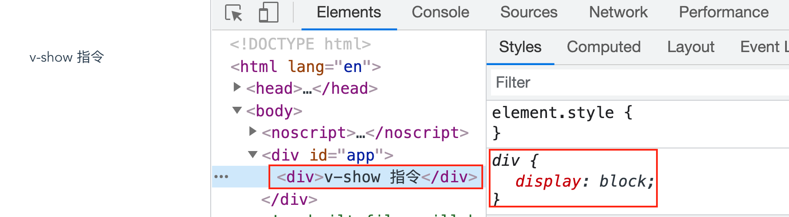
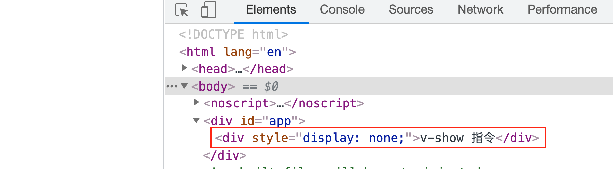

# 条件渲染

Vue 里面有两个根据条件展示元素的指令，分别是：`v-if` 指令和 `v-show` 指令，接下来分别了解它们用法及其不同。

### `v-if`

**`v-if` 指令用于有条件地渲染元素**，元素是否会被渲染取决于 `v-if` 指令绑定的表达式值的真假。有如下代码：

```html
<div v-if="seen">can you see?</div>
```

如果一开始数据 property `seen` 的值为真，那么 `div` 元素会被渲染；反之，`div` 元素不会出现在页面中。

#### `v-else-if` & `v-else`

可以同 `v-if` 指令一起搭配使用的还有 `v-else-if` 指令、`v-else` 指令，有如下代码：

```html
<div v-if="animal === 'dog'">dog</div>
<div v-else-if="animal === 'cat'">cat</div>
<div v-else-if="animal === 'bird'">bird</div>
<div v-else>I don't know this animal</div>
```

其中，`v-else-if` 指令可以连续使用，但它必须紧跟带 `v-if` 或者 `v-else-if` 元的素后面，否则它将不会被识别。同样地，`v-else` 也必须紧跟在带 `v-if` 或者 `v-else-if` 的元素后面。

#### 在 `<template>` 元素上使用 `v-if` 渲染分组

`v-if` 指令必须添加到一个元素上才能起作用，而如果想通过 `v-if` 切换渲染多个元素，则可以把  `<template>` 元素当作不可见的包裹元素，并在上面使用 `v-if` ，最终的渲染结果将是 `<template>` 元素所包含的内容。有如下代码：

```html
<template v-if="ok">
  <h1>标题</h1>
  <p>段落</p>
</template>
```

如果数据 property `ok` 的值为真，那么渲染结果如下图：


#### 用 key attribute 管理可复用元素

Vue 为了尽可能高效地渲染元素，通常会复用已有元素而不是从头开始渲染。比如，页面上有一个用户可以切换登录方式的模块，代码如下：

```vue
<template>
  <div id="app">
    <h3>不同的登录方式</h3>
    <template v-if="loginType === 'username'">
      <label>用户名：</label>
      <input placeholder="请输入用户名">
    </template>
    <template v-else>
      <label>手机：</label>
      <input placeholder="请输入手机号">
    </template>
    <div style="margin-top: 10px;">
      <button>切换登录方式</button>
    </div>
  </div>
</template>
```

当在 `input` 输入框中输入内容后，点击按钮切换登录方式不会清除已经输入的内容，如下图：


这是由于两个模板中都使用了相同的元素，所以 `<input>` 元素不会被替换掉——仅仅是替换它的 `placeholder`。

但如果需求是需要在切换登录方式时清空已经输入的内容，Vue 也提供了一种方式来表达“这两个元素是完全独立的，不要复用它们“，只需添加一个具有**唯一值的 `key`** attribute 即可：

```html
<template v-if="loginType === 'username'">
  <label>用户名：</label>
  <!-- 添加具有唯一值的 key -->
  <input key="username" placeholder="请输入用户名">
</template>
<template v-else>
  <label>手机：</label>
  <!-- 添加具有唯一值的 key -->
  <input key="phone" placeholder="请输入手机号">
</template>
```

现在，每次点击切换按钮时  `<input>`  都会被重新渲染，已经输入的内容都也会被清空，如下图：


值得注意的是，`<label>` 元素仍然会被高效地复用，因为它们没有添加 `key` attribute。

### `v-show`

`v-show` 指令也可用于根据条件展示元素，但它是通过简单地切换元素的 CSS property `display: none;` 和 `display: block` 来实现的，如下代码：

```html
<div v-ok="seen">can you see?</div>
```

上述代码中的 `<div>` 元素始终会被渲染并保留在 DOM 中，就算数据 property `seen` 值为假，结果如下图：



当把 `seen` 值的设置为真，结果如下图：



值得注意的是 `v-show` 指令不支持用在 `<template>` 元素上。

### `v-if` vs `v-show`

`v-if` 会根据初始条件动态地向 DOM 添加或删除元素，并且在切换过程中条件块内的事件监听器和子组件适当地被销毁和重建。`v-if` 也是“惰性的”，如果初始条件为假，则什么也不做——直到条件第一次变为真时，才会开始渲染条件块。

相比而言，`v-show` 则不管初始条件是什么，元素总是会被渲染，并只是简单地基于 CSS property `display` 进行切换。

一般来说，`v-if` 具有更高的切换开销；而 `v-show` 有更高的初始渲染开销。因此，如果需要非常频繁地切换，则使用 `v-show` 较好；如果在运行时条件很少改变，则使用 `v-if` 较好。


