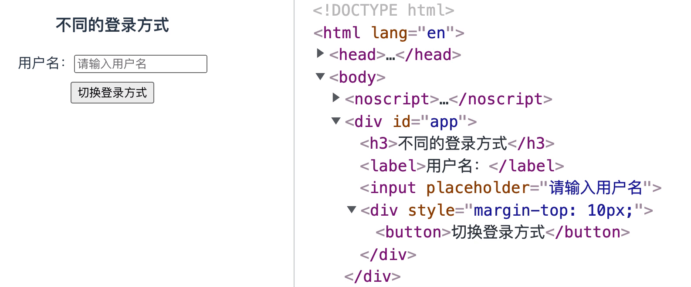
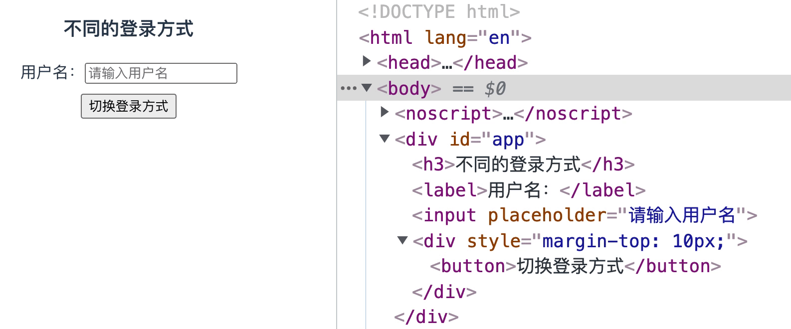

# 条件渲染


### `v-if`

**`v-if` 指令根据绑定的表达式值真假来有条件地渲染元素**，如下示例：

```html
<div v-if="visible">can you see?</div>
```

如果一开始 `visible` property 的值为真，那么 `<div>` 元素会被渲染；反之，`<div>` 元素不会被渲染，也就不会出现在页面中。

**`v-if` 是真正的条件渲染，在切换时元素及它的数据绑定和事件监听会被销毁并重建（对组件亦是如此）**。比如，页面上有一个切换按钮：

```vue
<template>
  <div>
    <button @click="toggle">toggle-v-if</button>
    <p v-if="visible">这是 v-if 指令</p>
  </div>
</template>

<script>
export default {
  data () {
    return {
      visible: true
    }
  },
  methods: {
    toggle () {
      this.visible = !this.visible
    }
  }
}
</script>
```

结果如下：


当点击切换按钮时，`<p>` 元素会根据 `visible` 值的真假来销毁或重建：


##### `v-else-if` & `v-else`

`v-else-if` 指令和 `v-else` 指令可以与 `v-if` 指令一起搭配使用：

```html
<template>
  <div>
    <div v-if="animal === 'dog'">dog</div>
    <div v-else-if="animal === 'cat'">cat</div>
    <div v-else-if="animal === 'bird'">bird</div>
    <div v-else>I don't know this animal</div>
  </div>
</template>
```

其中，`v-else` 指令用来表示 `v-if` 的 else 部分，它必须紧跟在带 `v-if` 或者 `v-else-if` 的元素后面，否则它将不会被识别。

`v-else-if` 指令用来表示 `v-if` 的 else-if 部分，可以连续使用。同样地，它也必须紧跟在带 `v-if` 或者 `v-else-if` 的元素后面。

##### 在 `<template>` 元素上使用 `v-if` 渲染分组

因为 `v-if` 是一个指令，所以必须将它添加到一个元素上才起作用。如果想通过 `v-if` 同时切换渲染多个元素，可以把  `<template>` 元素当作一个不可见的包裹元素，并在上面使用 `v-if`，最终的渲染结果将不会包含 `<template>` 元素自身：

```vue
<template>
  <div>
    <template v-if="visible">
      <h1>标题</h1>
      <p>段落</p>
    </template>
  </div>
</template>
```

如果 `visible` 的值为真，那么最终的渲染结果只会包含 `<h1>` 元素和 `<p>` 元素：


##### 用 key attribute 管理可复用元素

Vue 为了尽可能高效地渲染元素，通常会复用已有元素而不是从头开始渲染。比如，页面上有一个切换登录方式的模块：


代码如下：

```vue
<template>
  <div>
    <h3>不同的登录方式</h3>
    <template v-if="isUsernameLogin">
      <label>用户名：</label>
      <input placeholder="请输入用户名">
    </template>
    <template v-else>
      <label>手机：</label>
      <input placeholder="请输入手机号">
    </template>
    <div style="margin-top: 10px;">
      <button>切换登录方式</button>
    </div>
  </div>
</template>
```

在输入框中输入内容后，点击切换登录方式按钮后 `<input>` 元素中已输入的内容不会被清除：



由于两个模板中都使用了相同的元素，所以 `<input>` 元素不会被替换掉——仅仅是替换它的 `placeholder`。

但如果需要在切换登录方式时清空输入框的内容，可以通过添加一个具有**唯一值的 `key`** attribute 来实现——这表示“这两个元素是完全独立的，不要复用它们“：

```vue
<template>
  <div>
    <h3>不同的登录方式</h3>
    <template v-if="isUsernameLogin">
      <label>用户名：</label>
      <!-- 添加具有唯一值的 key -->
      <input key="username" placeholder="请输入用户名">
    </template>
    <template v-else>
      <label>手机：</label>
      <!-- 添加具有唯一值的 key -->
      <input key="phone" placeholder="请输入手机号">
    </template>
    <div style="margin-top: 10px;">
      <button>切换登录方式</button>
    </div>
  </div>
```

现在，每次切换时  `<input>`  元素都会被重新渲染，已经输入的内容都也会被清空：



值得注意的是，`<label>` 元素仍然会被高效地复用，因为它们没有添加 `key` attribute。

### `v-show`

**`v-show` 指令根据绑定的表达式值的真假来条件性地展示元素**，它是通过**切换元素的 CSS property `display`** 来实现的：

```vue
<template>
  <div v-show="visible">v-show 指令</div>
</template>
```

如果 `visible` 的值为真，那么 `<div>` 元素的 `display` 属性值会被设置为 `block`，会在页面上展示：


如果 `visible` 的值为假，那么 `<div>` 元素的 `display` 属性值会被设置为 `none`，不会在页面上展示，但 `<div>` 元素始终会被渲染并保留在 DOM 中：


值得注意的是 `v-show` 指令不支持用在 `<template>` 元素上。

### `v-if` vs `v-show`

`v-if` 和 `v-show` 都可以根据表达式值的真假来决定是否在页面上显示元素，但二者仍有一些不同：

- 实现方式：`v-if` 是真正的条件渲染，它会根据表达式值的真假动态地向 DOM 添加或删除元素，并且在切换时元素及其绑定的数据和事件监听会被销毁或重建。而 `v-show` 只是基于 CSS `display` 属性值 `none` 和 `block` 的切换。

- 初始渲染：`v-if` 是惰性的，如果初始条件一开始为假，则不会渲染元素，它会直到条件第一次变为真时才会渲染元素。而 `v-show` 不管初始条件是什么都会渲染元素。

  延伸问题：使用 `v-if` 在性能优化上有什么经验？ --->  `v-if` 的初始渲染条件是惰性的，意味着 `v-if="false"` 时是不会渲染元素的。对于需要特定条件下渲染的元素，可以一开始将条件设置为 `false`，当需要时（比如异步）再设置为 `true`。这样可以优先渲染其它内容，合理利用，从而进行性能优化。

- 性能消耗：`v-if` 有更高的切换开销，而 `v-show` 有更高的初始渲染开销。

- 使用场景：一次性渲染完的场景使用 `v-if`，而需要频繁地切换的场景则使用 `v-show`。


