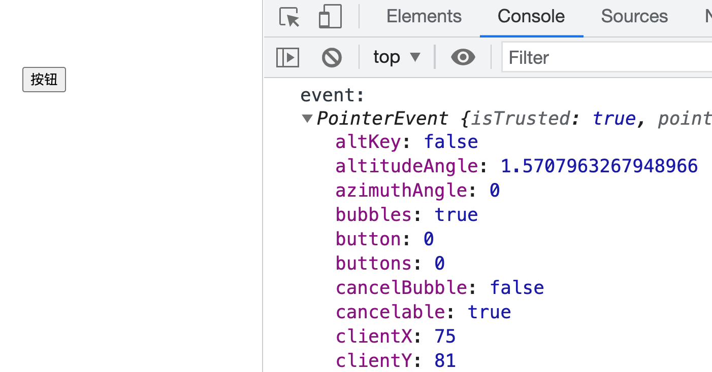
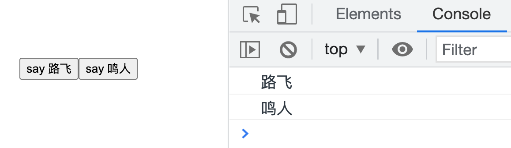
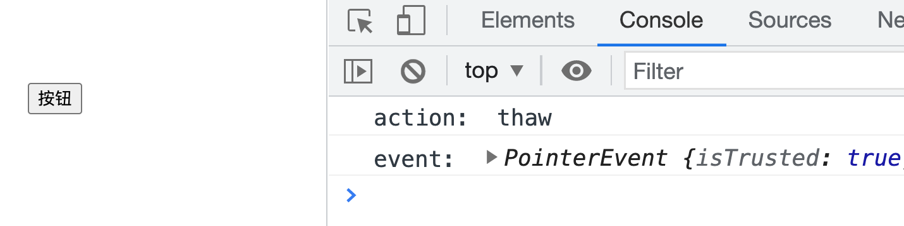

# 事件处理

### 监听事件

Vue 使用 `v-on` 指令来监听 DOM 事件，并在触发事件时执行一些 JavaScript。`v-on` 指令绑定的表达式的值可以有以下几种：

##### 简单的表达式

对于比较简单的逻辑可以作为一个表达式直接写在模板里：

```vue
<template>
  <div class="event-demo">
    <button v-on:click="visible = !visible">toggle</button>
    <p v-show="visible">click to toggle</p>
  </div>
</template>
```

##### 方法名

大多数的事件处理逻辑都较为复杂，如果直接写在模板里会导致模板过重且难以维护。不过 `v-on` 指令可以接收一个需要调用的方法名，所以可以将事件处理逻辑统一放在该方法内：

```vue
<template>
  <div class="event-demo">
    <!-- 方法名 -->
    <button v-on:click="doSomeThing">按钮</button>
  </div>
</template>

<script>
export default {
  methods: {
    doSomeThing() {
      // 复杂的处理逻辑
    }
  }
}
</script>
```

**在监听原生 DOM 事件时，方法以事件作为唯一的参数**：

```vue
<script>
export default {
  methods: {
    doSomeThing(event) {
      console.log('event: ', event)
    }
  }
}
</script>
```

结果：



##### 调用方法

除了直接绑定一个方法，还可以在内联的 JavaScript 语句中调用方法：

```vue
<template>
  <div class="event-demo">
    <!-- 直接调用方法 -->
    <button v-on:click="doSomeThing()">按钮</button>
  </div>
</template>
```

在调用方法时，还可以传入自定义的参数：

```vue
<template>
  <div class="event-demo">
    <button v-on:click="say('路飞')">say 路飞</button>
    <button v-on:click="say('鸣人')">say 鸣人</button>
  </div>
</template>

<script>
export default {
  methods: {
    say(message) {
      console.log(message)
    }
  }
}
</script>
```

依次点击按钮后：



如果需要在内联语句中调用方法时访问原始的 DOM 事件，可以将**特殊变量 `$event`** 传入方法：

```vue
<template>
  <div class="event-demo">
    <!-- $event -->
    <button v-on:click="handle('thaw', $event)">按钮</button>
  </div>
</template>

<script>
export default {
  methods: {
    handle(action, event) {
      console.log('action: ', action)
      console.log('event: ', event)
    }
  }
}
</script>
```

结果：




