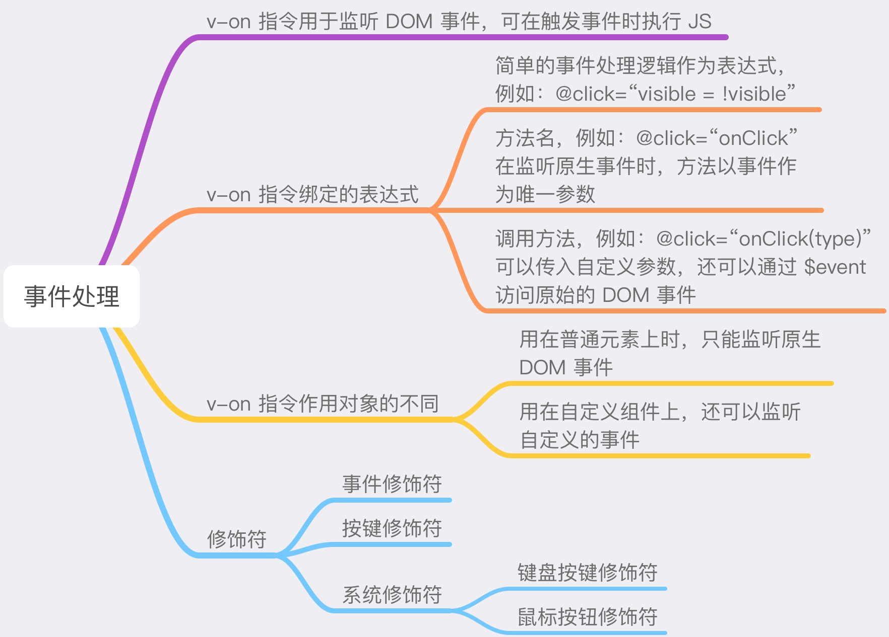

# 事件处理



### 监听事件

Vue 使用 `v-on` 指令来监听 DOM 事件，并在触发事件时执行一些 JavaScript。`v-on` 指令绑定的表达式的值可以有以下几种：

##### 简单的表达式

对于比较简单的逻辑可以作为一个表达式直接写在模板里：

```vue
<template>
  <div class="event-demo">
    <button v-on:click="visible = !visible">toggle</button>
    <p v-show="visible">click to toggle</p>
  </div>
</template>
```

##### 方法名

不过大多数的事件处理逻辑都较为复杂，如果直接写在模板里会导致模板过重且难以维护。然而 `v-on` 指令可以接收一个需要调用的方法名，所以可以将事件处理逻辑放在该方法内：

```vue
<template>
  <div class="event-demo">
    <!-- 方法名 -->
    <button v-on:click="doSomeThing">按钮</button>
  </div>
</template>

<script>
export default {
  methods: {
    doSomeThing() {
      // 复杂的处理逻辑
    }
  }
}
</script>
```

**在监听原生 DOM 事件时，方法以事件作为唯一的参数**：

```vue
<script>
export default {
  methods: {
    doSomeThing(event) {
      console.log('event: ', event)
    }
  }
}
</script>
```

结果：


##### 内联语句中调用方法

除了绑定一个方法，还可以在内联的 JavaScript 语句中调用方法：

```vue
<template>
  <div class="event-demo">
    <!-- 直接调用方法 -->
    <button v-on:click="doSomeThing()">按钮</button>
  </div>
</template>
```

在调用方法时，还可以传入自定义的参数：

```vue
<template>
  <div class="event-demo">
    <button v-on:click="say('路飞')">say 路飞</button>
    <button v-on:click="say('鸣人')">say 鸣人</button>
  </div>
</template>

<script>
export default {
  methods: {
    say(message) {
      console.log(message)
    }
  }
}
</script>
```

依次点击按钮后：


如果需要在内联语句中调用方法时访问原始的 DOM 事件，可以将**特殊变量 `$event`** 传入方法：

```vue
<template>
  <div class="event-demo">
    <!-- $event -->
    <button v-on:click="handle('thaw', $event)">按钮</button>
  </div>
</template>

<script>
export default {
  methods: {
    handle(action, event) {
      console.log('action: ', action)
      console.log('event: ', event)
    }
  }
}
</script>
```

结果：


此外，`v-on` 指令用在普通元素上时，只能监听**原生 DOM 事件**：

```html
<!-- click 事件 -->
<button v-on:click="doThis">按钮</button>

<!-- input 事件 -->
<input v-on:input="onInput">

<!-- scroll 事件 -->
<div v-on:scroll="onScroll">...</div>
```

用在自定义元素组件上时，也可以监听子组件触发的**自定义事件**：

```html
<!-- 当子组件触发自定义的 my-event 事件时调用 handleThis  -->
<base-component v-on:my-event="handleThis"></base-component>

<!-- 内联语句 -->
<base-component v-on:my-event="handleThis('test', $event)"></base-component>

<!-- 组件中的原生事件，使用 .native 修饰符 -->
<base-component v-on:click.native="onClick"></base-component>
```

最后，Vue 还为 `v-on` 指令提供了简写方式：

```html
<!-- 完整语法 -->
<button v-on:click="doSomething"></button>

<!-- 缩写 -->
<button @click="doSomething"></button>
```

### 修饰符

修饰符是以 `.` 开头作为指令的后缀来表示的，用于指出一个指令应该以特殊方式绑定。`v-on` 指令在监听事件时，用到的修饰符有以下几类：事件修饰符、按键修饰符、系统修饰符。

##### 事件修饰符

在事件处理逻辑中调用 `event.preventDefault()` 或 `event.stopPropagation()` 是非常常见的需求。虽然可以在事件处理方法中添加它们，但是更好的方式是：方法只是纯粹的数据逻辑，而不是去处理 DOM 事件细节。为解决该问题，Vue 为 `v-on` 指令提供了以下事件修饰符：

- `.stop`
- `.prevent`
- `.capture`
- `.self`
- `.once`
- `.passive`

例如：

```html
<!-- 阻止单击事件继续传播 -->
<a @click.stop>GitHub</a>

<!-- 阻止 a 元素的默认跳转行为，没有表达式 -->
<a @click.prevent>GitHub</a>

<!-- 阻止 a 元素的默认跳转行为并在点击时调用 doSomeThing 方法 -->
<a @click.prevent="doSomeThing">GitHub</a>

<!-- 修饰符可以串联 -->
<button @click.stop.prevent="doSomeThing">按钮</button>

<!-- 添加事件监听器时使用事件捕获模式 -->
<!-- 即内部元素触发的事件先在此处理，然后才交由内部元素进行处理 -->
<div @click.capture="doSomeThing">...</div>

<!-- 只当在 event.target 是当前元素自身时触发处理函数 -->
<!-- 即事件不是从内部元素触发的 -->
<div @click.self="doSomeThing">...</div>

<!-- 点击事件将只会触发一次 -->
<button @click.once="doSomeThing">按钮</button>

<!-- addEventListener 中的 passive 选项 -->
<!-- 滚动事件的默认行为 (即滚动行为) 将会立即触发 -->
<!-- 而不会等待 `onScroll` 完成 -->
<!-- 这其中包含 `event.preventDefault()` 的情况 -->
<div @scroll.passive="onScroll">...</div>
```

其中，只有 `.once` 修饰符能被用到自定义的组件事件上，其它修饰符只能对原生的 DOM 事件起作用。

##### 按键修饰符

在监听键盘事件时，常常有检查按键的需求。为此，Vue 允许为 `v-on` 指令在监听键盘事件时添加按键修饰符：

```html
<!-- v-on 监听的 keyup 事件只有在按键是 enter 时才会调用 handleSubmit 方法 -->
<input @keyup.enter="handleSubmit" />
```

还可以直接将 [KeyboardEvent.key](https://developer.mozilla.org/en-US/docs/Web/API/KeyboardEvent/key/Key_Values) 暴露的任意有效按键名转换为 kebab-case 来作为修饰符，例如：

```html
<!-- onPageDown 方法只会在按键是 PageDown 时被调用 -->
<input @keyup.page-down="onPageDown" />
```

另外，Vue 为最常用的键提供了别名：

- `.enter`
- `.tab`
- `.delete`（捕获“删除”和“退格”按键）
- `.esc`
- `.space`
- `.up`
- `.down`
- `.left`
- `.right`

##### 系统修饰符

可以用以下修饰符来实现仅在按下相应按键时才触发鼠标或键盘事件的监听器：

- 键盘按键修饰符：`.ctrl`、`.alt`、`.shift`、`.meta`、`.exact`，例如：

  ```html
  <!-- 按住 ctrl 的情况下点击才会调用 onClickCtrl -->
  <button @click.ctrl="onClickCtrl">按钮</button>
  
  <!-- alt + enter -->
  <input @keyup.alt.enter="handleAltEnter" />
  ```

  另外，`.exact` 修饰符允许你控制由精确的系统修饰符组合触发的事件：

  ```html
  !-- 按住 ctrl 时，alt 或 shift 被一同按下也会触发 -->
  <button @click.ctrl="onClick">按钮</button>
  
  <!-- 有且只有 ctrl 被按下的时候才触发 -->
  <button @click.ctrl.exact="onCtrlClick">按钮</button>
  
  <!-- 没有任何系统修饰符被按下的时候才触发 -->
  <button @click.exact="onClick">按钮</button>
  ```

- 鼠标按钮修饰符：`.right`、`.left`、`.middle`，例如：

  ```html
  <!-- 鼠标右键点击时触发 -->
  <button @click.right="onClickRight">按钮</button>
  ```

