# 表单输入绑定

表单输入是**双向数据绑定**中比较常见的应用场景，“双向”意味着用户操作视图发生改变时，其绑定的数据也随之改变，反之数据的变化也会导致视图发生相应变化。因此在表单交互较多的场景下，使用双向数据绑定可以省去监听每个表单数据变化的事件代码，从而达到简化代码专注于业务逻辑的目的。为此，Vue 提供了 `v-model` 指令用于在**表单控件**（`input`、`textarea`、 `select`）和**组件**上创建双向数据绑定。

### 表单控件

当 `v-model` 指令用在表单控件上时，它会根据控件类型自动选取正确的方法来更新元素。这是由于 `v-model` 会在内部为不同的输入元素绑定不同的 property 并抛出不同的事件：

- `<input type="text">` 和 `<textarea>` 使用 `value` property 和 `input` 事件。
- `<input type="checkbox">` 和 `<input type="radio">` 使用 `checked` property 和 `change` 事件。
- `<select>` 使用 `value` property 和 `change` 事件。

以下是 `v-model` 在表单控件上的用法示例。

##### 文本

```html
<template>
	<div>
    <input v-model="message" >
    <button @click="message = '落霞与孤鹜齐飞'">修改 message</button>
    <p>message: {{ message }}</p>
  </div>
</template>

<script>
export default {
  data () {
    return {
      message: ''
    }
  }
}
</script>
```

视图发生变化自动更新数据；数据发生变化时也会自动更新视图：

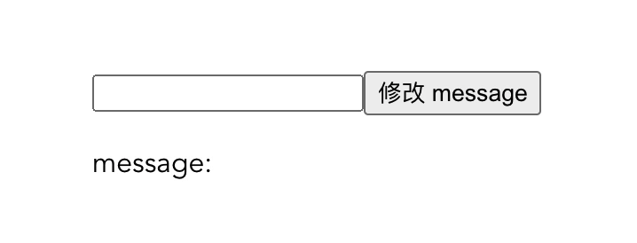

##### 多行文本

```html
<template>
  <div>
    <textarea v-model="comment"></textarea>
    <br>
    <button @click="comment = '秋水共长天一色'">修改 comment</button>
    <p>comment: {{ comment }}</p>
  </div>
</template>

<script>
export default {
  data () {
    return {
      comment: ''
    }
  }
}
</script>
```

结果：

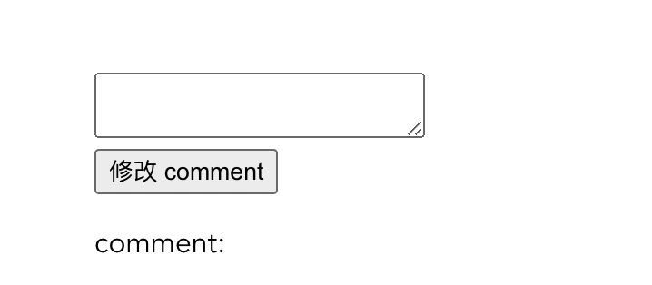

另外需要注意的是，在 `textarea` 元素中使用插值 `<textarea>{{ comment }}</textarea>` 不会生效。

##### 复选框

- 单个复选框，默认绑定到**布尔值**，不用添加 `value` property：

  ```html
  <template>
    <div>
      <input v-model="checked" type="checkbox" id="single-checkbox">
      <label for="single-checkbox">{{ checked }}</label>
      <br>
      <button @click="checked = !checked">toggle</button>
    </div>
  </template>
  
  <script>
  export default {
    data () {
      return {
        checked: false
      }
    }
  }
  </script>
  ```

  结果：

  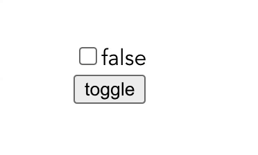

- 多个复选框，绑定到**同一个数组**，需要添加 `value` property：

  ```html
  <template>
    <div>
      <input v-model="checkedFruits" type="checkbox" value="apple" id="apple">
      <label for="apple">苹果</label>
      <input v-model="checkedFruits" type="checkbox" value="banana" id="banana">
      <label for="banana">香蕉</label>
      <input v-model="checkedFruits" type="checkbox" value="watermelon" id="watermelon">
      <label for="watermelon">西瓜</label>
      <input v-model="checkedFruits" type="checkbox" value="grape" id="grape">
      <label for="grape">葡萄</label>
      <p>checkedFruits: {{ checkedFruits }}</p>                         
    </div>
  </template>
  
  <script>
  export default {
    data () {
      return {
        checkedFruits: []
      }
    }
  }
  </script>
  ```

  结果：

  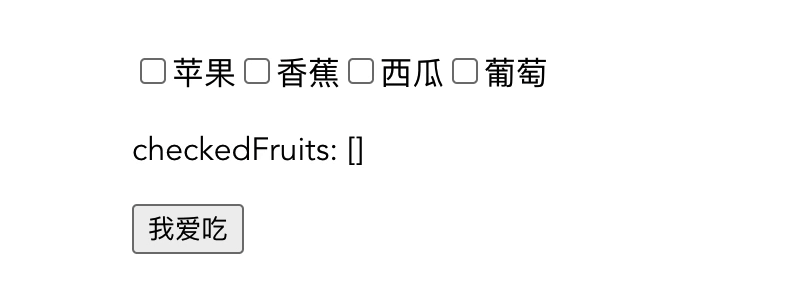

  如果复选框没有 `value` property，那么在 Vue 2 中选择复选框时会得到 `null` 值。比如，将苹果复选框的 `value` 去掉后再选择它：

  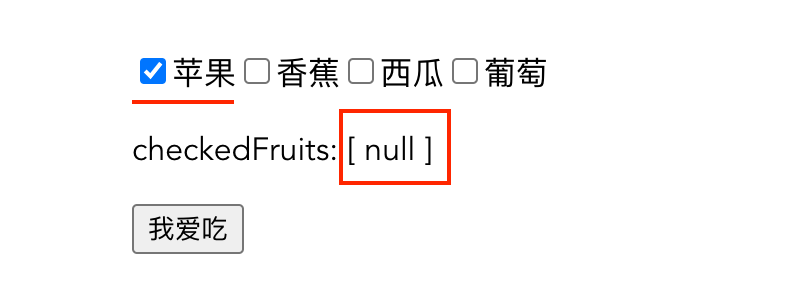
  
##### 单选按钮

需要在单选按钮中添加 `value` property：

  ```html
  <template>
    <div>
      <input v-model="favouriteFruit" type="radio" value="apple" id="apple">
      <label for="apple">苹果</label>
      <input v-model="favouriteFruit" type="radio" value="banana" id="banana">
      <label for="banana">香蕉</label>
      <input v-model="favouriteFruit" type="radio" value="watermelon" id="watermelon">
      <label for="watermelon">西瓜</label>
      <input v-model="favouriteFruit" type="radio" value="grape" id="grape">
      <label for="grape">葡萄</label>
      <p>favouriteFruit: {{ favouriteFruit }}</p>
      <button @click="favouriteFruit = 'watermelon'">我最爱吃</button>
    </div>
  </template>
  
  <script>
  export default {
    data () {
      return {
        favouriteFruit: ''
      }
    }
  }
  </script>
  ```

  结果：

  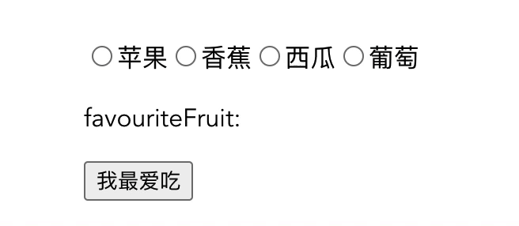

##### 选择框

- 单选时：

  ```html
  <template>
    <div>
      <label for="favouriteFruit">最爱吃的水果：</label>
      <select v-model="favouriteFruit" id="favouriteFruit">
        <option value="apple">苹果</option>
        <option value="banana">香蕉</option>
        <option value="watermelon">西瓜</option>
        <option value="grape">葡萄</option>
      </select>
      <p>favouriteFruit: {{ favouriteFruit }}</p>
    </div>
  </template>
  
  <script>
  export default {
    data () {
      return {
        favouriteFruit: ''
      }
    }
  }
  </script>
  ```

  结果：

  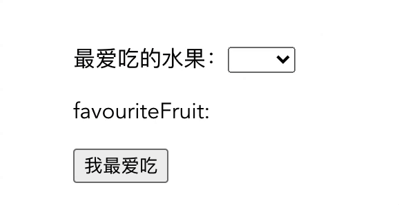

- 多选时，绑定到一个数组：

  ```html
  <template>
    <div>
      <label for="fruits">爱吃的水果：</label>
      <select v-model="fruitList" multiple id="fruits">
        <option value="apple">苹果</option>
        <option value="banana">香蕉</option>
        <option value="watermelon">西瓜</option>
        <option value="grape">葡萄</option>
      </select>
      <p>fruitList: {{ fruitList }}</p>
      <button @click="fruitList = ['apple', 'watermelon']">我爱吃</button>
    </div>
  </template>
  
  <script>
  export default {
    data () {
      return {
        fruitList: []
      }
    }
  }
  </script>
  ```
  
  结果：
  
  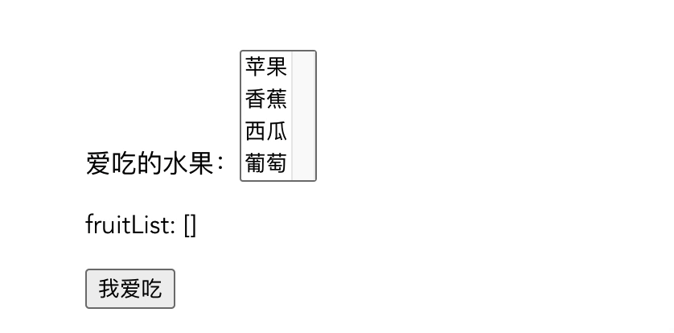
  

另外还可以使用 `v-for` 指令渲染动态 `<option>`：

```html
<template>
  <div>
    <label for="favouriteFruit">最爱吃的水果：</label>
    <select v-model="favouriteFruit" id="favouriteFruit">
      <option v-for="fruit in fruits" :key="fruit.value" :value="fruit.value">{{ fruit.name }}</option>
    </select>
  </div>
</template>

<script>
export default {
  data () {
    return {
      fruits: [
        { name: '苹果', value: 'apple' },
        { name: '香蕉', value: 'banana' },
        { name: '西瓜', value: 'watermelon' },
        { name: '葡萄', value: 'grape' }
      ]
    }
  }
}
</script>
```

##### 注意项

1.  `v-model` 指令会忽略所有表单元素的 `value`、`checked`、`selected` attribute 的初始值，而总是将 Vue 实例的数据作为数据来源。

   ```html
   <template>
     <div>
       <label for="text">文本</label>
       <input v-model="message" value="yyy" id="text">
       <br>
       <input v-model="toggle" type="checkbox" checked id="checkbox">
       <label for="checkbox">复选框</label>
       <br>
       <input v-model="status" type="radio" value="on" checked id="on">
       <label for="on">开</label>
       <input v-model="status" type="radio" value="off" id="off">
       <label for="off">关</label>
       <br>
       <select v-model="selectedItem">
         <option value="a" selected>A</option>
         <option value="b">B</option>
       </select>
     </div>
   </template>
   
   <script>
   export default {
     data () {
       return {
         message: 'xxx',
         toggle: false,
         status: 'off',
         selectedItem: 'b'
       }
     }
   }
   </script>
   ```

   结果：

   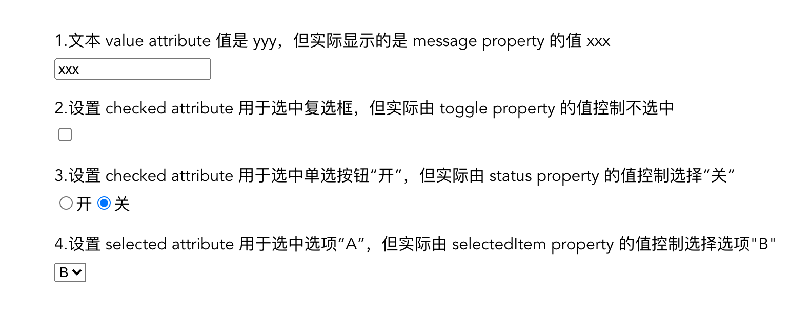

2. 对于需要使用输入法（中文等）的语言，`v-model` 不会在输入法组合过程中得到更新。

   ```html
   <input v-model="message" type="text">
   <p>message: {{ message }}</p>
   ```

   结果：

   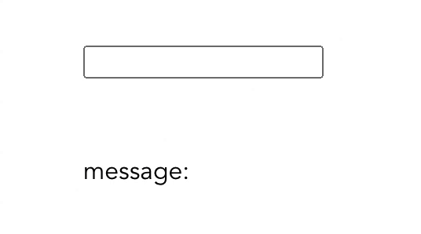

   可以看到在输入法组合文字的过程中，通过 `v-model` 绑定的 `message` property 不会自动更新。如果想处理这一过程，需要使用 `input` 事件。

   ```html
   <input v-model="message" type="text" @input="handleInput">
   
   <script>
   export default {
     // ...
     methods: {
       handleInput (event) {
         this.message = event.target.value
       }
     }
   }
   </script>
   ```

   结果：

   

### value 绑定

对于复选框、单选按钮和选择框的选项，`v-model` 绑定的值一般是静态字符串（单个复选框是布尔值）。而要想将值绑定到 data 中动态的 property 上，可以通过 `v-bind` 实现，并且该 property 的值可以不是字符串。

##### 复选框

- 单选时，如果不想绑定到布尔值，可以使用 `true-value` property 和 `false-value` property：

  ```html
  <input v-model="toggle" type="checkbox" true-value="yes" false-value="no">
  <p>toggle: {{ toggle }}</p>
  ```

  结果：

  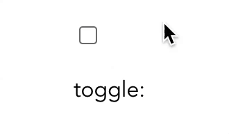

  此时，当复选框被选中时 `toggle === 'yes'`；当没有选中时 `toggle === 'no'`。

- 多选时，可以使用 `v-bind` 将 `value` 绑定到一个动态的 property 上：

  ```html
  <template>
    <div>
      <!-- value 绑定到 option 上 -->
      <input v-model="choose" type="checkbox" :value="option" id="one">
      <label for="one">选项一</label>
      <!-- value 绑定到一个对象上 -->
      <input v-model="choose" type="checkbox" :value="{ number: 10 }" id="two">
      <label for="two">选项二</label>
      <p>choose: {{ choose }}</p>
    </div>
  </template>
  
  <script>
  export default {
    data () {
      return {
        option: 'aaa',
        choose: []
      }
    }
  }
  </script>
  ```

  当都被选中时：

  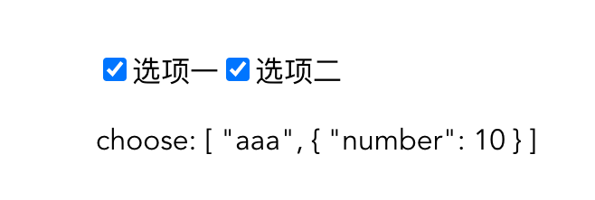

##### 单选按钮

```html
<!-- value 绑定到一个对象的属性上 -->
<input v-model="picked" type="radio" :value="role.name">
```

当被选中时 `picked === role.name`。

##### 选择框的选项

```vue
<select v-model="selected">
  <option :value="{ role1: 'lf', role2: 'sl' }">海贼王</option>
  <option :value="{ role1: 'mr', role2: 'zz' }">火影</option>
</select>
```

当选中”火影“项时 `selected === { role1: 'mr', role2: 'zz' }`。

### 修饰符

##### `.lazy`

使用 `.lazy` 修饰符会将输入框中 `v-model` 绑定的值的更新从的 `input` 事件转换为 `change` 事件：

```html
<!-- change 事件会在输入框失去焦点后才触发 -->
<input v-model.lazy="user1.username">
<p>使用 .lazy: {{ user1 }}</p>
<!-- input 事件会在输入框中的值发生变化时触发 -->
<input v-model="user2.username">
<p>未使用 .lazy: {{ user2 }}</p>
```

结果：

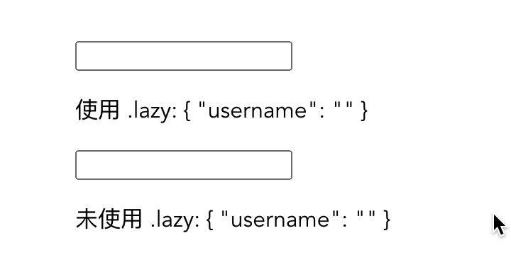

##### `.number`

使用 `.number` 修饰符通过 `parseFloat()` 函数可以自动将用户的输入值转为数值类型，如果无法被解析则返回输入的值：

```html
<input v-model.number="user.password">
<p>使用 .number: {{ user }}</p>
```

结果：

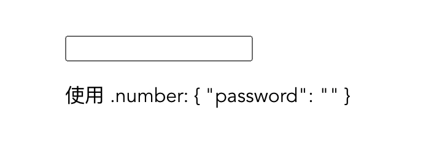

##### `.trim`

使用 `.trim` 修饰符可以自动过滤用户输入的首尾空白字符：

```html
<input v-model.trim="user1.username">
<p>使用 .trim: {{ user1 }}</p>
<input v-model="user2.username">
<p>未使用 .trim: {{ user2 }}</p>
```

结果：

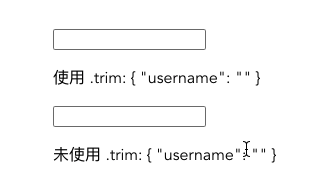

