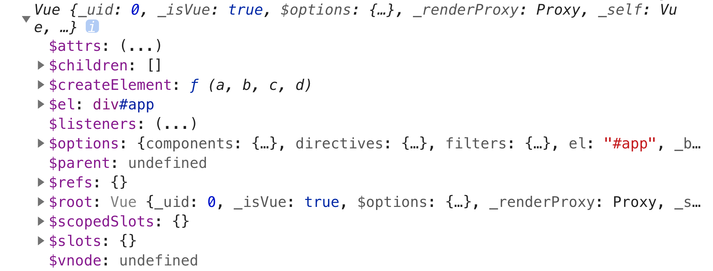

# Vue 实例

### 创建一个 Vue 实例

每个 Vue 应用都是通过用 `Vue` 函数创建一个新的 Vue 实例开始的，代码如下：

```javascript
const vm = new Vue({
  // 选项对象
})
```

当创建 Vue 实例时，可以传入一个**选项对象**，它包含：**数据**、**DOM**、**生命周期钩子**、**资源**、**组合**、**其它**这几大类，通过这些选项可以创建需要的行为。比如在 DOM 类中，我们常常使用 `el` 将 Vue 实例挂载到页面上：

```javascript
new Vue({
  el: '#app'
})
```

### 实例的属性和方法

在创建 Vue 实例后，可以将其在控制台打出，会发现 Vue 实例是一个对象：



Vue 实例这个对象暴露出来一些有用的属性和方法，它们都前缀 `$`，以便与开发者定义的 property 区分开来。比如：

```javascript
const data = { n: 0 }
const vm = new Vue({
  el: '#app',
  data: data
})

// $el 属性：使用的根 DOM 元素
vm.$el === document.getElementById('app') // true

// $data 属性：Vue 实例的属数据对象
vm.$data === data // true

// $watch 方法
vm.$watch('n', (newValue, oldValue) => {
  // 这个回调将在 `vm.n` 改变后调用
})
```

### 认识 data

`data` 是 Vue 实例的数据对象，比如，可以这样使用数据对象：

```javascript
// 数据对象
const person = {
  name: 'xxx',
  age: 18
}
// 将数据对象加入到 Vue 实例中
const vm = new Vue({
  data: person
})
```

在一个 Vue 实例被创建时，它会将 `data` 对象中所有的 property 加入到 **Vue 的响应式系统**。当这些 property 的值发生改变时，视图将会产生响应：重新渲染并匹配更新为最新的值。比如，如下代码：

```vue
<template>
	<p>计数：{{ n }}</p>
	<button @click="addOne">+1</button>
</template>

<script>
export default {
  data: {
    n: 0
  },
  methods: {
    addOne() {
      this.n += 1
    }
  }
}
</script>
```

刚进入页面时，产生的视图如下：


由于 +1 按钮的作用是将 `data` 中的 `n` property 自增 1，所以当首次点击 +1 按钮时，`n` 的值会变为 2，视图也会随之匹配更新：


值得注意的是**只有当 Vue 实例被创建时就已经存在于 `data` 中的 property 才是响应式的**。比如，在下面实例中添加一个新的 property：

```javascript
const vm = new Vue({
  el: '#app',
  data: {
    a: 1
  }
})
// 给实例添加 b property
vm.b = 2

// 更改 b
vm.b = 100 // 视图不会更新
```

像上面这样没有在实例被创建时添加到 `data` 中的 property，后面对它的改动不会触发任何视图的更新。所以如果你知道你会在晚些时候需要一个 property，但是一开始它为空或不存在，那么你仅需要设置一些初始值。比如：

```javascript
data: {
  title: '',
  count: 0,
  todos: [],
  visible: false,
  error: null
}
```

### 认识生命周期钩子

**生命周期**是指在 Vue 实例被创建时都要经历——比如，数据监听、编译模板、将实例挂载到 DOM 并数据变化时更新 DOM 等这一系列的**初始化过程**。而**钩子**是在这个过程中运行的一些**函数**，其作用是让开发者有在不同阶段添加代码的机会。比如，`created` 钩子用来在实例被创建后执行代码，在这个阶段已经可以访问 `data` 数据对象了：

```javascript
new Vue({
  data: {
    n: 0,
  },
  created () {
    console.log('n: ' + this.n) // n: 0
  }
})
```

注意，**生命周期钩子的 `this` 上下文会自动指向调用它的 Vue 实例，所以不能用箭头函数定义生命周期钩子**，比如如下代码：

```javascript
const vm = new Vue({
  created: () =>{
    console.log(this)
  }
})
vm.$watch('a', newValue => this.myMethod())
```

由于箭头函数没有 `this`，则上面代码将会有 `Uncaught TypeError: Cannot read property of undefined` 或 `Uncaught TypeError: this.myMethod is not a function` 之类的错误。