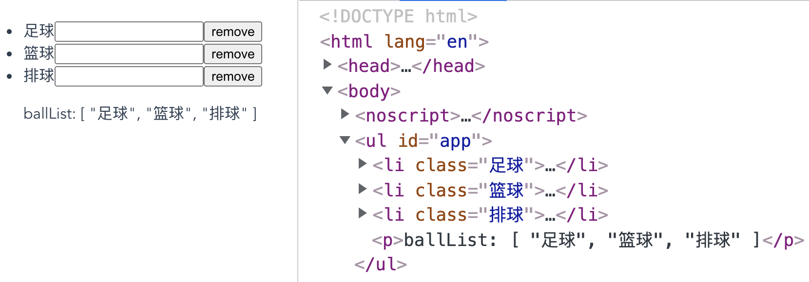

# 列表渲染

### v-for 循环的源数据

`v-for` 指令用于列表渲染，它会基于源数据多次渲染元素或模板块，源数据的数据类型可以是：`Array`、`Object`、`Number`、`String`、`Iterable`。

##### 数组

`v-for` 指令可以基于数组来渲染一个列表。`v-for` 指令需要使用形如 `item in items` 的特殊语法，其中 `items` 是源数据数组，而 `item` 则是被迭代的数组元素的别名：

```vue
<template>
  <ul>
    <li v-for="role in roleList" :key="role.name">
      {{ role.name }} - {{ role.cartoon }}
    </li>
  </ul>
</template>

<script>
export default {
  data () {
    return {
      roleList: [
        { name: '路飞', cartoon: '海贼王' },
        { name: '索隆', cartoon: '海贼王' },
        { name: '娜美', cartoon: '海贼王' }, 
        { name: '佐助', cartoon: '火影' },
        { name: '卡卡西', cartoon: '火影' },
        { name: '鸣人', cartoon: '火影' },
        { name: '坂田银时', cartoon: '银魂' },
        { name: 'HATA皇子', cartoon: '银魂' }
      ]
    }
  }
}
</script>
```

结果如下：


另外 `v-for` 还支持第二个可选的参数——即当前项的索引：

```vue
<template>
  <ul>
    <li v-for="(role, index) in roleList" :key="role.name">
      {{index}} - {{ role.name }} - {{ role.cartoon }}
    </li>
  </ul>
</template>
```

结果如下：


对于分隔符，我们也可以用 `of` 来替代 `in`，因为它更接近 JavaScript 迭代器的语法：

```vue
<li v-for="role of roleList" :key="role.name"></li>
```

##### 对象

`v-for` 指令可以遍历一个对象，第一参数是属性值：

```vue
<template>
  <ul>
    <li v-for="value in user" :key="value">
      {{ value }}
    </li>
  </ul>
</template>

<script>
export default {
  data () {
    return {
      user: {
        nickname: '花木兰',
        age: 18,
        gender: 'female'
      }
    }
  }
}
</script>
```

结果如下：


还可以提供第二个参数表示属性名：

```vue
<template>
  <ul>
    <li v-for="(value, key) in user" :key="value">
      {{ key }} : {{ value }}
    </li>
  </ul>
</template>
```

结果如下：


最后还可以用第三个参数作为索引：

```vue
<template>
  <ul>
    <li v-for="(value, key, index) in user" :key="value">
      {{ index }} - {{ key }} : {{ value }}
    </li>
  </ul>
</template>
```

结果如下：


值得注意的是，`v-for` 遍历对象时，会按 `Object.keys()` 的结果遍历，但不能保证它的结果在不同 JavaScript 引擎下都一致。

##### 数值

`v-for` 指令也可以接受一个**正整数**作为源数据，它会基于该正整数将模板重复渲染对应次数：

```vue
<template>
  <span v-for="n in 10" :key="n">{{ n }} - </span>
</template>
```

结果如下：


同样地，第二个可选的参数作为索引：

```vue
<template>
  <span v-for="(n, index) in 4" :key="n">index: {{ index }} - n: {{ n }}、</span>
</template>
```

结果如下：


##### 字符串

`v-for` 指令还可以接受一个字符串作为源数据，它会基于该字符串的长度进行循环渲染。其中，第一参数作为字符串的，第二个参数作为当前字符串的索引：

```vue
<template>
  <ul>
    <li v-for="(s, index) in testString" :key="index">{{ index }} - {{ s }}</li>
  </ul>
</template>

<script>
export default {
  data () {
    return {
      testString: '落霞与孤鹜齐飞'
    }
  }
}
</script>
```

结果如下：


##### Iterable

`v-for` 指令也可以用在具有可遍历的数据结构的值上，包括原生的 `Map` 和 `Set`：

```vue
<template>
  <ul>
    <li v-for="(item, index) in setList" :key="item">{{ index }} - {{ item }}</li>
  </ul>
</template>

<script>
const setList = new Set(['HTML', 'CSS', 'JavaScript', 'Vue'])
export default {
  data () {
    return {
      setList
    }
  }
}
</script>
```

结果如下：


### `v-for` 更新数据的模式

在使用 `v-for` 渲染元素列表时，Vue 默认采用更加高效的**就地更新**模式，即：

> 如果数据项的顺序被改变，Vue 将不会移动 DOM 元素来匹配数据项的顺序，而是就地更新每个元素，并且确保它们在每个索引位置正确渲染。

比如，页面上有如下模块：



当点击 add 按钮时会往 `itemList` 数组里添加一项，`v-for` 指令则会根据 `itemList` 将内容渲染出来。比如，在点击了三次 add 按钮后：


其中，红色方框部分是一个子组件 `ChildItem`，toggle 按钮用于切换 `status` 的值，相应代码如下：

```vue
<template>
  <span>
    <strong>{{ status }}</strong>
    <button @click="toggle">toggle</button>
  </span>
</template>

<script>
export default {
  data () {
    return {
      status: false
    }
  },
  methods: {
    toggle () {
      this.status = !this.status
    }
  }
}
</script>

<style scoped>
span {
  padding: .2em .5em;
  border: 1px solid red;
}
</style>
```

整个页面是由 App.vue 构建，remove 按钮用于删除当前项，相应代码如下：

```vue
<template>
  <div id="app">
    <button @click="add">add</button>
    <ul>
      <li v-for="(item, index) in itemList">
        <child-item />
        <button @click="remove(index)">remove</button>
      </li>
    </ul>
  </div>
</template>

<script>
import ChildItem from './components/ChildItem.vue'

export default {
  components: { ChildItem },
  data () {
    return {
      status: false,
      itemList: []
    }
  },
  methods: {
    add () {
      this.itemList.push({
        id: Date.now()
      })
    },
    remove (index) {
      this.itemList.splice(index, 1)
    }
  }
}
</script>
```

现进行以下操作，先点击三次 add 按钮，然后点击前两项的 toggle 按钮将 `status` 状态变更为 `true`，最后点击第一项的 remove 按钮：


，删除第一项后，剩下的两项应该是一个带有 `true` 的项和一个带有 `false` 的项。但实际的结果

### 在 `<template>` 上使用 `v-for`

因为 `v-for` 是一个指令，所以必须将它添加到一个元素上才起作用。如果想要使用 `v-for` 循环渲染多个元素而不添加多余的包裹元素，可以把 `<template>` 元素当作一个不可见的包裹元素，并在上面添加 `v-for`。最终的渲染结果只有 `<template>` 元素所包含的元素，而不会包含 `<template>` 元素自身：

```vue
<template>
  <div class="wrapper">
    
  </div>
</template>
```

