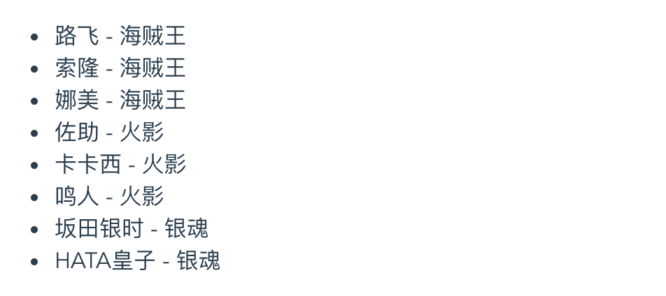

# 列表渲染

### v-for 循环的源数据

`v-for` 指令用于列表渲染，它会基于源数据多次渲染元素或模板块，源数据的数据类型可以是：`Array`、`Object`、`Number`、`String`、`Iterable`。

##### 数组

`v-for` 指令可以基于数组来渲染一个列表。`v-for` 指令需要使用形如 `item in items` 的特殊语法，其中 `items` 是源数据数组，而 `item` 则是被迭代的数组元素的别名：

```vue
<template>
  <ul>
    <li v-for="role in roleList" :key="role.name">
      {{ role.name }} - {{ role.cartoon }}
    </li>
  </ul>
</template>

<script>
export default {
  data () {
    return {
      roleList: [
        { name: '路飞', cartoon: '海贼王' },
        { name: '索隆', cartoon: '海贼王' },
        { name: '娜美', cartoon: '海贼王' }, 
        { name: '佐助', cartoon: '火影' },
        { name: '卡卡西', cartoon: '火影' },
        { name: '鸣人', cartoon: '火影' },
        { name: '坂田银时', cartoon: '银魂' },
        { name: 'HATA皇子', cartoon: '银魂' }
      ]
    }
  }
}
</script>
```

结果如下：



另外 `v-for` 还支持第二个可选的参数——即当前项的索引：

```vue
<template>
  <ul>
    <li v-for="(role, index) in roleList" :key="role.name">
      {{index}} - {{ role.name }} - {{ role.cartoon }}
    </li>
  </ul>
</template>
```

结果如下：


对于分隔符，我们也可以用 `of` 来替代 `in`，因为它更接近 JavaScript 迭代器的语法：

```vue
<li v-for="role of roleList" :key="role.name"></li>
```

##### 对象

`v-for` 指令可以遍历一个对象，第一个参数是属性值：

```vue
<template>
  <ul>
    <li v-for="value in user" :key="value">
      {{ value }}
    </li>
  </ul>
</template>

<script>
export default {
  data () {
    return {
      user: {
        nickname: '花木兰',
        age: 18,
        gender: 'female'
      }
    }
  }
}
</script>
```

结果如下：


还可以提供第二个参数表示属性名：

```vue
<template>
  <ul>
    <li v-for="(value, key) in user" :key="value">
      {{ key }} : {{ value }}
    </li>
  </ul>
</template>
```

结果如下：


最后还可以用第三个参数作为索引：

```vue
<template>
  <ul>
    <li v-for="(value, key, index) in user" :key="value">
      {{ index }} - {{ key }} : {{ value }}
    </li>
  </ul>
</template>
```

结果如下：


值得注意的是，`v-for` 遍历对象时，会按 `Object.keys()` 的结果遍历，但不能保证它的结果在不同 JavaScript 引擎下都一致。

##### 数值

`v-for` 指令也可以接受一个**正整数**作为源数据，它会基于该正整数将模板重复渲染对应次数：

```vue
<template>
  <span v-for="n in 10" :key="n">{{ n }} - </span>
</template>
```

结果如下：


同样地，第二个可选的参数作为索引：

```vue
<template>
  <span v-for="(n, index) in 4" :key="n">index: {{ index }} - n: {{ n }}、</span>
</template>
```

结果如下：


##### 字符串

`v-for` 指令还可以接受一个字符串作为源数据，它会基于该字符串的长度进行循环渲染。其中，第一参数作为字符串的，第二个参数作为当前字符串的索引：

```vue
<template>
  <ul>
    <li v-for="(s, index) in testString" :key="index">{{ index }} - {{ s }}</li>
  </ul>
</template>

<script>
export default {
  data () {
    return {
      testString: '落霞与孤鹜齐飞'
    }
  }
}
</script>
```

结果如下：


##### Iterable

`v-for` 指令也可以用在具有可遍历的数据结构的值上，包括原生的 `Map` 和 `Set`：

```vue
<template>
  <ul>
    <li v-for="(item, index) in setList" :key="item">{{ index }} - {{ item }}</li>
  </ul>
</template>

<script>
const setList = new Set(['HTML', 'CSS', 'JavaScript', 'Vue'])
export default {
  data () {
    return {
      setList
    }
  }
}
</script>
```

结果如下：


### `v-for` 更新数据的模式

在使用 `v-for` 渲染元素列表时，Vue 默认采用更加高效的**就地更新**模式，即：

> 如果数据项的顺序被改变，Vue 将不会移动 DOM 元素来匹配数据项的顺序，而是就地更新每个元素，并且确保它们在每个索引位置正确渲染。

比如，页面上有如下模块，一个 add 按钮和一块根据 `itemList` 展示列表（默认为空）：


当点击 add 按钮时会往 `itemList` 数组里添加一项，`v-for` 指令则会根据 `itemList` 将对应内容渲染出来。比如，在点击了三次 add 按钮后：


其中，红色方框部分是一个组件 `ChildItem`，toggle 按钮用于切换 `status` 的值，相应代码如下：

```vue
<template>
  <span>
    <strong>{{ status }}</strong>
    <button @click="toggle">toggle</button>
  </span>
</template>

<script>
export default {
  name: 'ChildItem',
  data () {
    return {
      status: false
    }
  },
  methods: {
    toggle () {
      this.status = !this.status
    }
  }
}
</script>

<style scoped>
span {
  padding: .2em .5em;
  border: 1px solid red;
}
</style>
```

整个页面是由 App.vue 构建，remove 按钮用于删除当前项，相应代码如下：

```vue
<template>
  <div id="app">
    <button @click="add">add</button>
    <ul>
      <li v-for="(item, index) in itemList" :class="`item-${item.id}`">
        <child-item />
        <button @click="remove(index)">remove</button>
      </li>
    </ul>
  </div>
</template>

<script>
import ChildItem from './components/ChildItem.vue'

export default {
  components: { ChildItem },
  data () {
    return {
      status: false,
      itemList: []
    }
  },
  methods: {
    add () {
      this.itemList.push({
        id: Date.now()
      })
    },
    remove (index) {
      this.itemList.splice(index, 1)
    }
  }
}
</script>
```

现进行以下操作，先点击三次 add 按钮，然后点击前两项的 toggle 按钮将 `status` 状态变更为 `true`，最后点击第一项的 remove 按钮：


按照我们的预期，在删除第一项后，剩下的两项应该是一个带有 `true` 的项和一个带有 `false` 的项，但结果却是剩下两个带 `true` 的项，反而是最后一项带 `false` 的被删除了。

实际过程是这样的，点击三次 add 按钮后，`itemList` 变为：`[{ id: 1627713812082 }, { id: 1627713812494 }, { id: 1627713813326 }]`，页面上也会有三个 `<li>` 元素。

在点击第一项的 remove 按钮后，`itemList[0]` 会被删除，现在 `itemList` 变为：`[{ id: 1627713812494 }, { id: 1627713813326 }]`。Vue 发现 `itemList` 有变化后，`v-for` 指令会遍历当前只有两项的 `itemList` 并渲染。同时 Vue 默认采用就地更新策略，它会原地修改元素，过程如下：


可以看见 `itemList[0]` 确实被删除了，不过 Vue 会直接复用之前的 DOM 并修改元素。第一个 `<li>` 元素的 class 变更为最初 `itemList` 有三项时的**第二项**的 id，即 `1627713812494`。第二个 `<li>` 元素的 class  变更为最初  `itemList` 有三项时的**第三项**的 id，即 `1627713813326`。由于现在 `itemList` 只有两项，所以带有 `fasle` 的第三个 `<li>` 元素便被“删除“了。而由于被复用的第一个和第二个 `<li>` 元素中的 ChildItem 子组件的 `status` 仍是 `true`，所以页面上会显示两个带有 `true` 的项。

要想让 Vue 跟踪每个数据项对应的 DOM 节点，需要添加一个具有唯一标识的 **`key`** attribute：

```vue
<template>
  <div id="app">
    <button @click="add">add</button>
    <ul>
      <!-- 添加 key -->
      <li v-for="(item, index) in itemList" :key="item.id" :class="`item-${item.id}`">
        <child-item />
        <button @click="remove(index)">remove</button>
      </li>
    </ul>
  </div>
</template>
```

这样 Vue 便能跟踪每个 DOM 节点的身份，它会基于 key 的变化重用和重新排序现有元素。当点击 remove 按钮时，Vue 会明确地知道移除哪个节点：


建议尽可能在使用 `v-for` 时提供 `key` attribute，同时不要使用对象或数组之类的非基本类型值作为 `v-for` 的 `key`，要用字符串或数值类型的值。

### 在 `<template>` 上使用 `v-for`

因为 `v-for` 是一个指令，所以必须将它添加到一个元素上才起作用。如果想使用 `v-for` 循环渲染多个元素而不添加多余的包裹元素，可以使用 `<template>` 元素，将它当作一个不可见的包裹元素，并在上面添加 `v-for`。最终的渲染结果将不会包含 `<template>` 元素：

```vue
<template>
  <div id="app">
    <template v-for="(item, index) in itemList">
      <span :key="item">{{ index }}-</span>
      <strong :key="item">{{ item }}</strong>
      <br :key="item" />
    </template>
  </div>
</template>
```

值得注意的是 `key` attribute 要添加在需要实际展示的元素上，结果如下：


### 在组件上使用 `v-for`

在组件上也可以使用 `v-for` 指令，此时 `key` 是必须的：

```vue
<template>
  <div id="app">
    <my-component v-for="item in itemList" :key="item" />
  </div>
</template>
```

### 数组更新检测

##### 变更方法

Vue 对被侦听的数组的**变更方法**进行了**包裹**，所以它们也会触发视图更新。这些被包裹过的变更方法包括：

`push()`、`pop()`、`shift()`、`unshift()`、`splice()`、`sort()`、`reverse()`。比如页面上有以下模块：


相应代码如下：

```vue
<template>
  <div id="app">
    <button @click="add">add</button>
    <ul>
      <li v-for="item in itemList" :key="item">{{ item }}</li>
    </ul>
  </div>
</template>

<script>
export default {
  data () {
    return {
      itemList: ['HTML', 'CSS', 'JavaScript']
    }
  },
  methods: {
    add () {
      this.itemList.push('Vue')
    }
  }
}
</script>
```

当点击 add 按钮时会调用 `itemList` 的 `push` 方法，从而触发视图更新：


##### 替换数组

在 JavaScript 中也有一些方法不会改变原始数组，而总是返回一个新数组，例如 `filter()`、`concat()` 、`slice()`。在使用它们时，可以用新数组替换旧数组的方式。这种方式并不会让 Vue 重新渲染整个列表，这是因为：

> Vue 为了使得 DOM 元素得到最大范围的重用而实现了一些智能的启发式方法，所以用一个含有相同元素的数组去替换原来的数组是非常高效的操作。

比如，有以下代码：

```vue
<template>
  <div id="app">
    <button @click="add">add</button>
    <p v-for="item in itemList" :key="item">{{ item }}</p>
  </div>
</template>

<script>
export default {
  data () {
    return {
      itemList: ['a', 'b', 'c']
    }
  },
  methods: {
    add () {
      this.itemList = this.itemList.concat(['d', 'e', 'f'])
    }
  }
}
</script>
```

当点击 add 按钮时，页面 DOM 的变化过程：


可以看见，Vue 没有重新渲染整个 `itemList`，它只渲染了 `itemList` 中新增加的部分。

##### 注意事项

由于 JavaScript 的限制，Vue **不能检测**数组和对象的变化。

### `v-for` 与 `v-if` 一同使用

当它们用在同一元素时，`v-for` 的优先级比 `v-if` 更高，这意味着 `v-if` 将分别重复运行于每个 `v-for` 循环中。一般有两种常见的情况下会倾向于将它们用在同一元素上，但都有更好的方法避免：

- 为了过滤源数据中的某些项，这种情形可以使用计算属性。比如，在所有用户中展示活跃用户：

  ```vue
  <template>
    <ul>
      <li v-for="user in userList" v-if="user.isActive" :key="user.id">{{ user.name }}</li>
    </ul>
  </template>
  ```

  这种情形下都将会经过以下运算：

  ```javascript
  this.userList.map(user => {
    if (user.isActive) {
      return user.name
    }
  })
  ```

  尽管只需要展示活跃用户，但每次渲染时都会遍历整个用户列表，而不管活跃的用户是否发生变化。这种方式在渲染上低效，并且逻辑耦合。

  我们可以将源数据更换为在一个活跃用户的计算属性上遍历：

  ```vue
  <template>
    <ul>
      <li v-for="user in userListActive" :key="user.id">{{ user.name }}</li>
    </ul>
  </template>
  
  <script>
  export default {
    computed: {
      userListActive () {
        return this.userList.filter(user => {
          return user.isActive
        })
      }
    }
  }
  </script>
  ```

  这样做的好处有：

  - 过滤后的列表只有在 `userList` 发生相关变化时才被重新计算，过滤更高效。
  - 源数据更换为计算属性 `userListActive` 后，渲染时只会遍历活跃用户，渲染更高效。
  - 解耦渲染层的逻辑，可维护性 (对逻辑的更改和扩展) 更强

- 为了避免渲染本应该被隐藏的列表，这种情形可以将 `v-if` 移动至容器元素上。比如，当有 todo item 才渲染：

  ```vue
  <template>
    <div>
      <ul v-if="todoList.length">
        <li v-for="todo in todoList":key="todo.id">{{ todo.name }}</li>
      </ul>
      <p v-else>当前没有待做事项！</p>
    </div>
  </template>
  ```
