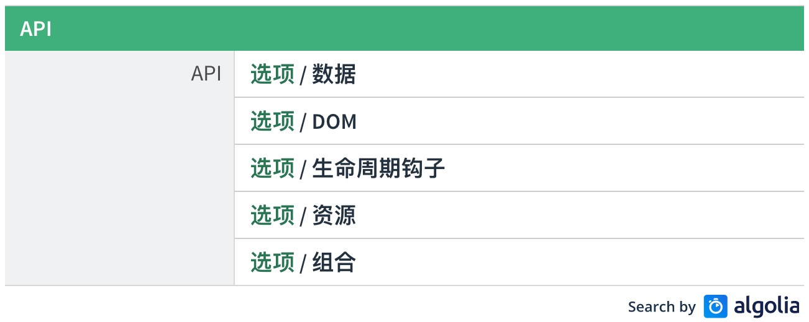
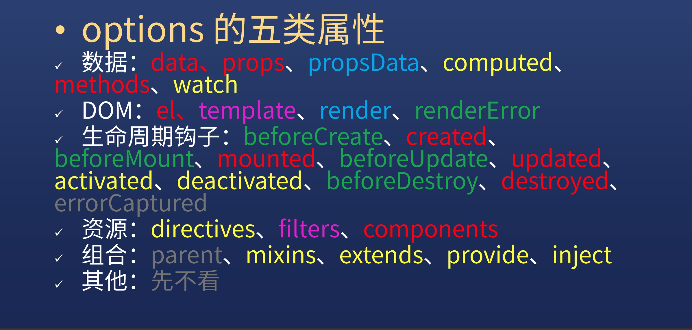

# Vue 构造选项

### 背景

每个 Vue 应用都是通过 Vue 函数创建一个新的 **Vue 实例**开始的，如下代码：

```javascript
var vm = new Vue({
  // 选项
})
```

当创建 Vue 实例时，需要传入一个**选项对象**，本文将介绍及理解这些选项

### 选项对象

在 Vue 的文档搜索栏，输入 选项 就可以看到选项的相关文档，如下图所示



可以看出，选项对象有五类属性：

- 选项/数据：`data`、`props`、`propsData`、`computed`、`methods`、`watch`
- 选项/DOM：`el`、`template`、`render`、`renderError`
- 选项/生命周期钩子：`beforeCreate`、`created`、`beforeMount`、`mounted`、`beforeUpdate`、`updated`、`activated`、`deactivated`、`beforeDestroy`、`destroyed`、`errorCaptrured`
- 选项/资源：`directives`、`filters`、`components`
- 选项/组合：`parent`、`mixins`、`extends`、`provide/inject`
- 选项/其它：暂不看

我们将上面选项类型按难易程度用颜色作如下图所示的划分：



分类说明如下：

- 红色属性：好学，比较容易学
- 黄色：高级属性，需要费点力
- 绿色：可通过红色中的某些属性推敲而来，一看就明了
- 蓝色：不常用，可学可不学
- 紫色：比较特殊，重点讲下
- 灰色：很不常用，用的时候看文档