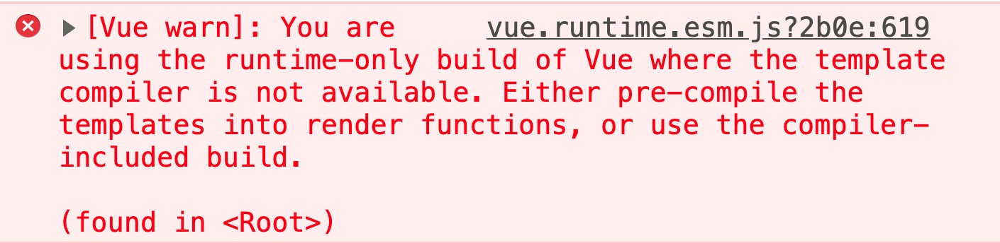
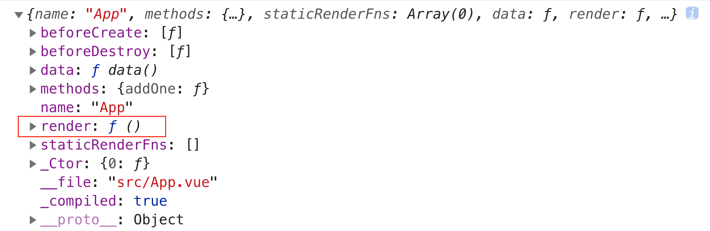
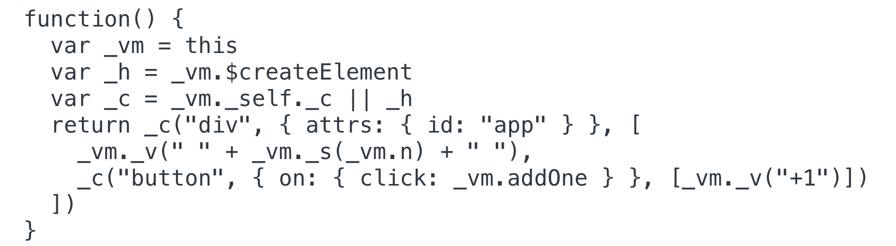

# 理解 Vue 不同构建版本

Vue 将构建版本大致划分为：**完整版**和**运行时版**。

> 完整版：同时包含编译器和运行时的版本。
>
> 编译器：用来将模板字符串编译成为 JavaScript 渲染函数的代码。
>
> 运行时：用来创建 Vue 示例、渲染并处理虚拟 DOM 等的代码。基本上就是除去编译器的其它一切。

以下通过具体示例理解这两个构建版本的不同。

### 制作 +1 按钮

#### 完整版

在完整版中，可以使用模板语法得到视图。

```html
<html>
  <body>
    <div id="app">
      {{ n }}
      <button @click="addOne">+1</button>
    </div>
    <!-- 引入完整版的 Vue -->
    <script src="https://cdn.jsdelivr.net/npm/vue@2.6.12/dist/vue.js"></script>
    <script>
      new Vue({
        el: '#app',
        data: {
          n: 0
        },
        methods: {
         addOne() {
           this.n += 1
         }
        }
      })
    </script>
  </body>
</html>
```

在页面中点击 `+1` 按钮，初始值将会从 0 变为 1。

#### 运行时版

引入运行时版。

```html
<!-- 引入运行时版的 Vue -->
<script src="https://cdn.jsdelivr.net/npm/vue@2.6.12/dist/vue.runtime.js"></script>
```

 引入后，控制台会出现报错信息。



由于运行时版没有模板编译器，所以不支持使用模板语法的方式来得到视图，解决办法是：

- 使用 `render` 函数。

  ```html
  <html>
    <body>
      <div id="app"></div>
      <!-- 运行时版的 Vue -->
      <script src="https://cdn.jsdelivr.net/npm/vue@2.6.12/dist/vue.runtime.js"></script>
      <script>
        new Vue({
          el: '#app',
          data: {
            n: 0
          },
          methods: {
            addOne() {
              this.n += 1
            }
          },
          // render 函数
          render(h) {
            return h('div', [this.n, h('button', { on: { click: this.addOne }}, '+1')])
          }
        })
      </script>
    </body>
  </html>
  ```

- 使用完整版。

### 完整版 vs 运行时版

通过开发 `+1` 按钮的过程中对两个构建版本的比较，可以发现：模板语法相较于 `render` 函数更加直观易理解。那是否在开发时都是使用完整版呢？答案是否定的，大多数情况下都是使用运行时版。例如，@vue/cli 创建的项目默认使用运行时版，原因在于：

> 因为运行时版本相比完整版体积要小大约 30%，所以应该尽可能使用这个版本。

完整版比运行时版体积大的部分就是编译器，编译器需要把模板字符串编译成为 JavaScript 渲染函数，所以编译器会比较复杂，进而导致其体积较大。例如，假设完整版的体积 100kb，则运行时版的体积大约是 70kb，相当于完整版比运行时版体积大了 40% 左右，所以应尽可能地使用运行时版。

完整版和运行时版的区别在于**是否需要编译模板**，当需要编译模板时则必须使用完整版。

- 使用 `template` 选项。

  ```javascript
  new Vue({
    el: '#app',
    template: '<div>{{ n }}</div>'
  })
  ```

- 挂载到一个元素上并以其 DOM 内部的 HTML 作为模板。

  ```html
  <div id="app">
    <h1>hellow Vue.js</h1>
  </div>
  <script>
    new Vue({
      el: '#app'
    })
  </script>
  ```

### 最佳实践

总是使用使用**运行时版**，并结合 `vue-loader` 和 `*.vue` 这样的单文件组件一起使用，原因如下：

1. 保证用户体验，用户下载的 JavaScript 体积更小，则需要使用 `render` 函数。
2. 保证开发体验，开发者可以使用直观方便的模板语法，则需要在单文件组件中进行开发。
3. 构建时，通过使用 `vue-loader` 将 `*.vue` 文件内部的模板预编译成 JavaScript 渲染函数。
4. 这样做同时兼顾了用户体验和开发体验。

例如，在 @vue/cli 创建的项目中开发 `App.vue` 时使用模板语法：

```vue
<template>
  <div id="app">
    {{ n }}
    <button @click="addOne">+1</button>
  </div>
</template>

<script>
export default {
  name: 'App',
  data () {
    return {
      n: 0
    }
  },
  methods: {
    addOne () {
      this.n += 1
    }
  }
}
</script>

<style lang="scss">
#app {
  color: red
}
</style>
```

当在 `main.js` 中添加 `console.log(App)` 语句时，便会在控制台得到以下对象。

  

当打印该对象的 `render` 方法时，便会得到 `App.vue` 的 JavaScript 渲染函数。


