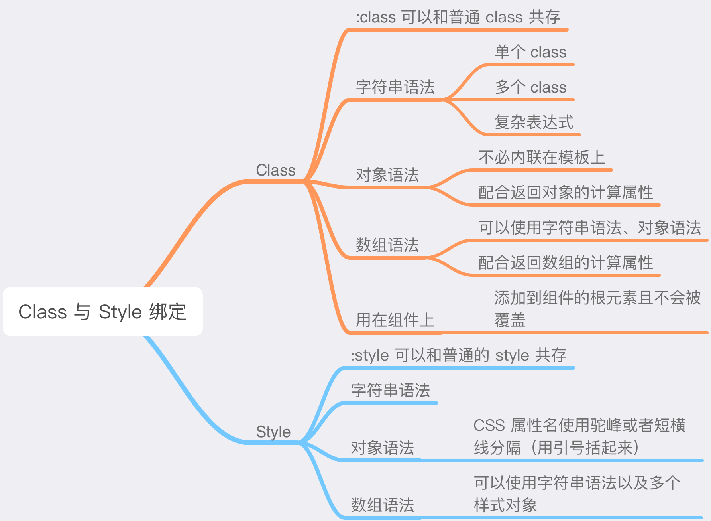
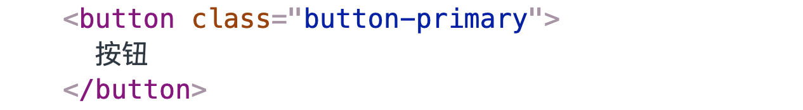
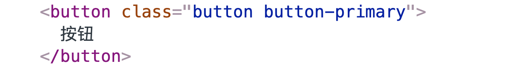
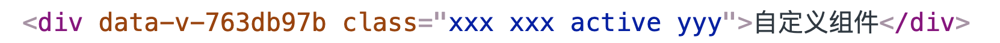
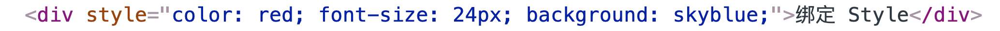

# Class 与 Style 绑定



在使用 Vue 开发时，经常会有操作元素 `class` 和 `style` 的需求。比如，开发组件时常会使用计算属性来根据不同的 props 添加对应的 class，从而在组件上应用不同的样式。

> 因为 `class` 和 `style` 都是 HTML attribute，所以可以通过 `v-bind` 进行处理：只需要绑定的表达式计算出字符串结果即可。不过，字符串拼接麻烦且容易出错。因此，`v-bind` 在用于 `class` 和 `style` 时，Vue 做了专门的增强，表达式结果的类型除了字符串，还可以是对象和数组。

### 绑定 Class

##### 字符串语法

`v-bind:class` 绑定的表达式的计算结果可以是字符串：

```vue
<template>
  <div :class="activeClass">绑定 HTML Class</div>
</template>

<script>
export default {
  data () {
    return {
      activeClass: 'active'
    }
  }
}
</script>
```

结果：


还可以绑定多个 class：

```vue
<template>
  <div :class="classList">绑定多个 class</div>
</template>

<script>
export default {
  data () {
    return {
      classList: 'xxx yyy zzz'
    }
  }
}
</script>
```

结果：


此外，绑定的表达式也可以复杂一点，只要表达式计算结果是字符串即可：

```vue
<template>
  <button :class="type && `button-${type}`">按钮</button>
</template>

<script>
export default {
  props: {
    type: {
      type: String,
      default: 'primary'
    }
  }
}
</script>
```

在使用按钮组件后：



**`v-bind:class` 指令也可以与普通的 class attribute 共存**：

```vue
<template>
  <button class="button" :class="type && `button-${type}`">按钮</button>
</template>
```

结果：



##### 对象语法

绑定 class 时，也可以**传给 `v-bind:class` 一个对象，用以动态地切换 class**：

```vue
<template>
  <div :class="{ active: isActive }" />
</template>
```

`active` class 是否存在取决于 `isActive` property 值的真假。比如，当 `isActive` 值为真时：


还可以在对象中传入更多的字段来**动态**切换多个 class。并且，绑定 class 的对象语法也可以和普通的 class attribute 共存。比如，有如下模板：

```vue
<template>
  <div class="demo" :class="{ active: isActive, disabled: isDisabled, loading: isLoading, 'has-sider': hasSider }" />
</template>

<script>
export default {
  data () {
    return {
      isActive: true,
      isDisabled: false,
      isLoading: true,
      hasSider: false
    }
  }
}
</script>
```

结果：


当 data 中 `isActive`、`isDisabled`、`isLoading` 有变化时，class 列表会作相应地更新：

```vue
<script>
export default {
  data () {
    return {
      isActive: false,
      isDisabled: true,
      isLoading: false
    }
  }
}
</script>
```

结果：


在使用对象语法绑定 class 时，可以将对象放在 data 中，而不必将对象内联在模板里，这会让模板更加清晰：

```vue
<template>
  <div class="demo" :class="classObject" />
</template>

<script>
export default {
  data () {
    return {
      classObject: {
        active: true,
        disabled: false,
        loading: true
      }
    }
  }
}
</script>
```

结果：


还可以在 `v-bind:class` 中绑定一个返回对象的计算属性，这是一种更常用且更强大的模式：

```vue
<template>
  <div class="demo" :class="classObject" />
</template>

<script>
export default {
  data () {
    return {
      isActive: true,
      isDisabled: false,
      isLoading: true
    }
  },
  computed: {
    classObject () {
      const { isActive, isDisabled, isLoading } = this
      return {
        active: isActive,
        disabled: isDisabled,
        loading: isLoading
      }
    }
  }
}
</script>
```

##### 数组语法

在绑定 class 时，也可以**传一个数组给 `v-bind:class`，用以应用一个 class 列表**：

```vue
<template>
  <div class="demo" :class="[activeClass, loadingClass]" />
</template>

<script>
export default {
  data () {
    return {
      activeClass: 'active',
      loadingClass: 'loading'
    }
  }
}
</script>
```

结果：


如果想在数组中根据条件切换不同的 class，可以使用三元表达式：

```vue
<template>
  <div class="demo" :class="[isActive ? 'active' : '']" />
</template>
```

`active` class 是否存在取决于 data 中 `isActive` property 值的真假。

此外，我们也可以在数组中使用字符串语法、对象语法。并且，绑定一个返回数组的计算属性，这是一种更常用且更强大的模式：

```vue
<template>
  <button class="demo" :class="classList">按钮</button>
</template>

<script>
import { oneOf } from '@/utils/index.js'

const prefixClass = 'w-button-'

export default {
  name: 'WButton',
  props: {
    iconPosition: {
      type: String,
      validator (value) {
        return oneOf(value, ['left', 'right'])
      }
    },
    loading: {
      type: Boolean,
      default: false
    }
  },
  computed: {
    classList () {
      const { iconPosition, loading } = this
      return [
        iconPosition && `${prefixClass}icon-${iconPosition}`,
        { [`${prefixClass}loading`]: loading }
      ]
    }
  }
}
</script>
```

##### 用在组件上

**当在自定义组件上使用 class 时（不管是否使用 `v-bind` 绑定），这些 class 都会被添加到组件的根元素上。同时，这个根元素上已经存在的 class 不会被覆盖**。比如，有如下自定义组件：

```vue
<template>
  <div class="xxx">自定义组件</div>
</template>

<script>
export default {
  name: 'MyComponent'
  // ...
}
</script>
```

在使用组件时绑定 class：

```vue
<my-component class="xxx" :class="[{ active: isActive }, 'yyy']" />
```

当 `isActive` 的值为真：



### 绑定 Style

##### 字符串语法

`v-bind:style` 绑定的表达式计算结果可以是字符串，用以在元素上添加内联样式。同时，`v-bind:style` 和普通的 style attribute 可以共存：

```vue
<template>
  <div style="background: yellowgreen" :style="styleString">绑定 Style</div>
</template>

<script>
export default {
  data () {
    return {
      // 字符串语法拼接麻烦且容易出错
      styleString: 'color: red; font-size: 20px;'
    }
  }
}
</script>
```

结果：


##### 对象语法

绑定 style 时，可以传给 `v-bind:style` 一个对象，用以添加内联样式。在这个对象中，CSS property 名可以使用驼峰式或者短横线分隔（用引号括起来）来命名：

```vue
<template>
  <div style="color: red;" :style="{ fontSize: fontSize }">绑定 Style</div>
  <!-- <div style="color: red;" :style="{ 'font-size': fontSize }">绑定 Style</div> -->
</template>

<script>
export default {
  data () {
    return {
      fontSize: '22px'
    }
  }
}
</script>
```

结果：


此外，对象不必内联到模板中，直接绑定一个样式对象是更好的选择，这会让模板更清晰：

```vue
<template>
  <div style="color: red;" :style="styleObject">绑定 Style</div>
</template>

<script>
export default {
  data () {
    return {
      styleObject: {
        fontSize: '22px'
      }
    }
  }
}
</script>
```

同样地，绑定一个返回对象的计算属性是更常用且更强大的模式：

```vue
<template>
  <div :style="styleObj">绑定一个返回对象的计算属性</div>
</template>

<script>
export default {
  props: {
    ratio: {
      type: String
    }
  },
  computed: {
    styleObj () {
      const { ratio } = this
      const iconColor = ratio.includes('-') ? 'red' : 'green'
      return {
        color: iconColor
      }
    }
  }
}
</script>
```

##### 数组语法

绑定 style 时，也可以传一个数组，数组中可以包含多个样式对象：

```vue
<template>
  <div style="color: red;" :style="[baseStyle, spcialStyle]">绑定 Style</div>
</template>

<script>
export default {
  data () {
    return {
      baseStyle: {
        fontSize: '24px'
      },
      spcialStyle: {
        background: 'skyblue'
      }
    }
  }
}
</script>
```

结果：


