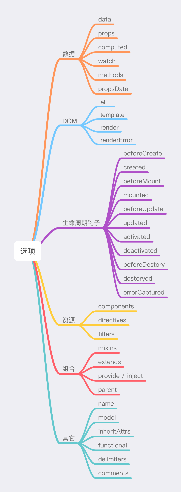
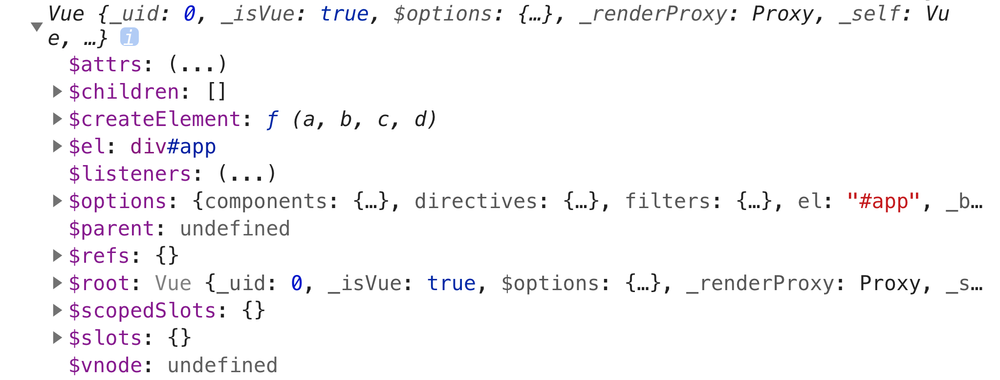

# Vue 实例

### 创建 Vue 实例

每个 Vue 应用都是通过用 `Vue` 函数创建一个新的 Vue 实例开始的：

```javascript
const vm = new Vue({
  // 构造选项
})
```

当创建 Vue 实例时，可以传入一个**选项对象**：



通过这些选项可以创建想要的行为。例如，可以使用 `el` 将 Vue 实例挂载到页面的某个元素上。

```javascript
new Vue({
  el: '#app'
})
```

### 实例的属性和方法

Vue 实例是一个对象，它会暴露出来一些有用的属性和方法——它们都有前缀 `$`，以便与开发者定义的 property 区分。例如：

```javascript
const data = { n: 0 }
const vm = new Vue({
  el: '#app',
  data: data
})

// $el 属性：实例使用的根 DOM 元素
vm.$el === document.getElementById('app') // true

// $data 属性：Vue 实例观察的数据对象
vm.$data === data // true

// $watch 方法
vm.$watch('n', (newValue, oldValue) => {
  // 这个回调将在 `vm.n` 改变后调用
})
```

可以在控制台打印实例：


