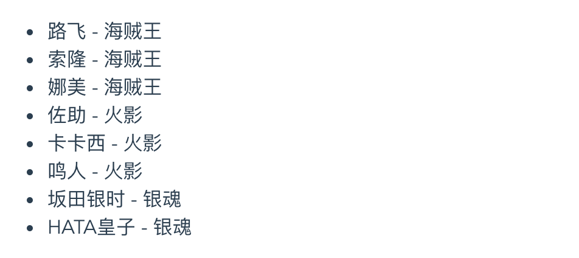
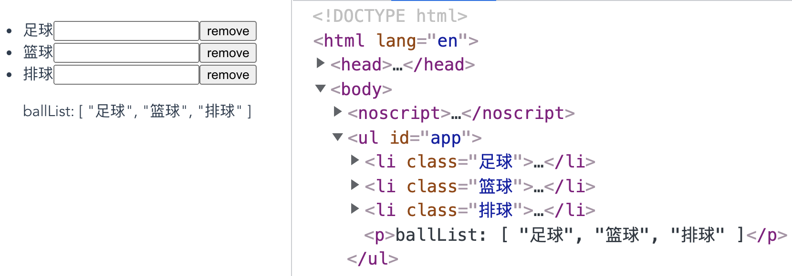
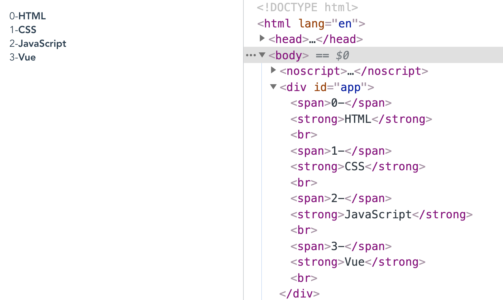
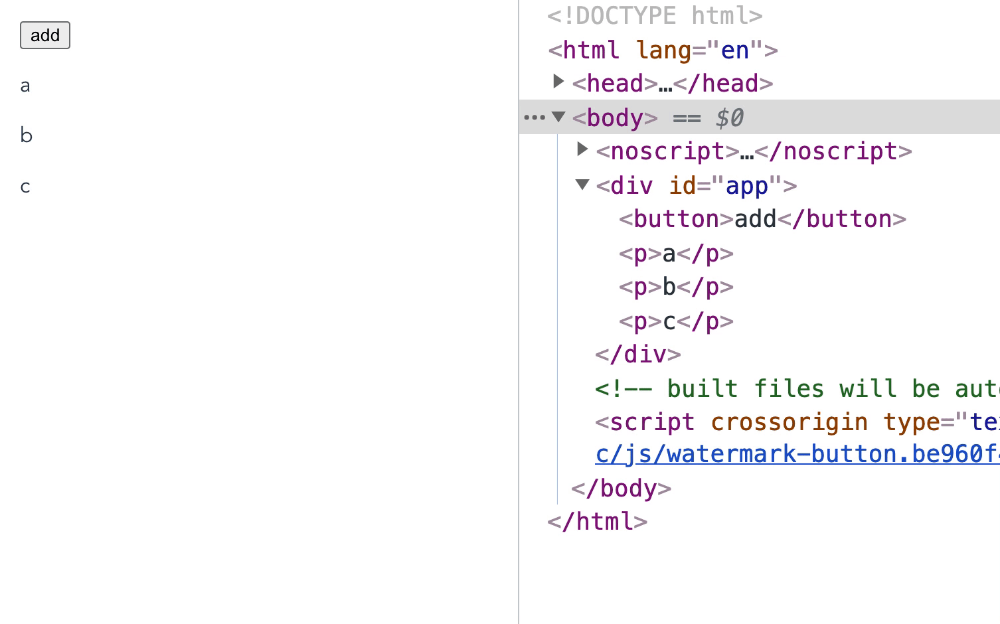

# 列表渲染

### v-for 循环

`v-for` 指令会基于源数据多次渲染元素或模板块，源数据的数据类型可以是：`Array`、`Object`、`Number`、`String` 或 `Iterable`。`v-for` 指令在使用时的值必须使用形如 `alias in expression` 的特殊语法。其中，`alias` 是当前被遍历元素的别名，`expression` 是源数据。

##### 数组

`v-for` 指令可以基于一个数组来渲染一个列表：

```vue
<template>
  <ul>
    <li v-for="role in roleList" :key="role.name">
      {{ role.name }} - {{ role.cartoon }}
    </li>
  </ul>
</template>

<script>
export default {
  data () {
    return {
      roleList: [
        { name: '路飞', cartoon: '海贼王' },
        { name: '索隆', cartoon: '海贼王' },
        { name: '娜美', cartoon: '海贼王' }, 
        { name: '佐助', cartoon: '火影' },
        { name: '卡卡西', cartoon: '火影' },
        { name: '鸣人', cartoon: '火影' },
        { name: '坂田银时', cartoon: '银魂' },
        { name: 'HATA皇子', cartoon: '银魂' }
      ]
    }
  }
}
</script>
```

结果：



另外，`v-for` 还支持一个可选的第二个参数，即当前项的索引（索引从 0 开始）：

```vue
<template>
  <ul>
    <li v-for="(role, index) in roleList" :key="role.name">
      {{index}} - {{ role.name }} - {{ role.cartoon }}
    </li>
  </ul>
</template>
```

结果：


对于分隔符，还可以用 `of` 来替代 `in`，因为它更接近 JavaScript 迭代器的语法：

```vue
<li v-for="role of roleList" :key="role.name"></li>
```

##### 对象

`v-for` 指令也可以遍历一个对象，第一个参数是属性值：

```vue
<template>
  <ul>
    <li v-for="value in user" :key="value">
      {{ value }}
    </li>
  </ul>
</template>

<script>
export default {
  data () {
    return {
      user: {
        nickname: '花木兰',
        age: 18,
        gender: 'female'
      }
    }
  }
}
</script>
```

结果：


还可以提供第二个参数表示属性名：

```vue
<template>
  <ul>
    <li v-for="(value, key) in user" :key="value">
      {{ key }} : {{ value }}
    </li>
  </ul>
</template>
```

结果：


还可以用第三个参数作为索引：

```vue
<template>
  <ul>
    <li v-for="(value, key, index) in user" :key="value">
      {{ index }} - {{ key }} : {{ value }}
    </li>
  </ul>
</template>
```

结果：


另外，`v-for` 在遍历对象时，会按 `Object.keys()` 的结果遍历，但不能保证它在不同 JavaScript 引擎下的结果都一致。

##### 数值

`v-for` 指令也可以接受一个正整数作为源数据，它会把模板重复渲染对应次数：

```vue
<template>
  <span v-for="n in 10" :key="n">{{ n }} - </span>
</template>
```

结果：


还可以提供可选的第二个参数作为索引：

```vue
<template>
  <span v-for="(n, index) in 4" :key="n">index: {{ index }} - n: {{ n }}、</span>
</template>
```

结果：


##### 字符串

`v-for` 指令还可以接受一个字符串作为源数据，它会基于字符串的长度进行循环渲染。其中，第一个参数是被遍历的字符，第二个参数是索引：

```vue
<template>
  <ul>
    <li v-for="(s, index) in testString" :key="index">{{ index }} - {{ s }}</li>
  </ul>
</template>

<script>
export default {
  data () {
    return {
      testString: '落霞与孤鹜齐飞'
    }
  }
}
</script>
```

结果：


##### Iterable

`v-for` 指令还可以在实现了可迭代协议的值上使用，包括原生的 `Map` 和 `Set`：

```vue
<template>
  <ul>
    <li v-for="(item, index) in setList" :key="item">{{ index }} - {{ item }}</li>
  </ul>
</template>

<script>
const setList = new Set(['HTML', 'CSS', 'JavaScript', 'Vue'])
export default {
  data () {
    return {
      setList
    }
  }
}
</script>
```

结果：


### `v-for` 就地更新策略

当 Vue 正在更新使用 `v-for` 渲染的元素列表时，它默认使用更加高效的**就地更新**策略，即：

> 如果数据项的顺序被改变，Vue 将不会移动 DOM 元素来匹配数据项的顺序，而是就地更新每个元素，并且确保它们在每个索引位置正确渲染。

上面内容可以通过以下示例来理解，页面有一个使用 `v-for` 基于 `ballList` 渲染的列表：



列表的渲染模板由展示球类名称的  `<span>` 元素、可输入内容的 `input` 元素以及点击后删除当前项的 `<button>` 元素组成，对应代码：

```vue
<template>
  <ul id="app">
    <li v-for="(ball, index) in ballList" :key="ball" :class="ball">
      <span>{{ ball }}</span>
      <input />
      <button @click="remove(index)">remove</button>
    </li>
    <p>ballList: {{ ballList }}</p>
  </ul>
</template>

<script>
export default {
  data () {
    return {
      ballList: ['足球', '篮球', '排球']
    }
  },
  methods: {
    remove (index) {
      this.ballList.splice(index, 1)
    }
  }
};
</script>
```

在“足球”这一行的 input 框输入内容后，点击 remove 按钮。按照预期，“足球”这一行将会被删除，但结果与预期不符：


可以看见，“足球”确实被删除了，但其后 input 框已输入的内容却还在，并且第三个 `<li>` 元素像是被删除了。这是因为 `v-for` 渲染的列表在源数据变化时，Vue 为了高效会尽可能地复用/修改 DOM 中已经存在的同类型元素，所以实际上是这样变化地：

当“足球”项被删除时，`v-for` 会根据新的 `ballList` 重新进行渲染，接着 Vue 将 `ballList` 新的值 `['篮球', '排球']` 直接更新到以前的第一个和第二个 `<li>` 元素上，所以第三个 `<li>` 元素会被删除。同时，由于  `<span>` 元素内的文本绑定了 `ballList` 中被遍历的项，所以 Vue 会直接在第一个和第二个 `<li>` 的 `<span>` 元素中更新值。对于 `<input>` 元素，它没有和 `data` 中的任何数据绑定，所以它会被 Vue 直接复用。因此在“足球”项中输入的内容仍然会存在。

Vue 默认使用的就地更新策略是高效的，但是**只适用于不依赖子组件状态或临时 DOM 状态 (例如：表单输入值) 的列表渲染输出**。

要想让 Vue 能跟踪每个节点的身份，从而重用和重新排序现有元素，需要为被遍历的每项添加一个具有唯一标识的 **`key`** attribute：

```vue
<template>
  <ul id="app">
    <!-- 添加 key -->
    <li v-for="(ball, index) in ballList" :key="ball" :class="ball">
      <span>{{ ball }}</span>
      <input />
      <button @click="remove(index)">remove</button>
    </li>
    <p>ballList: {{ ballList }}</p>
  </ul>
</template>
```

当点击 remove 按钮时，Vue 会明确地知道移除哪个节点：


建议尽可能在使用 `v-for` 时提供 `key` attribute，同时不要使用对象或数组之类的非基本类型值作为 `v-for` 的 `key`，要用字符串或数值类型的值。

### 在 `<template>` 上使用 `v-for`

因为 `v-for` 是一个指令，所以必须将它添加到一个元素上才起作用。如果想使用 `v-for` 循环渲染多个元素而不添加多余的包裹元素，可以把 `<template>` 元素当作一个不可见的包裹元素，并在上面使用 `v-for`。最终的渲染结果将不会包含 `<template>` 元素自身：

```vue
<template>
  <div id="app">
    <template v-for="(item, index) in itemList">
      <span :key="item">{{ index }}-</span>
      <strong :key="item">{{ item }}</strong>
      <br :key="item" />
    </template>
  </div>
</template>
```

结果：



值得注意的是 `key` attribute 需要添加在实际展示的元素上。

### 在组件上使用 `v-for`

在组件上也可以使用 `v-for` 指令，此时 `key` attribute 是必须的：

```vue
<template>
  <div id="app">
    <my-component v-for="item in itemList" :key="item" />
  </div>
</template>
```

### 数组更新检测

##### 变更方法

Vue 对被侦听数组的**变更方法**进行了**包裹**，所以它们也会触发视图更新。这些被包裹过的变更方法包括：

`push()`、`pop()`、`shift()`、`unshift()`、`splice()`、`sort()`、`reverse()`。比如，页面上有以下模块：


对应代码：

```vue
<template>
  <div id="app">
    <button @click="add">add</button>
    <ul>
      <li v-for="item in itemList" :key="item">{{ item }}</li>
    </ul>
  </div>
</template>

<script>
export default {
  data () {
    return {
      itemList: ['HTML', 'CSS', 'JavaScript']
    }
  },
  methods: {
    add () {
      this.itemList.push('Vue')
    }
  }
}
</script>
```

当点击 add 按钮时会调用 `itemList` 的 `push` 方法，这样也触发视图更新：


##### 替换数组

在 JavaScript 中还有一些方法不会改变原始数组，而总是返回一个新数组，例如 `filter()`、`concat()` 、`slice()`。在使用它们时，可以用新数组替换旧数组的方式，这并不会让 Vue 重新渲染整个列表：

> Vue 为了使得 DOM 元素得到最大范围的重用而实现了一些智能的启发式方法，所以用一个含有相同元素的数组去替换原来的数组是非常高效的操作。

比如，有以下代码：

```vue
<template>
  <div id="app">
    <button @click="add">add</button>
    <p v-for="item in itemList" :key="item">{{ item }}</p>
  </div>
</template>

<script>
export default {
  data () {
    return {
      itemList: ['a', 'b', 'c']
    }
  },
  methods: {
    add () {
      this.itemList = this.itemList.concat(['d', 'e', 'f'])
    }
  }
}
</script>
```

当点击 add 按钮时，页面 DOM 的变化过程：



可以看见，Vue 没有重新渲染整个 `itemList`，它只渲染了 `itemList` 中新增加的部分。

### `v-for` 与 `v-if` 一同使用

当它们用在同一节点时，`v-for` 的优先级比 `v-if` 更高，这意味着 `v-if` 将分别重复运行于每个 `v-for` 循环中。一般有两种常见的情况下会倾向于将它们用在同一元素上，但都有更好的方法避免：

- 为了过滤源数据中的某些项，这种情形可以使用计算属性。比如，在所有用户中展示活跃用户：

  ```vue
  <template>
    <ul>
      <li v-for="user in userList" v-if="user.isActive" :key="user.id">{{ user.name }}</li>
    </ul>
  </template>
  ```

  都将会经过以下运算：

  ```javascript
  this.userList.map(user => {
    if (user.isActive) {
      return user.name
    }
  })
  ```

  尽管只需要展示活跃用户，但每次渲染时都会遍历整个用户列表，不论活跃的用户是否发生变化。这种方式在渲染上低效，并且逻辑耦合。

  我们可以将源数据更换为在一个活跃用户的计算属性上遍历：

  ```vue
  <template>
    <ul>
      <li v-for="user in userListActive" :key="user.id">{{ user.name }}</li>
    </ul>
  </template>
  
  <script>
  export default {
    computed: {
      userListActive () {
        return this.userList.filter(user => {
          return user.isActive
        })
      }
    }
  }
  </script>
  ```

  这样做的好处有：

  - 过滤后的列表只有在 `userList` 发生相关变化时才被重新计算，过滤更高效。
  - 源数据更换为计算属性 `userListActive` 后，渲染时只会遍历活跃用户，渲染更高效。
  - 解耦渲染层的逻辑，可维护性 (对逻辑的更改和扩展) 更强

- 为了避免渲染本应该被隐藏的列表，这种情形可以将 `v-if` 移动至容器元素上。比如，当有 todo item 才渲染：

  ```vue
  <template>
    <div>
      <ul v-if="todoList.length">
        <li v-for="todo in todoList":key="todo.id">{{ todo.name }}</li>
      </ul>
      <p v-else>当前没有待做事项！</p>
    </div>
  </template>
  ```
