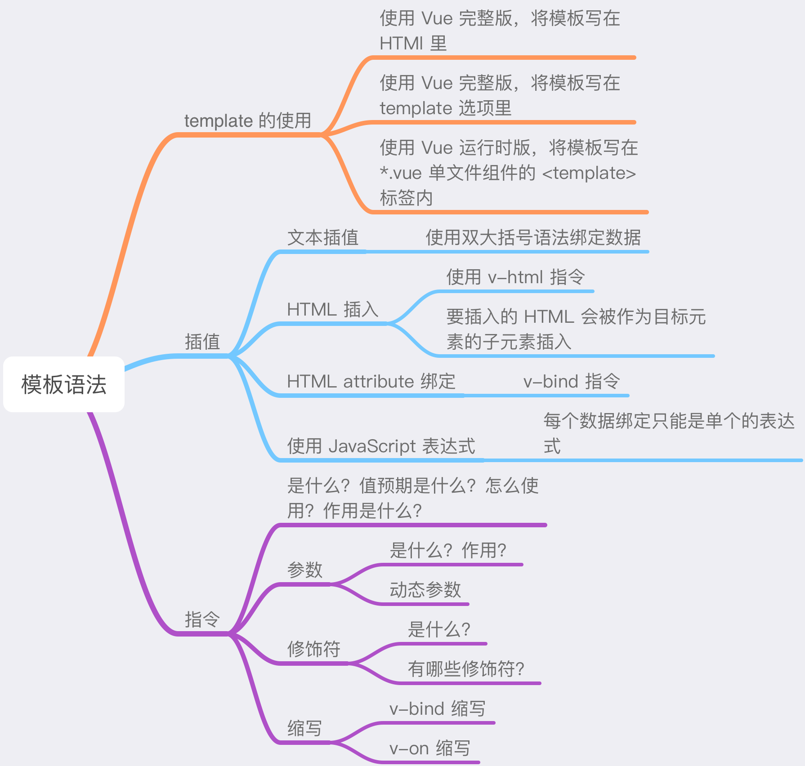
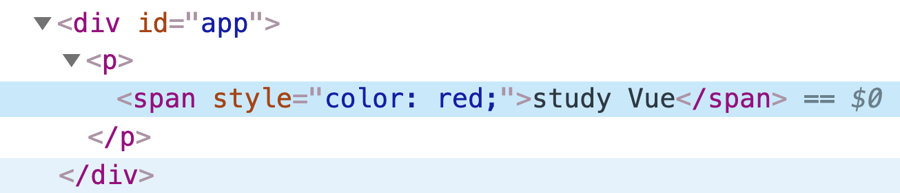
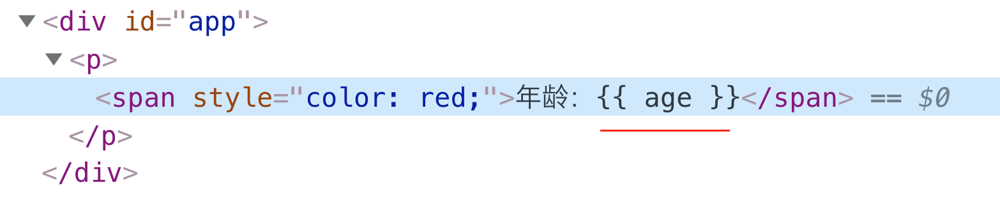
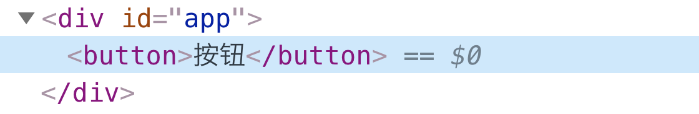

# 模板语法



### template 的使用

在使用 Vue 进行开发时，模板 template 可以有以下三种写法：

- Vue 完整版，模板可以直接写在 HTML 里：

  ```html
  <div id="app">
    <p>{{ n }}</p>
    <button @click="add">+1</button>
  </div>
  <script>
  new Vue({
    el: '#app',
    data: { 
      n: 0 
    },
    methods: { 
      add () {
        this.n += 1
      } 
     }
  })
  </script>
  ```

- Vue 完整版，模板可以写在 `template` 选项里：

  ```html
  <div id="app"></div>
  <script>
  new Vue({
    template: `
      <div>
        <p>{{ n }}</p>
        <button @click="add">+1</button>
      </div>
    `,
    data: {
      n: 0
    },
    methods: {
      add () {
        this.n += 1
      }
    }
  }).$mount('#app') // div#app 会被替换为 template 里的内容
  </script>
  ```

- Vue 运行时版，将模板在 `*.vue` 单文件组件的 `<template>` 内，开发时常常使用这种方式：

  ```vue
  <template>
    <div>
      <p>{{ n }}</p>
      <button @click="add">+1</button>
    </div>
  </template>
  
  <script>
  export default {
    // data 必须是函数
    data () {
      return {
        n: 0
      }
    },
    methods: {
      add () {
        this.n += 1
      }
    }
  }
  </script>
  ```

以上三种写法，都使用了 Vue 特有的**模板语法**，Vue 文档中对模板语法有如下介绍：

> Vue 使用了基于 HTML 的模板语法 ，允许开发者声明式地将 DOM 绑定至底层 Vue 实例的数据。所有 Vue.js 的模板都是合法的 HTML，所以能被遵守规范的浏览器和 HTML 解析器解析。
>
> 在底层实现上，Vue 将模板编译成虚拟 DOM 渲染函数。结合响应式系统，Vue 能够智能地计算出最少需要重新渲染多少组件，并把 DOM 操作次数减少到最少。
>
> 也可以不使用模板，直接写渲染（render）函数，使用可选的 JSX 语法。

接下来就了解一下 Vue 有哪些模板语法？

### 插值

##### 文本插值

要在页面中展示 `data` 中的 property，可以使用**双大括号**语法进行文本插值：

```vue
<template>
  <div>{{ name }}</div>
</template>

<script>
  export default {
    data () {
      return {
        name: '路飞'
      }
    }
  }
</script>
```

双大括号里的内容会被替换成数据对象上 `name` property 的值。并且，只要数据对象上 `name` property 发生改变，双大括号里的内容也会随之更新。

##### HTML 插入

双大括号语法只会将数据解释为普通文本，而非 HTML 代码。要想输出真正的 HTML，可以使用 `v-html` 指令：

```vue
<template>
  <div>
    <p v-html="rawHtml"></p>
  </div>
</template>

<script>
  export default {
    data () {
      return {
        rawHtml: '<span style="color: red;">study Vue</span>'
      }
    }
  }
</script>
```

`v-html` 指令会更新插入元素的 `innerHTML`，即 `rawHtml` property 的值会作为 `<p>` 元素的子元素插入：




如果 `rawHtml` 的值含有数据对象的其它 property，那么 Vue 只会将其作为**普通 HTML** 插入——会忽略解析 property 值中的数据绑定：

```vue
<template>
  <div>
    <p v-html="rawHtml"></p>
  </div>
</template>

<script>
  export default {
    data () {
      return {
        age: 18,
        rawHtml: '<span style="color: red;">年龄：{{ age }}</span>'
      }
    }
  }
</script>
```

此时，`rawHtml` 含有的 `age` property 便不会被解析：



另外，为了避免 **XSS 攻击**，只对可信内容使用 HTML 插值，绝不要对用户提供的内容使用插值。

##### 绑定 HTML attribute

在开发中，经常有对 HTML attribute 进行数据绑定的场景。比如，`<a>` 元素的 `title` attribute 会根据不同的角色展示不同的内容，这便需要对 `title` 进行数据绑定。但由于双大括号语法不能作用在 HTML attribute 上，所以这种情况下应该使用 **`v-bind`** 指令：

```vue
<template>
  <div>
    <a href="www.xxx.com" v-bind:title="linkTitle">路飞</a>
  </div>
</template>

<script>
  export default {
    data () {
      return {
        linkTitle: '路飞是海贼王里的角色'
      }
    }
  }
</script>
```

`v-bind` 指令会将 `title` attribute 和数据对象中的 `linkTitle` property 绑定在一起，当 `linkTitle` property 发生改变时，`title` attribute 也会随之改变。

对于 HTML attribute 是布尔值的情况，比如：

```vue
<button v-bind:disabled="isDisabled">按钮</button>
```

如果 `isDisabled` property 的值为真，那么 `disabled` attribute 会出现在 `<button>` 元素中，并且按钮会处于禁用状态：


反之，如果 `isDisabled` property 的值为假，比如是 `null`、`undefined`、`false` 等值，那么 `disabled` attribute 不会出现在 `<button>` 元素中：



##### 使用 JavaScript 表达式

在模板的数据绑定中，除了绑定简单的 property 键值，**Vue 还提供了完全的 JavaScript 表达式支持，但每个绑定只能包含单个表达式**：

```html
<div>{{ n + 10 }}</div>
<div>{{ isDisabled ? 'yes' : 'ok' }}</div>
<div>{{ message.split('').reverse().join('') }}</div>
<div v-bind:id="'list-' + id"></div>
```

以上表达式会在所属 Vue 实例数据作用域下作为 JavaScript 被解析。

### 指令

**指令是带有 `v-` 前缀的特殊 attribute，指令 attribute 的值预期是单个 JavaScript 表达式**（`v-for` 除外）。指令的语法为：`v-指令名:参数.修饰符=值`，比如，事件指令 `v-on` 可以这样写：

```vue
<template>
  <div v-on:click.stop="add"></div>
</template>
```

其中，`v-on` 就是用于绑定事件监听器的指令，`click` 是参数，`stop` 是修饰符，`add` 就是对应的值。有些指令使用时可以没有参数和修饰符，如 `v-pre`：

```vue
<template>
  <div v-pre>这里可以显示双大括号 {{ n }}</div>
</template>
```

有些指令使用时可以没有值，如 `v-on:click.prevent`：

```vue
<template>
  <a href="https://www.baidu.com" v-on:click.prevent>百度</a>
</template>
```

**指令的作用是，当表达式的值改变时，将其产生的连带影响，响应式地作用于 DOM**：

```html
<div v-if="visible">你可以看见了</div>
```

`v-if` 指令将根据表达式 `visible` 的值的真假来插入或移除 `<div>` 元素。

##### 参数

一些 Vue 指令能够接收一个**参数**，在指令名之后以冒号表示。比如使用 `v-bind` 指令绑定 HTML attribute：

```html

```

这里 `src` 便是参数，其作用是告知 `v-bind` 指令将 `` 元素的 `src` attribute 和表达式 `logoUrl` 的值绑定在一起。

还可以使用 `v-on` 指令绑定事件监听器，比如监听 `<input>` 元素的 `focus` 事件：

```html
<input v-on:focus="handleInput" type="text">
```

在上面代码中，这个 `focus` 事件名便是参数。 

除了上述那样一开始就定义好的参数，Vue 还提供了**动态参数**——使用方括号括起来的 JavaScript 表达式作为一个指令的参数：

```html

```

这里的 `name` 便是动态参数，它会被作为一个 JavaScript 表达式进行动态求值，求得的值将作为最终的参数来使用。比如，如果 `name` property 的值为 `href`，那么这个绑定等价于 `v-bind:href`。在使用动态参数时，有以下约束：

- 对动态参数的值的约束，动态参数的值预期应求出一个字符串，异常情况下的值为 `null`（可显性地用于移除绑定）。任何其它非字符串类型的值都将会触发一个警告。

- 对动态参数表达式的语法约束：

  - 动态参数表达式里面不能包含空格、引号，因为它们放在 HTML attribute 里是无效的，并且会触发编译警告：

    ```html
    <!-- 这会触发一个编译警告 -->
    <!-- 解决办法是表达式中不要使用空格、引号；或者使用计算属性来代替这种复杂表达式 -->
    
    ```

  - 直接在 HTML 模板中写的动态参数应该避免使用大写字符来命名，因为浏览器会把 HTML attribute 全部强制转为小写：

    ```html
    
    ```

    在上面代码中，浏览器会把动态参数强制转换为小写：`v-bind:[attributename]`，如果当前的 Vue 实例中没有一个名为 `attributename` 的 property，则 Vue 会有如下报错：`[Vue warn]: Property or method "attributename" is not defined on the instance but referenced during render...`。

##### 修饰符

**修饰符是以 `.` 跟在参数后面的特殊后缀，它的作用是用于指出一个指令应该以特殊的方式绑定**。比如：

```html
<a v-on:click.prevent="onSubmit">链接A</a>
```

这里 `.prevent` 便是修饰符，它告诉 `v-on` 指令对于触发的 click 事件应该调用 `event.preventDefault()` 来阻止其默认行为。

那么有哪些修饰符呢？根据指令的不同，对应的修饰符如下：

- `v-on` 指令支持的修饰符分为：事件修饰符、按钮修饰符、系统修饰符。
  - 事件修饰符：`.stop`、`.prevent`、`.capture`、`.self`、`.once`、`.passive`。
  - 按键修饰符：`.enter`、`.tab`、`.esc`、`.selfdelete` 等。
  - 按键修饰符：`.ctrl`、`.shift`、`.left`、`.right` 等。
- `v-bind` 指令支持的修饰符有：`.prop`、`.camel`、`.sync`。
- `v-model` 指令支持的修饰符有：`.lazy`、`.number`、`.trim`。

##### 缩写

Vue 为 `v-bind` 和 `v-on` 这两个常用的指令提供了特定的简写：

- `v-bind` 缩写

  ```html
  <!-- 完整语法 -->
  
  
  <!-- 缩写语法 -->
  
  
  <!-- 动态参数缩写语法 -->
  
  ```

- `v-on` 缩写

  ```html
  <!-- 完整语法 -->
  <button v-on:click="doSomething">按钮</button>
  
  <!-- 缩写语法 -->
  <button @click="doSomething">按钮</button>
  
  <!-- 动态参数缩写语法 -->
  <button @[event]="doSomething">按钮</button>
  ```