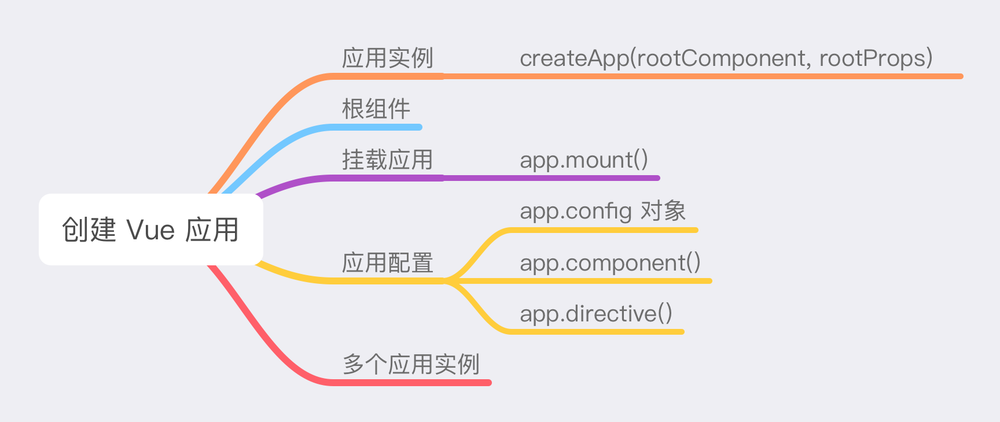

# 创建应用



### 应用实例

通过 `createApp` 函数可以创建一个新的 Vue 应用实例。`createApp` 函数接收两个参数：

```javascript
createApp(rootComponent, rootProps)
```

1. 第一个参数是根组件，属于必填项，有以下两种使用方式。

   - 直接内联根组件。

     ```javascript
     import { createApp } from 'vue'
     
     const app = createApp({
       // 根组件选项
     })
     ```

   - 使用从别处导入的组件。

     ```javascript
     import { createApp } from 'vue'
     import App from './App.vue'
     
     const app = createApp(App)
     ```

2. 第二个参数是传递给根组件的 `props`，属于可选项。

   ```javascript
   import { createApp } from 'vue/dist/vue.esm-bundler.js'
   
   const app = createApp(
     {
       template: '<p>username: {{ username }}</p>',
       props: ['username']
     },
     {
       username: 'libai'
     }
   )
   ```

### 根组件

Vue 应用通常由一棵嵌套的、可重用的组件树组成，位于树顶端的组件被称为根组件，其它组件都是其子组件。例如，在 App.vue 中：

```vue
<script setup>
import NavBar from './components/NavBar.vue'
import SearchInput from './compoents/SearchInput.vue'
import Layout from './components/Layout.vue'
import SiderBar from './components/SiderBar.vue'
import AppMain from './components/AppMain.vue'
</script>

<template>
  <NavBar>
    <SearchInput />
  </NavBar>
  <Layout>
    <SiderBar />
    <AppMain />
  </Layout>
</template>
```

该应用对应的组件树：

```
App (root component)
├─ NavBar
│  └─ SearchInput
└─ Layout
   ├─ SiderBar
   └─ AppMain
```

### 挂载应用

应用实例必须在调用了 `.mount()` 方法后才会渲染出来。`.mount()` 方法只接收一个参数，可以是一个实际的 DOM 元素，或者是一个 CSS 选择器（使用第一个匹配到的元素）。`.mount()` 方法的返回值是根组件实例。例如，对于以下 HTML：

```html
<!DOCTYPE html>
<html>
  <body>
    <div id="app"></div>
  </body>
</html>
```

挂载方式：

- 使用实际的 DOM 元素。

  ```javascript
  import { createApp } from 'vue'
  
  const app = createApp()
  app.mount(document.body.firstElementChild)
  ```

- 使用 CSS 选择器。

  ```javascript
  import { createApp } from 'vue'
  
  const app = createApp()
  app.mount('#app')
  ```

如果应用根组件有模板或定义了渲染函数，那么它的内容将替换容器元素内所有现存的 DOM 节点。例如，上述应用实例渲染出来的 DOM 结构：

```html
<!DOCTYPE html>
<html>
  <body>
    <div id="app">
      <div>App SFC</div>
    </div>
  </body>
</html>
```

反之，在运行时编译器可用的情况下，容器内的 `innerHTML` 将被用作模板。例如：

```html
<div id="app">
  <button @click="count++">count: {{ count }}</button>
</div>
```

```javascript
import { createApp } from 'vue/dist/vue.esm-bundler.js'

createApp({
  data () {
    return {
      count: 100
    }
  }
}).mount('#app')
```

此时的 DOM 结构：

```html
<!DOCTYPE html>
<html>
  <body>
    <div id="app">
      <button>count: 100</button>
    </div>
  </body>
</html>
```

不管根组件是否有模板，容器元素自身都不会被视作应用的一部分。另外，`.mount()` 方法应该始终在整个应用配置和资源注册完成后被调用。

```javascript
import { createApp } from 'vue'
import router from './router/index.js
import store from './store/index.js'
import App from './App.vue'

const app = createApp(App)

app.use(router)
app.use(store)

app.mount('#app')
```

### 应用配置

应用实例通过暴露 `.config` 对象来配置一些应用级的选项。例如:

- `app.config.warnHandler` 定义一个应用级的警告处理器。

  ```javascript
  app.config.warnHandler = (msg, instance, trace) => {
    // 处理警告
  }
  ```

- `app.config.errorHandler` 定义一个应用级的错误处理器，用于捕获应用内抛出的未被处理的错误。

  ```javascript
  app.config.errorHandler = (err, instance, info) => {
    // 处理错误
  }
  ```

- `app.config.globalPropertier`  用于注册能够被应用内所有组件实例访问到的全局属性的对象。如果全局属性与组件自己的属性冲突，组件自己的属性将具有更高的优先级。

  ```javascript
  app.config.globalProperties.author = 'libai'
  ```

  可以在组件模板内使用：

  ```vue
  <template>
    <p>config globalProperties: {{ author }}</p>
  </template>
  ```

  也可以通过组件实例的 `this` 访问到：

  ```javascript
  export default {
    mounted () {
      console.log(this.author)
    }
  }
  ```

另外，应用实例还提供了一些方法来注册应用范围内可用的资源。例如：

- `app.component` 用于注册全局组件。
- `app.directive` 用于注册全局指令。

可以在[应用实例 API 的完整列表](https://cn.vuejs.org/api/application.html)中查看其它 API。值得注意的是，要确保在挂载应用实例之前完成所有应用配置。

### 多个应用实例

`createApp` API 还允许在同一个页面中创建多个共存的 Vue 应用，并且每个应用都拥有自己的用于配置和全局资源的作用域。

```javascript
const app1 = createApp({
  //
})
app1.mount('#app1')

const app2 = createApp({
  //
})
app2.mount('#app2')
```

