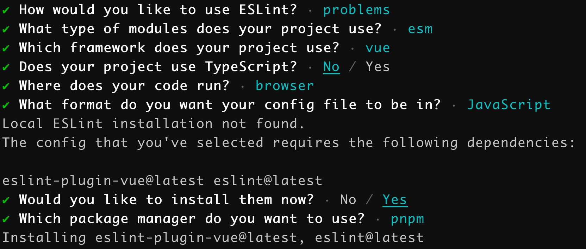

# ESLint

JavaScript 作为一种即时编译型的编程语言，它会在程序运行时才进行编译，这导致代码中的错误只有在运行后才能暴露。这种暴露错误的方式会极大地影响开发效率，因此需要一个工具可以在开发阶段就能将语法错误暴露出来。另外，在多人协作的场景下，需要统一的代码规范保证代码的可维护性。但仅有规范不行，还需要一个工具来保证规范的落地。ESLint 便是一个满足上述需求的 Lint 工具。

ESLint 是一个可配置的 ECMAScript/JavaScript 代码检测工具，其目标是保证代码的一致性和避免错误。它可以帮助检测代码中存在的问题，例如：潜在的运行时错误、未遵守最佳实践的错误以及代码格式错误。

### 初始化

在命令行输入以下命令（需要保证项目中已存在 package.json 文件）：

```bash
npm init @eslint/config
```

该命令将会安装 eslint 包，并执行以下初始化流程：



最终会基于所选选项生成对应的 `.eslintrc.*` 配置文件。

### 使用

根据使用 ESLint 进行代码检测的时间和场景，代码检测的方式分为以下几种。

##### 编码时检测

在开发代码时检测，通常是把 ESLint 集成到开发工具中来实现代码实时检测。例如：

- WebStorm 集成了 ESLint，但默认是禁用状态，需要在以下设置中进行配置： Settings/Preferences > Languages & Frameworks > JavaScript > Code Quality Tools > ESLint。
- VSCode 需要安装 ESLint 插件。

##### 编码后检测

在完成代码开发后检测，通常是在命令行输入以下命令来执行 ESLint：

```bash
npx eslint [options] [file|dir|glob]*

pnpm dlx eslint [options] [file|dir|glob]*
```

例如：

```bash
# 多个文件
npx eslint file1.js file2.js

# src 目录下的所有文件
npx eslint src/**

# 使用 --ext 选项配置 eslint 可执行的文件扩展名
npx eslint --ext .js,.vue src
npx eslint --ext .js --ext .vue src
```

通常在 `package.json` 中定义一个脚本来运行 ESLint。

```javascript
{
  "scripts": {
    "lint": "eslint --ext .js,.vue src"
  }
}
```

##### 构建前检测

在代码执行构建前检测，通常是将 ESLint 代码检测作为一个构建流程的前置任务。例如，使用 Webpack 构建时，需要先安装 `eslint-webpack-plugin`：

```bash
npm install eslint-webpack-plugin --save-dev
```

然后在 webpack.config.js 配置：

```javascript
const ESLintPlugin = require('eslint-webpack-plugin')

module.exports = {
  // ...
  plugins: [new ESLintPlugin(
    // ESLint 配置项
  )]
}
```

##### 提交前检测

在使用 Git 提交代码前进行检测，通常是将 ESLint 放置在 Git Hooks 的一个钩子任务中。Git 钩子会在特定事件发生时触发，用以执行自定义 shell 脚本。对于提交前的代码检测可以使用 `pre-commit` 钩子，该钩子会在 `git commit` 前触发，用于检查即将提交的快照。

另外，使用 shell 脚本编写 Git 钩子的方式对前端不太方便。但可以安装 husky，使用 JS 编写 Git 钩子。

1. 安装 husky。

   ```bash
   pnpm add husky -D
   ```

2. 启用 Git 钩子。

   ```bash
   pnpm dlx husky install
   ```

3. 在 package.json 中配置 `prepare` 脚本。

   ```javascript
   {
     "script": {
       // 安装依赖后执行
       "prepare": "husky install"
     }
   }
   ```

4. 添加钩子。

   ```bash
   pnpm dlx husky add .husky/pre-commit 'pnpm run lint'
   ```

执行完上述流程后，在项目的根目录下会生成 .husky/pre-commit 的文件。当执行 `git commit` 时，会先执行 `pnpm run lint` 脚本，只有代码检测通过后才会执行 `git commit`。

不过，上述配置会导致每次提交时都进行代码检测，即使是某些文件并未改动。随着项目代码越来越多，提交过程将会变得越来越慢，从而影响开发效率。

为此，可以引入 lint-staged，它只会对存入暂存区的文件进行代码检测，这样能极大地提高提交代码的效率。

1. 安装 lint-staged。

   ```bash
   pnpm add lint-staged -D
   ```

2. 在 package.json 中配置。

   ```javascript
   {
     "lint-staged": {
       "**/*.{js,vue}": [
         "pnpm run lint:script",
         "git add ."
       ]
     }
   }
   ```

3. 改写 `pre-commit` 钩子内容。

   ```bash
   pnpm exec lint-staged
   ```

### 配置


